ЧАСТЬ 1. ТРИГГЕРЫ

1. NEW

1.1. Вставка дефолтной (средней) сложности новому растению, если оно не указано
```sql
CREATE OR REPLACE FUNCTION plant_set_default_difficulty()
RETURNS trigger AS $$
DECLARE
  v_default_id integer;
BEGIN
  SELECT id INTO v_default_id
  FROM refs.difficulty
  WHERE type = 'Среднее';

  IF NEW.difficulty_id IS NULL THEN
    NEW.difficulty_id := v_default_id;
  END IF;

  RETURN NEW;
END;
$$ LANGUAGE plpgsql;

CREATE TRIGGER plant_set_default_difficulty
BEFORE INSERT ON main.plant
FOR EACH ROW EXECUTE FUNCTION plant_set_default_difficulty();

INSERT INTO main.plant (name, description)
VALUES ('Фикус', 'Домашний фикус без заданной сложности');

SELECT id, name, difficulty_id
FROM main.plant
WHERE name = 'Фикус';
```


1.2. Запрет создавать растение с уровнем безопасности «Токсичное», если в описании сказано, что оно подходит для детей
```sql
CREATE OR REPLACE FUNCTION plant_check_safety_for_description()
RETURNS trigger AS $$
DECLARE
  v_toxic_id integer;
BEGIN
  
  SELECT id INTO v_toxic_id
  FROM refs.safety
  WHERE type = 'Токсичное';

  IF NEW.description ILIKE '%дет%' THEN
    IF NEW.safety_id = v_toxic_id THEN
      RAISE EXCEPTION
        'Нельзя сохранять токсичное растение как рекомендуемое для детей/питомцев';
    END IF;
  END IF;

  RETURN NEW;
END;
$$ LANGUAGE plpgsql;

CREATE TRIGGER plant_check_safety_for_description
BEFORE INSERT ON main.plant
FOR EACH ROW EXECUTE FUNCTION plant_check_safety_for_description();

INSERT INTO main.plant (name, description, safety_id)
VALUES (
  'Oleander',
  'Красивое, но ядовитое растение для детей в комнату',
  (SELECT id FROM refs.safety WHERE type = 'Токсичное')
);
```
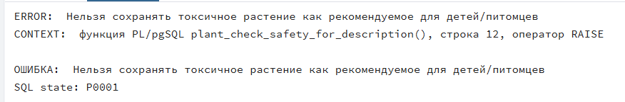


2. OLD

2.1. Запрет на обновление размера растения после его добавления
```sql
CREATE OR REPLACE FUNCTION plant_forbid_size_downgrade()
RETURNS trigger AS $$
BEGIN
  IF NEW.size_id IS DISTINCT FROM OLD.size_id THEN
    IF NEW.size_id < OLD.size_id THEN
      RAISE EXCEPTION
        'Нельзя уменьшать размер растения: было %, стало %',
        OLD.size_id, NEW.size_id;
    END IF;
  END IF;

  RETURN NEW;
END;
$$ LANGUAGE plpgsql;

CREATE TRIGGER plant_forbid_size_downgrade
BEFORE UPDATE ON main.plant
FOR EACH ROW EXECUTE FUNCTION plant_forbid_size_downgrade();

INSERT INTO main.plant (name, description, size_id)
VALUES ('Monstera', 'Среднего размера', 2);

UPDATE main.plant
SET size_id = 1
WHERE name = 'Monstera';
```


2.2. Логирование удаляемых растений
```sql
CREATE TABLE log.deleted_plants (
  id integer,
  name text,
  description text,
  deleted_at timestamp default now()
);

CREATE OR REPLACE FUNCTION plant_log_delete()
RETURNS trigger AS $$
BEGIN
  INSERT INTO log.deleted_plants (id, name, description)
  VALUES (OLD.id, OLD.name, OLD.description);
  RETURN OLD;
END;
$$ LANGUAGE plpgsql;

CREATE TRIGGER plant_log_delete
BEFORE DELETE ON main.plant
FOR EACH ROW EXECUTE FUNCTION plant_log_delete();

INSERT INTO main.plant (name, description)
VALUES ('Тестовое растение', 'Для удаления');

DELETE FROM main.plant
WHERE name = 'Тестовое растение';

SELECT *
FROM log.deleted_plants;
```
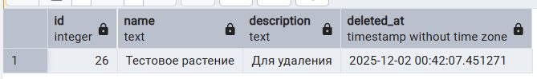


3. BEFORE

3.1. Запрет на обновление безопасности растения с опасного на безопасное
```sql
CREATE OR REPLACE FUNCTION plant_prevent_safety_upgrade()
RETURNS trigger AS $$
DECLARE
  v_safe_id   integer;
  v_toxic_id  integer;
BEGIN
  SELECT id INTO v_safe_id  FROM refs.safety WHERE type = 'Безопасное';
  SELECT id INTO v_toxic_id FROM refs.safety WHERE type = 'Токсичное';

  IF NEW.safety_id IS DISTINCT FROM OLD.safety_id THEN
    IF OLD.safety_id = v_toxic_id AND NEW.safety_id = v_safe_id THEN
      NEW.safety_id := OLD.safety_id;
    END IF;
  END IF;

  RETURN NEW;
END;
$$ LANGUAGE plpgsql;

CREATE TRIGGER plant_prevent_safety_upgrade
BEFORE UPDATE ON main.plant
FOR EACH ROW EXECUTE FUNCTION plant_prevent_safety_upgrade();

INSERT INTO main.plant (name, description, safety_id)
VALUES ('TestPlant', 'Для проверки безопасности', 2);

UPDATE main.plant
SET safety_id = 1
WHERE name = 'TestPlant';

SELECT name, safety_id
FROM main.plant
WHERE name = 'TestPlant';
```
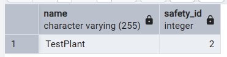

3.2. Запрет на удаление растения, если описание содержит «редкое»
```sql
CREATE OR REPLACE FUNCTION forbid_delete_rare_plants()
RETURNS trigger AS $$
BEGIN
  IF OLD.description ILIKE '%редк%' THEN
    RAISE EXCEPTION 'Нельзя удалять редкое растение (id=%)', OLD.id;
  END IF;
  RETURN OLD;
END;
$$ LANGUAGE plpgsql;

CREATE TRIGGER forbid_delete_rare
BEFORE DELETE ON main.plant
FOR EACH ROW EXECUTE FUNCTION forbid_delete_rare_plants();

INSERT INTO main.plant(name, description) VALUES ('TestPlant', 'Очень редкое растение');
DELETE FROM main.plant WHERE name = 'TestPlant'; 
```
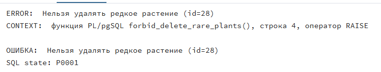


4. AFTER

4.1. Логирование добавляемых растений
```sql
CREATE TABLE log.inserted_plants (
  plant_id int,
  name text,
  inserted_at timestamp default now()
);

CREATE OR REPLACE FUNCTION log_plant_insert()
RETURNS trigger AS $$
BEGIN
  INSERT INTO log.inserted_plants(plant_id, name)
  VALUES (NEW.id, NEW.name);
  RETURN NEW;
END;
$$ LANGUAGE plpgsql;

CREATE TRIGGER log_plant_insert
AFTER INSERT ON main.plant
FOR EACH ROW EXECUTE FUNCTION log_plant_insert();

INSERT INTO main.plant(name, description)
VALUES ('TestPlant', 'Описание TestPlant');

SELECT * FROM log.inserted_plants
WHERE name = 'TestPlant';
```
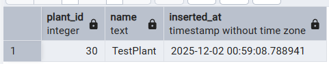

4.2. Логирование изменения уровня полива растения
```sql
CREATE TABLE log.plant_watering_change (
  plant_id int,
  old_watering int,
  new_watering int,
  changed_at timestamp default now()
);

CREATE OR REPLACE FUNCTION log_watering_update()
RETURNS trigger AS $$
BEGIN
  IF NEW.watering_id IS DISTINCT FROM OLD.watering_id THEN
    INSERT INTO log.plant_watering_change(plant_id, old_watering, new_watering)
    VALUES (OLD.id, OLD.watering_id, NEW.watering_id);
  END IF;
  RETURN NEW;
END;
$$ LANGUAGE plpgsql;

CREATE TRIGGER log_watering_update
AFTER UPDATE ON main.plant
FOR EACH ROW EXECUTE FUNCTION log_watering_update();

INSERT INTO main.plant(name, description, watering_id)
VALUES ('TestPlant', 'Описание TestPlant', 1);

UPDATE main.plant
SET watering_id = 2
WHERE name = 'TestPlant';

SELECT * FROM log.plant_watering_change
WHERE plant_id = (SELECT id FROM main.plant WHERE name = 'TestPlant');
```
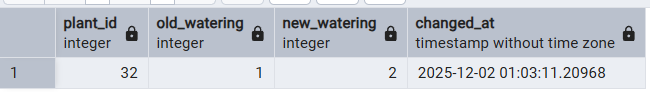


5. Row level

5.1. Если у добавляемого растения не указано описание, вставляется дефолтная фраза
```sql
CREATE OR REPLACE FUNCTION plant_auto_fill_description()
RETURNS trigger AS $$
BEGIN
  IF NEW.description IS NULL THEN
    NEW.description := 'Описание не указано';
  END IF;

  RETURN NEW;
END;
$$ LANGUAGE plpgsql;

CREATE TRIGGER plant_auto_fill_description
BEFORE INSERT ON main.plant
FOR EACH ROW EXECUTE FUNCTION plant_auto_fill_description();

INSERT INTO main.plant (name) VALUES ('TestPlantForDesc');

SELECT name, description
FROM main.plant
WHERE name = 'TestPlantForDesc';
```
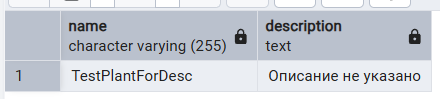

5.2. Запрет на обнуление уровня освещения существующего растения
```sql
CREATE OR REPLACE FUNCTION forbid_null_sunlight()
RETURNS trigger AS $$
BEGIN
  IF NEW.sunlight_id IS NULL AND OLD.sunlight_id IS NOT NULL THEN
    RAISE EXCEPTION 'Нельзя обнулять уровень освещения растения!';
  END IF;

  RETURN NEW;
END;
$$ LANGUAGE plpgsql;

CREATE TRIGGER forbid_null_sunlight
BEFORE UPDATE ON main.plant
FOR EACH ROW EXECUTE FUNCTION forbid_null_sunlight();

INSERT INTO main.plant (name, description, sunlight_id)
VALUES ('TestPlantForSunNull', 'Описание TestPlantForSunNull', 1);

UPDATE main.plant
SET sunlight_id = NULL
WHERE name = 'TestPlantForSunNull';
```
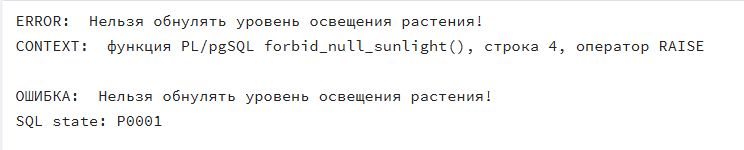


6. Statement level

6.1. Логирование каждого обновления растений
```sql
CREATE TABLE log.plant_update_log (
  table_name text,
  operation text,
  changed_at timestamp default now()
);

CREATE OR REPLACE FUNCTION log_plant_update_statement()
RETURNS trigger AS $$
BEGIN
  INSERT INTO log.plant_update_log(table_name, operation)
  VALUES (TG_TABLE_NAME, TG_OP);
  RETURN NULL;
END;
$$ LANGUAGE plpgsql;

CREATE TRIGGER log_plant_update_statement
AFTER UPDATE ON main.plant
FOR EACH STATEMENT EXECUTE FUNCTION log_plant_update_statement();

UPDATE main.plant
SET description = description || ' (обновлено)'
WHERE id IN (SELECT id FROM main.plant LIMIT 5);

SELECT * FROM log.plant_update_log;
```
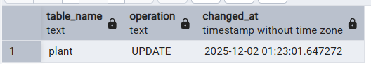

6.2. Подсчет количества имеющихся в базе растений после каждого удаления или добавления
```sql
CREATE TABLE log.plant_delete_log (
  table_name text,
  operation text,
  deleted_rows int,
  logged_at timestamp default now()
);

CREATE OR REPLACE FUNCTION log_plant_delete_statement()
RETURNS trigger AS $$
BEGIN
  INSERT INTO log.plant_delete_log(table_name, operation, deleted_rows)
  VALUES (TG_TABLE_NAME, TG_OP, (SELECT count(*) FROM main.plant));
  RETURN NULL;
END;
$$ LANGUAGE plpgsql;

CREATE TRIGGER log_plant_delete_statement
AFTER INSERT OR DELETE ON main.plant
FOR EACH STATEMENT EXECUTE FUNCTION log_plant_delete_statement();

DELETE FROM main.plant
WHERE id IN (SELECT id FROM main.plant ORDER BY id DESC LIMIT 3);

SELECT * FROM log.plant_delete_log;

```
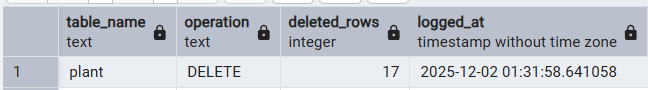


ЧАСТЬ 2. ОТОБРАЖЕНИЕ СПИСКА ТРИГГЕРОВ.

2.1. Список триггеров
```sql
SELECT trigger_name,
       action_timing  AS timing,
       event_manipulation AS event
FROM information_schema.triggers;
```
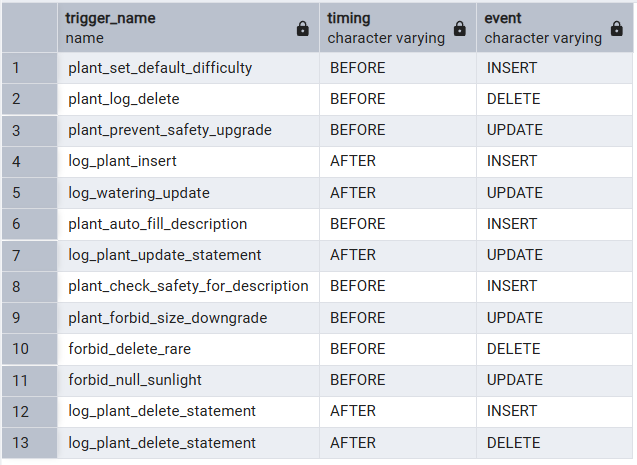


ЧАСТЬ 3. КРОНЫ.

3.1. Каждый день в 02:00 считает количество растений в main.plant и сохраняет в лог.
```sql
CREATE TABLE IF NOT EXISTS log.daily_plant_stats (
  stats_date date default current_date,
  plant_count int
);

SELECT cron.schedule(
  'daily_plant_count',
  '0 2 * * *',
  $$INSERT INTO log.daily_plant_stats(plant_count)
    SELECT count(*) FROM main.plant;$$
);
```
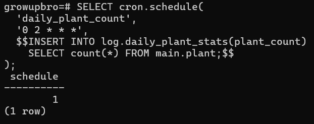


3.2. Каждый час удаляет тестовые растения 
```sql
SELECT cron.schedule(
  'delete_test_plants',
  '0 * * * *',
  $$DELETE FROM main.plant WHERE name ILIKE 'TestPlant%';$$
);
```
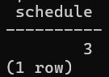


3.3. Каждый день пишет в лог список всех имеющихся токсичных растений
```sql
CREATE TABLE IF NOT EXISTS log.toxic_daily_log (
  logged_at timestamp default now(),
  plant_id int,
  plant_name text
);

SELECT cron.schedule(
  'log_toxic_plants',
  '0 3 * * *',
  $$INSERT INTO log.toxic_daily_log(plant_id, plant_name)
    SELECT p.id, p.name
    FROM main.plant p
    JOIN refs.safety s ON p.safety_id = s.id
    WHERE s.type = 'Токсичное';$$
);
```


3.4. Запрос на просмотр выполнения кронов 
```sql
SELECT *
FROM cron.job_run_details
ORDER BY start_time DESC;
```
На момент выполнения запроса ни одно время из указанных в кроне не наступало
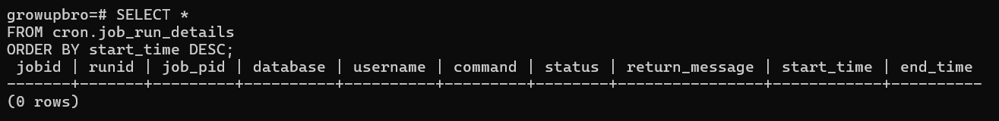


3.5. Запрос на просмотр кронов 
```sql
SELECT jobid, jobname, schedule, command
FROM cron.job;
```
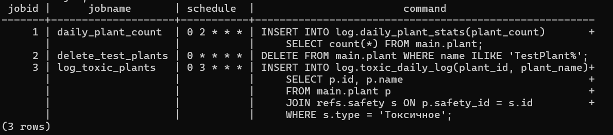