Агрегатные функции и операторы GROUP BY, HAVING

1. COUNT()

1.1. Количество растений
```sql
SELECT COUNT(*) FROM main.plant;
```
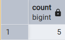

1.2. Количество разных удобрений у растений
```sql
SELECT COUNT(DISTINCT fertilizer_id) FROM main.plant;
```
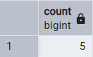


2. SUM()

2.1. Сумма всех идентификаторов растений
```sql
SELECT SUM(id) FROM main.plant;
```
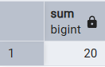

2.2. Сумма всех идентификаторов удобрений
```sql
SELECT SUM(id) FROM main.fertilizer;
```
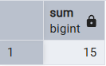


3. AVG()

3.1. Среднее значение сложности ухода
```sql 
SELECT AVG(difficulty_id) FROM main.plant;
```
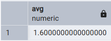

3.2. Средний идентификатор удобрения
```sql
SELECT AVG(fertilizer_id) FROM main.plant;
```
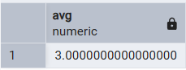


4. MIN()

4.1. Минимальный идентификатор удобрения
```sql 
SELECT MIN(fertilizer_id) FROM main.plant;
```


4.2. Минимальный идентификатор растения
```sql
SELECT MIN(id) FROM main.plant;
```


5. MAX()

5.1. Максимальный идентификатор размера
```sql 
SELECT MAX(size_id) FROM main.plant;
```
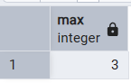

5.2. Максимальный идентификатор растения
```sql
SELECT MAX(id) FROM main.plant;
```
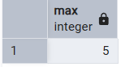


6. STRING_AGG()

6.1. Все советы через запятую
```sql 
SELECT STRING_AGG(tip_text, ', ') FROM main.advice;
```
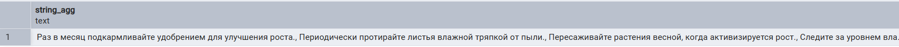

6.2. Названия всех растений через запятую
```sql
SELECT STRING_AGG(name, ', ') FROM main.plant;
```
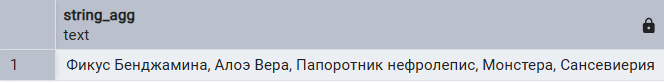


7. GROUP BY

7.1. Количество растений каждого размера
```sql 
SELECT size_id, COUNT(*) FROM main.plant GROUP BY size_id;
```
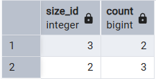

7.2. Количество растений по типу освещения
```sql
SELECT sunlight_id, COUNT(*) FROM main.plant GROUP BY sunlight_id;
```
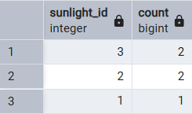


8. HAVING

8.1. Количество растений по типу полива только с несколькими экземплярами
```sql 
SELECT watering_id, COUNT(*) FROM main.plant GROUP BY watering_id HAVING COUNT(*) > 1;
```
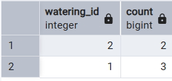

8.2. Количество растений каждого размера с двумя и более экземплярами
```sql
SELECT size_id, COUNT(*) FROM main.plant GROUP BY size_id HAVING COUNT(*) >= 2;
```
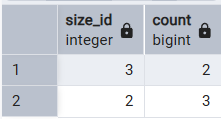


9. GROUPING SETS

9.1. Количество растений по уровню сложности и типу освещения вместе и отдельно
```sql 
SELECT difficulty_id, sunlight_id, COUNT(*)
FROM main.plant
GROUP BY GROUPING SETS (
    (difficulty_id, sunlight_id),
    (difficulty_id),
    (sunlight_id)
    );
```
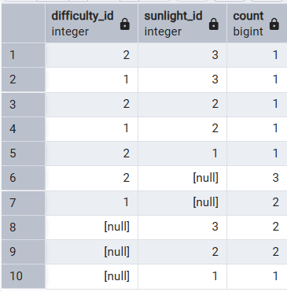

9.2. Количество растений по размеру и типу полива вместе и отдельно
```sql
SELECT size_id, watering_id, COUNT(*)
FROM main.plant
GROUP BY GROUPING SETS (
    (size_id, watering_id),
    (size_id),
    (watering_id)
    );
```
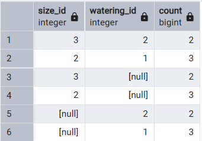


10. ROLLUP

10.1. Количество растений по уровню сложности и размеру вместе, только по уровню сложности и итог
```sql 
SELECT difficulty_id, size_id, COUNT(*)
FROM main.plant
GROUP BY ROLLUP(difficulty_id, size_id);
```
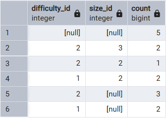

10.2. Сумма идентификаторов растений по освещению и размеру, только по освещению и итог
```sql
SELECT sunlight_id, size_id, SUM(id)
FROM main.plant
GROUP BY ROLLUP(sunlight_id, size_id);
```
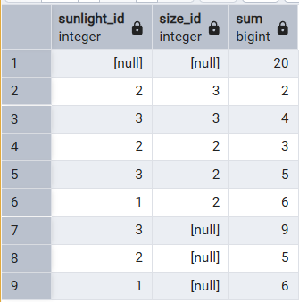


11. CUBE

11.1. Количество растений по уровню сложности и типу освещения вместе, отдельно и итог
```sql 
SELECT difficulty_id, sunlight_id, COUNT(*)
FROM main.plant
GROUP BY CUBE (difficulty_id, sunlight_id);
```
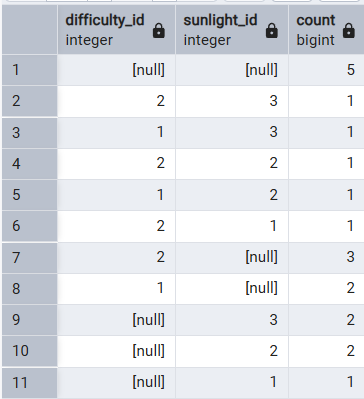

11.2. Количество растений по размеру и типу полива вместе, отдельно и итог
```sql
SELECT size_id, watering_id, COUNT(*)
FROM main.plant
GROUP BY CUBE (size_id, watering_id);
```
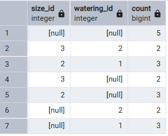


12. SELECT, FROM, WHERE, GROUP BY, HAVING, ORDER BY

12.1. Количество растений по виду удобрения, только с несколькими экземплярами, сортировка по убыванию количества растений
```sql 
SELECT fertilizer_id, COUNT(*)
FROM main.plant
WHERE fertilizer_id IS NOT NULL
GROUP BY fertilizer_id
HAVING COUNT(*) > 1
ORDER BY COUNT(*) DESC;
```
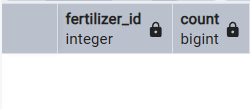

12.2. Средняя сложность ухода по каждому типу полива, только если средняя сложность больше 1.5, сортировка по убыванию среднего значения
```sql
SELECT watering_id, AVG(difficulty_id)
FROM main.plant
WHERE watering_id IS NOT NULL
GROUP BY watering_id
HAVING AVG(difficulty_id) > 1.5
ORDER BY avg_difficulty DESC;
```
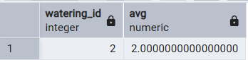