ПОДЗАПРОСЫ

1. SELECT

1.1. Количество советов у каждого растения
```sql
SELECT
    p.name,
    (SELECT COUNT(*) 
     FROM links.plant_tip pt 
     WHERE pt.plant_id = p.id) AS tip_count
FROM main.plant p;
```
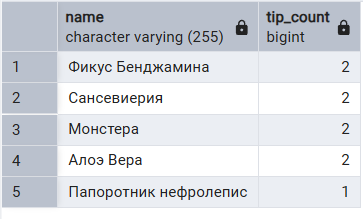

1.2. Тип освещения для каждого растения
```sql
SELECT
    p.name,
    (SELECT s.type 
     FROM refs.sunlight s 
     WHERE s.id = p.sunlight_id) AS sunlight_type
FROM main.plant p;
```


1.3. Количество дополнительных характеристик у растения 
```sql
SELECT
    p.name,
    (SELECT COUNT(*) 
     FROM links.plant_feature pf 
     WHERE pf.plant_id = p.id) AS feature_count
FROM main.plant p;
```
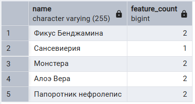


2. FROM

2.1. Количество советов у каждого растения
```sql
SELECT 
    p.name,
    t.tip_count
FROM main.plant p JOIN (
    SELECT plant_id, COUNT(*) AS tip_count
    FROM links.plant_tip
    GROUP BY plant_id) t ON p.id = t.plant_id;
```


2.2. Количество дополнительных характеристик у растения
```sql
SELECT 
    p.name,
    f.feature_count
FROM main.plant p LEFT JOIN (
    SELECT plant_id, COUNT(*) AS feature_count
    FROM links.plant_feature
    GROUP BY plant_id) f ON p.id = f.plant_id;
```
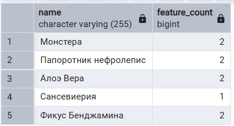

2.3. Безопасные растения
```sql
SELECT 
    safe_plants.name,
    safe_plants.safety_type
FROM (
    SELECT p.id, p.name, s.type AS safety_type
    FROM main.plant p JOIN refs.safety s ON p.safety_id = s.id) safe_plants
WHERE safe_plants.safety_type = 'Безопасное';

```
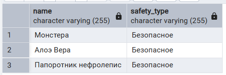


3. WHERE

3.1. Все растения, для которых есть хотя бы один совет
```sql
SELECT name
FROM main.plant
WHERE main.plant.id IN (SELECT pt.plant_id FROM links.plant_tip pt);
```
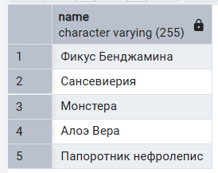

3.2. Растения с уровнем сложности ниже среднего
```sql
SELECT p.name
FROM main.plant p
WHERE p.difficulty_id < (SELECT AVG(id) FROM refs.difficulty);
```
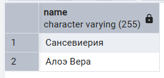

3.3. Растения, использующие в качестве удобрения Эффектон
```sql
SELECT p.name
FROM main.plant p
WHERE p.fertilizer_id = (SELECT id FROM main.fertilizer WHERE name = 'Эффектон');
```


4. HAVING

4.1. Растения с количеством советов больше среднего
```sql
SELECT 
    pt.plant_id,
    COUNT(*) AS tip_count
FROM links.plant_tip pt
GROUP BY pt.plant_id
HAVING COUNT(*) > (
    SELECT AVG(tip_total)
    FROM (SELECT COUNT(*) AS tip_total FROM links.plant_tip GROUP BY plant_id) sub
);
```
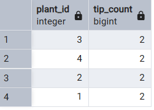

4.2. Растения, у которых больше дополнительных характеристик, чем у растения с наименьшим количеством этих характеристик
```sql
SELECT 
    pf.plant_id,
    COUNT(*) AS feature_count
FROM links.plant_feature pf
GROUP BY pf.plant_id
HAVING COUNT(*) > (
    SELECT MIN(feature_total)
    FROM (SELECT COUNT(*) AS feature_total FROM links.plant_feature GROUP BY plant_id) sub
);
```
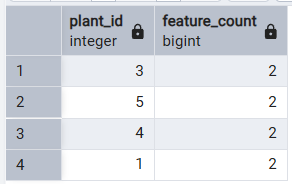

4.3. Удобрения, которые используются чаще, чем удобрение с id = 1
```sql
SELECT 
    f.name,
    COUNT(p.id) AS usage_count
FROM main.fertilizer f JOIN main.plant p ON f.id = p.fertilizer_id
GROUP BY f.name
HAVING COUNT(p.id) > (SELECT COUNT(*) FROM main.plant WHERE fertilizer_id = 1);
```


5. All

5.1. Самые сложные в уходе растения
```sql
SELECT p.name 
FROM main.plant p
WHERE p.difficulty_id >= ALL (
    SELECT difficulty_id FROM main.plant
    WHERE difficulty_id IS NOT NULL
);
```
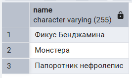

5.2. Самые безопасные растения
```sql
SELECT p.name
FROM main.plant p
WHERE p.safety_id <= ALL (
    SELECT safety_id FROM main.plant WHERE safety_id IS NOT NULL
);
```
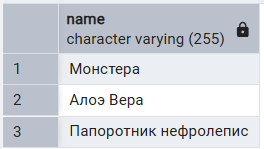

5.3. Растения, которые нужно поливать реже всего
```sql
SELECT p.name
FROM main.plant p
WHERE p.watering_id <= ALL (
    SELECT p2.watering_id
    FROM main.plant p2
    WHERE p2.watering_id IS NOT NULL
);

```
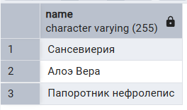


6. IN

6.1. Растения, у которых есть советы
```sql
SELECT p.name
FROM main.plant p
WHERE p.id IN (SELECT pt.plant_id FROM links.plant_tip pt);
```
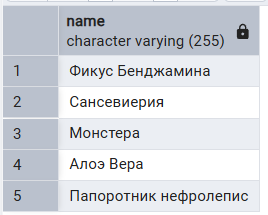

6.2. Растения, которым нужен свет
```sql
SELECT p.name
FROM main.plant p
WHERE p.sunlight_id IN (
    SELECT s.id
    FROM refs.sunlight s
    WHERE s.type IN ('Прямой свет', 'Рассеянный свет')
);
```
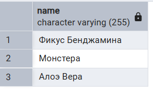

6.3. Растения, советы для которых говорят о поливе
```sql
SELECT p.name
FROM main.plant p
WHERE p.id IN (
    SELECT pt.plant_id FROM links.plant_tip pt
    WHERE pt.tip_id IN (
        SELECT t.id
        FROM main.advice t
        WHERE t.tip_text ILIKE '%полив%'
    )
);
```
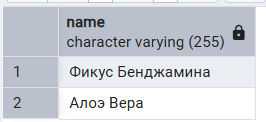


7. ANY

7.1. Растения с уровнем сложности ниже, чем у самого сложного
```sql
SELECT p.name
FROM main.plant p
WHERE p.difficulty_id < ANY (
    SELECT d.id
    FROM refs.difficulty d
    WHERE d.id > 2
);
```
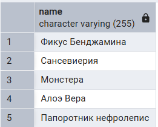

7.2. Растения, которые используют удобрение, встречающееся хотя бы у одного другого растения
```sql
SELECT p.name
FROM main.plant p
WHERE p.fertilizer_id = ANY (
    SELECT p2.fertilizer_id
    FROM main.plant p2
    WHERE p2.id <> p.id
);
```
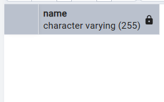

7.3. Растения, которые требуют температуру, совпадающую хотя бы с одной из температур, используемых растениями с типом освещения «Тень»
```sql
SELECT p.name
FROM main.plant p
WHERE p.temperature_id = ANY (
    SELECT p2.temperature_id
    FROM main.plant p2
    WHERE p2.sunlight_id IN (SELECT s.id FROM refs.sunlight s WHERE s.type = 'Тень'
    )
);
```
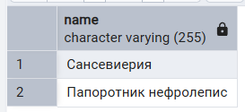


8. EXIST

8.1. Растения, у которых есть хотя бы один совет
```sql
SELECT p.name
FROM main.plant p
WHERE EXISTS (
    SELECT 1
    FROM links.plant_tip pt
    WHERE pt.plant_id = p.id
);
```
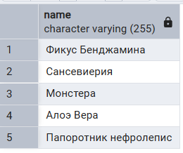

8.2. Растения, у которых есть хотя бы одна дополнительная характеристика
```sql
SELECT p.name
FROM main.plant p
WHERE EXISTS (
    SELECT 1
    FROM links.plant_feature pf
    WHERE pf.plant_id = p.id
);
```
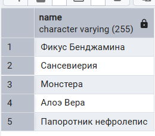

8.3. Растения, которые используют удобрение, для которого указано описание
```sql
SELECT p.name
FROM main.plant p
WHERE EXISTS (
    SELECT 1
    FROM main.fertilizer f
    WHERE f.id = p.fertilizer_id AND f.usage IS NOT NULL AND f.usage <> ''
);
```
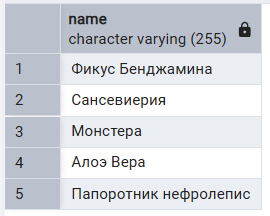


9. Сравнение по нескольким столбцам

9.1. Растения с тем же размером и поливом, что и у фикуса
```sql
SELECT p.name
FROM main.plant p
WHERE (p.size_id, p.watering_id) = (
    SELECT p2.size_id, p2.watering_id
    FROM main.plant p2
    WHERE p2.name ilike '%фикус%'
);
```
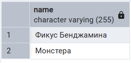

9.2. Растения, использующие те же температуру и удобрение, что и какое-либо растение с типом освещения «Тень»
```sql
SELECT p.name
FROM main.plant p
WHERE (p.temperature_id, p.fertilizer_id) IN (
    SELECT p2.temperature_id, p2.fertilizer_id
    FROM main.plant p2
    WHERE p2.sunlight_id IN (
        SELECT s.id FROM refs.sunlight s WHERE s.type = 'Тень'
    )
);
```
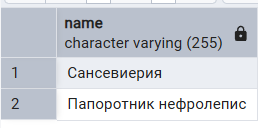

9.3. Растения, у которых совпадают сложность и безопасность с любым другим растением
```sql
SELECT p.name
FROM main.plant p
WHERE (p.difficulty_id, p.safety_id) IN (
    SELECT p2.difficulty_id, p2.safety_id
    FROM main.plant p2
    WHERE p2.id <> p.id
);
```
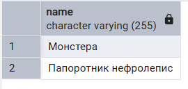


10. Коррелированные подзапросы

10.1. Количество советов для каждого растения
```sql
SELECT 
    p.name,
    (SELECT COUNT(*) 
     FROM links.plant_tip pt 
     WHERE pt.plant_id = p.id) AS tip_count
FROM main.plant p;
```
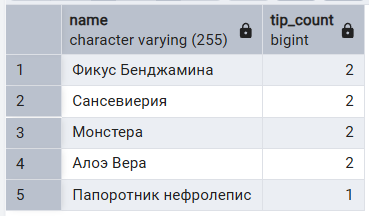

10.2. Есть ли советы, содержащие название растения
```sql
SELECT 
    p.name
FROM main.plant p
WHERE EXISTS (
    SELECT 1
    FROM main.advice a
    JOIN links.plant_tip pt ON pt.tip_id = a.id
    WHERE pt.plant_id = p.id AND a.tip_text ILIKE '%' || p.name || '%'
);
```
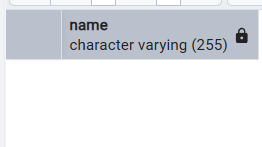

10.3. Растения со сложностью, большей, чем средняя сложность всех растений с таким же типом освещения
```sql
SELECT 
    p.name
FROM main.plant p
WHERE p.difficulty_id > (
    SELECT AVG(p2.difficulty_id)
    FROM main.plant p2
    WHERE p2.sunlight_id = p.sunlight_id
);
```
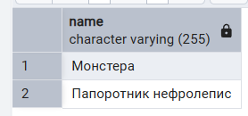

10.4. Растения, у которых меньше характеристик, чем у растений с тем же типом безопасности
```sql
SELECT p.name
FROM main.plant p
WHERE (
    SELECT COUNT(*) FROM links.plant_feature pf WHERE pf.plant_id = p.id
	) < (
    SELECT AVG(f_count)
    FROM (
        SELECT p2.id, COUNT(pf2.feature_id) AS f_count
        FROM main.plant p2 LEFT JOIN links.plant_feature pf2 ON pf2.plant_id = p2.id
        WHERE p2.safety_id = p.safety_id
        GROUP BY p2.id
    ) sub
);
```
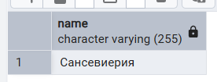


10.5. Растения, которые используют те же удобрения, что и растения с максимальной сложностью того же типа освещения
```sql
SELECT p.name
FROM main.plant p
WHERE EXISTS (
    SELECT 1
    FROM main.plant p2
    WHERE p2.fertilizer_id = p.fertilizer_id AND p2.difficulty_id = (
          SELECT MAX(p3.difficulty_id)
          FROM main.plant p3
          WHERE p3.sunlight_id = p.sunlight_id
      )
);
```
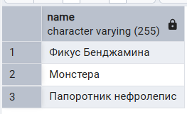