1. CTE

1.1. Растения с названием удобрения
```sql
WITH plant_fertilizer AS (
    SELECT p.name AS plant_name, f.name AS fertilizer_name
    FROM main.plant p
    JOIN main.fertilizer f ON p.fertilizer_id = f.id
)
SELECT * FROM plant_fertilizer;
```
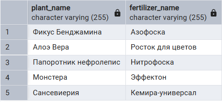

1.2. Растения с типом освещения
```sql
WITH plant_sunlight AS (
    SELECT p.name, s.type AS sunlight_type
    FROM main.plant p
    JOIN refs.sunlight s ON p.sunlight_id = s.id
)
SELECT * FROM plant_sunlight;
```
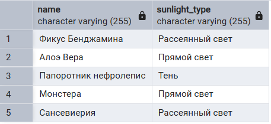

1.3. Растения с уровнем сложности
```sql
WITH plant_safety AS (
    SELECT p.name, s.type AS safety_type
    FROM main.plant p
    JOIN refs.safety s ON p.safety_id = s.id
)
SELECT * FROM plant_safety;
```
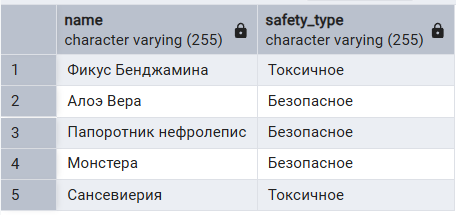

1.4. Растения с уровнем безопасности
```sql
WITH plant_difficulty AS (
    SELECT p.name, d.type AS difficulty_type
    FROM main.plant p
    JOIN refs.difficulty d ON p.difficulty_id = d.id
)
SELECT * FROM plant_difficulty;
```
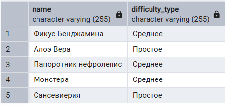

1.5. Растения с типом температуры
```sql
WITH plant_temperature AS (
	SELECT p.name, t.type AS temperature_type
	FROM main.plant p
	JOIN refs.temperature t ON p.temperature_id = t.id
)
SELECT * FROM plant_temperature;
```
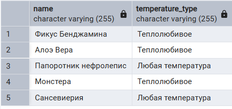

2. UNION

2.1. Типы температуры и уровни безопасности
```sql 
SELECT type FROM refs.temperature 
UNION 
SELECT type FROM refs.safety;
```
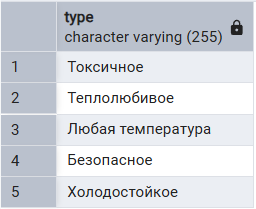

2.2. Типы освещения и полива
```sql
SELECT type FROM refs.sunlight
UNION
SELECT type FROM refs.watering;
```
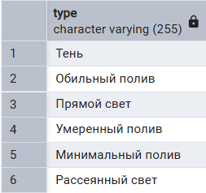

2.3. Уровни сложности и размеры
```sql 
SELECT type FROM refs.difficulty 
UNION 
SELECT type FROM refs.size;
```
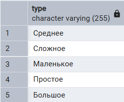

3. INTERSECT

3.1. Уровни сложности, которые совпадают с размером
```sql
SELECT type FROM refs.difficulty
INTERSECT
SELECT type FROM refs.size;
```


3.2. Растения, у которых и тип освещения, и уровень сложности совпадают с определёнными значениями
```sql
SELECT name FROM main.plant WHERE sunlight_id = 1
INTERSECT 
SELECT name FROM main.plant WHERE difficulty_id = 2;
```
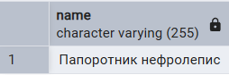

3.3. Советы, которые встречаются в двух различных диапазонах id
```sql 
SELECT tip_text FROM main.advice WHERE id BETWEEN 1 AND 5 
INTERSECT 
SELECT tip_text FROM main.advice WHERE id BETWEEN 4 AND 10;
```
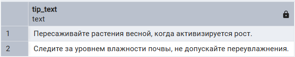

4. EXCEPT

4.1. Уровни сложности, которые отсутствуют среди размеров
```sql
SELECT type FROM refs.difficulty
EXCEPT
SELECT type FROM refs.size;
```
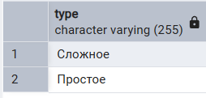

4.2. Названия растений, кроме тех, у которых уровень безопасности 1
```sql
SELECT name FROM main.plant 
EXCEPT 
SELECT name FROM main.plant WHERE safety_id = 1;
```
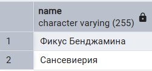

4.3. Названия характеристик, которые не отмечены как безопасные
```sql
SELECT name FROM refs.feature 
EXCEPT 
SELECT name FROM refs.feature WHERE safety_flag = TRUE;
```
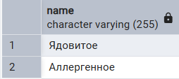

5. PARTITION BY

5.1. Подсчет количества типов освещения
```sql 
SELECT type, COUNT(*) OVER(PARTITION BY type) AS type_count
FROM refs.sunlight;
```
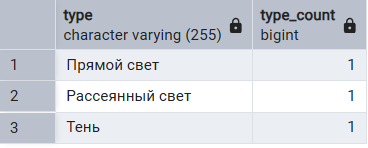

5.2. Подсчет количества типов полива
```sql
SELECT type, COUNT(*) OVER(PARTITION BY type) AS type_count
FROM refs.watering;
```
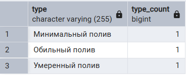

6. PARTITION BY + ORDER BY

6.1. Количество растений в каждой группе по уровню сложности с порядком по имени
```sql 
SELECT name, difficulty_id,
  COUNT(*) OVER (PARTITION BY difficulty_id ORDER BY name) AS count_per_difficulty 
FROM main.plant;
```
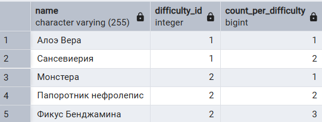

6.2. Средняя длина текста советов в каждой группе по номеру id с порядком по id
```sql
SELECT id, tip_text,
  AVG(LENGTH(tip_text)) OVER (PARTITION BY id ORDER BY tip_text) AS avg_length
FROM main.advice;
```
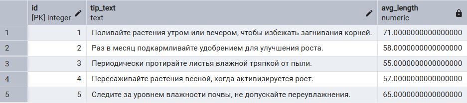

7. ROWS

7.1. Количество растений в каждой группе по уровню сложности, упорядоченных по имени, с подсчетом за текущую и 1 предыдущую строку
```sql 
SELECT name, difficulty_id,
  COUNT(*) OVER (PARTITION BY difficulty_id ORDER BY name ROWS BETWEEN 1 PRECEDING AND CURRENT ROW) AS count_prev_1_and_current
FROM main.plant;
```
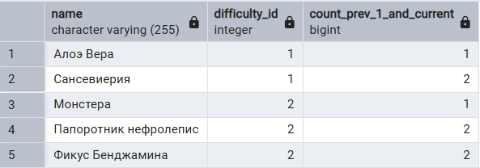

7.2. Количество растений в каждой группе по уровню безопасности, упорядоченных по имени, с подсчетом за 1 следующую, текущую и 1 предыдущую строку
```sql
SELECT name, safety_id,
  COUNT(*) OVER (PARTITION BY safety_id ORDER BY name ROWS BETWEEN 1 PRECEDING AND 1 FOLLOWING) AS count_safety_neighbourhood
FROM main.plant;
```


8. RANGE

8.1. Количество растений по уровню сложности в диапазоне id от текущего до 2 ниже
```sql 
SELECT id, name, difficulty_id, 
  COUNT(*) OVER (PARTITION BY difficulty_id ORDER BY id RANGE BETWEEN 2 PRECEDING
  AND CURRENT ROW) AS count_in_range 
FROM main.plant;
```
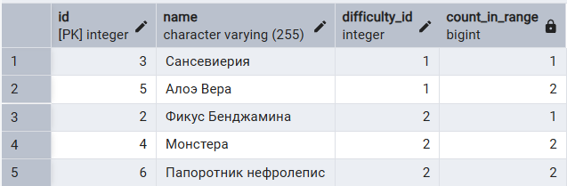

8.2. Количество растений по уровню безопасности в диапазоне id от текущего до 1 ниже 
```sql
SELECT id, name, safety_id, 
  COUNT(*) OVER (PARTITION BY safety_id ORDER BY id RANGE BETWEEN 1 PRECEDING AND    CURRENT ROW) AS count_in_range
FROM main.plant;
```


9. Ранжирующие функции

9.1. Нумерация растений в каждой группе по уровню безопасности, упорядоченная по имени
```sql 
SELECT name, safety_id,
  ROW_NUMBER() OVER (PARTITION BY safety_id ORDER BY name) AS row_num_in_safety
FROM main.plant;
```
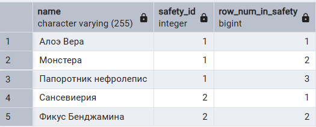

9.2. Pанжирование уровней интенсивности в группах с одинаковым флагом безопасности
```sql
SELECT name, intensity_level, safety_flag,
  RANK() OVER (PARTITION BY safety_flag ORDER BY intensity_level) AS rank_intensity
FROM refs.feature;
```
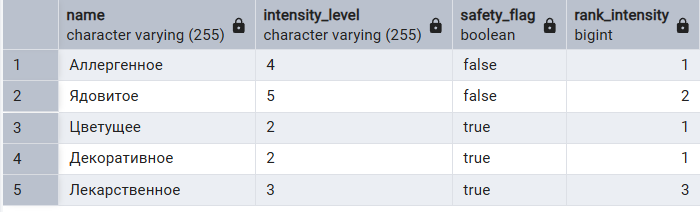

9.3. Плотное ранжирование растений по уровню безопасности в группах с одинаковым типом полива
```sql
SELECT name, safety_id, watering_id,
  DENSE_RANK() OVER (PARTITION BY watering_id ORDER BY safety_id) AS 
  rank_safety_in_watering
FROM main.plant;
```
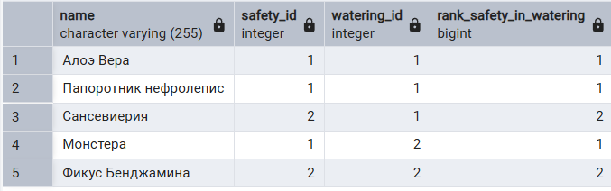

10. Функции смещения

10.1. Предыдущее значение уровня сложности для растений в каждой группе, упорядоченный по имени
```sql
SELECT name, difficulty_id,
  LAG(difficulty_id) OVER (PARTITION BY difficulty_id ORDER BY name) AS 
  prev_difficulty_in_group
FROM main.plant;
```
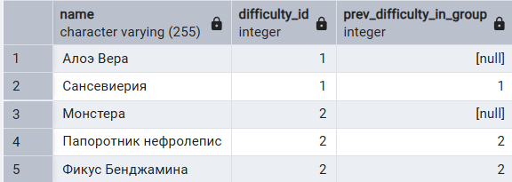

10.2. Следующий уровень безопасности для растений в каждой группе размера, упорядоченный по имени
```sql 
SELECT name, size_id, difficulty_id, 
  LEAD(difficulty_id) OVER (PARTITION BY size_id ORDER BY name) AS
  next_difficulty_in_size
FROM main.plant;
```
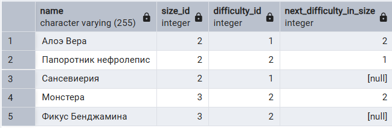

10.3. Первый тип удобрения в каждой группе по типу полива, упорядоченный по имени
```sql
SELECT name, watering_id, fertilizer_id,
  FIRST_VALUE(fertilizer_id) OVER (PARTITION BY watering_id ORDER BY name) AS
  first_fertilizer_in_watering
FROM main.plant;
```


10.4. Последний тип удобрения в каждой группе по уровню безопасности, упорядоченный по имени
```sql
SELECT name, safety_id, fertilizer_id,
  LAST_VALUE(fertilizer_id) OVER (PARTITION BY safety_id ORDER BY name) AS 
  last_fertilizer_in_safety
FROM main.plant;
```
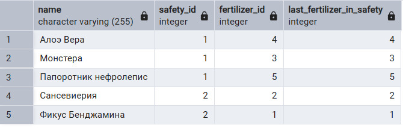