ЧАСТЬ 1. Базовые операции с транзакциями

1.1. Добавление нового растения и обновление связи с советом
```sql
BEGIN;

-- Добавляем новое растение
INSERT INTO main.plant (
    name,
    description,
    sunlight_id,
    watering_id,
    temperature_id,
    safety_id,
    difficulty_id,
    size_id,
    fertilizer_id
) VALUES (
    'Хлорофитум',
    'Неприхотливое комнатное растение с длинными узкими листьями',
    2, 2, 2, 1, 1, 2, 3
)

-- Добавляем связь нового растения с некоторым советом
INSERT INTO links.plant_tip (plant_id, tip_id)
VALUES (6, 1);

COMMIT;
```
Результат: новое растение добавлено, связь с советом создана.
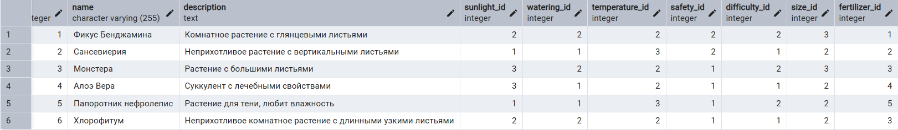
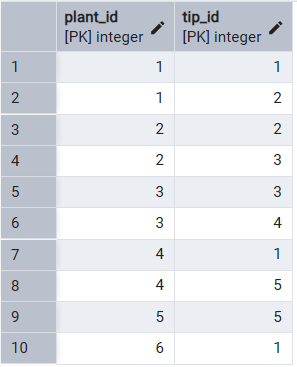


1.2. Добавление новой характеристики и обновление связи
```sql
BEGIN;

-- Добавляем новую характеристику
INSERT INTO refs.feature (
    name,
    description,
    intensity_level,
    safety_flag
) VALUES (
    'Ароматное', 'Растение выделяет приятный запах', '3', true
);

-- Добавляем связь новой характеристики с некоторым растением
INSERT INTO links.plant_feature (plant_id, feature_id)
VALUES (6, 6);

COMMIT;
```
Результат: характеристика добавлена, связь с растением создана.
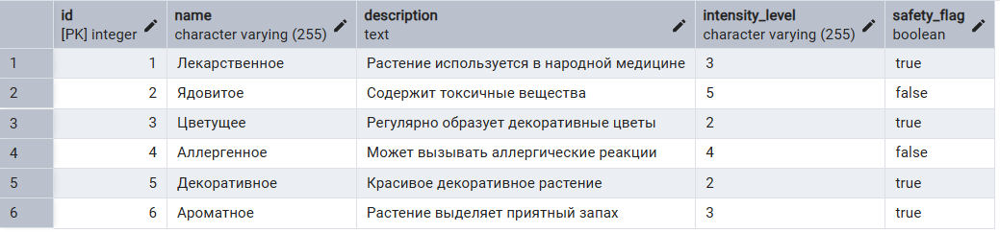
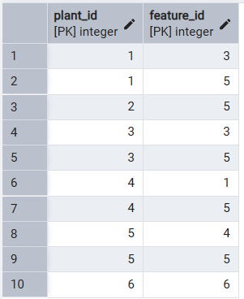


2.1. Добавление растения с ROLLBACK
```sql
BEGIN;

-- Добавляем новое растение
INSERT INTO main.plant (
    name,
    description,
    sunlight_id,
    watering_id,
    temperature_id,
    safety_id,
    difficulty_id,
    size_id,
    fertilizer_id
) VALUES (
    'Хлорофитум',
    'Неприхотливое комнатное растение с длинными узкими листьями',
    2, 2, 2, 1, 1, 2, 3
);

-- Добавляем связь нового растения с некоторым советом
INSERT INTO links.plant_tip (plant_id, tip_id)
VALUES (6, 1);

ROLLBACK;
```
Результат: изменений в базе нет — транзакция откатилась.
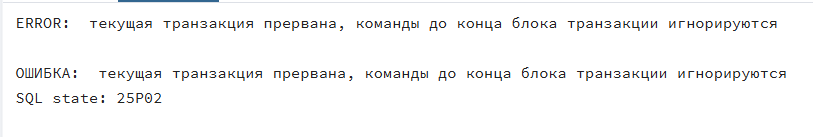


2.2. Добавление характеристики с ROLLBACK
```sql
BEGIN;

-- Добавляем новую характеристику
INSERT INTO refs.feature (
    name,
    description,
    intensity_level,
    safety_flag
) VALUES (
    'Ароматное', 'Растение выделяет приятный запах', '3', true
);

-- Добавляем связь новой характеристики с некоторым растением
INSERT INTO links.plant_feature (plant_id, feature_id)
VALUES (6, 6);

ROLLBACK;
```
Результат: изменений в базе нет — транзакция откатилась.
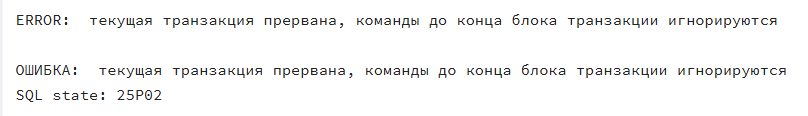


3.1. Ошибка внутри транзакции (деление на 0)
```sql
BEGIN;

-- Добавляем новую характеристику
INSERT INTO refs.feature (
    name, description, intensity_level, safety_flag
) VALUES (
    'Запрос с ошибкой', 'Характеристика не должна сохраниться', '2', true
);

-- Добавляем ошибку
SELECT 1 / 0;

-- Добавляем связь новой характеристики с некоторым растением
INSERT INTO links.plant_feature (plant_id, feature_id)
VALUES (3, 7);

COMMIT;
```
Результат: все изменения откатились из-за ошибки.
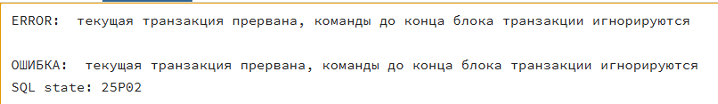


3.2. Ошибка вставки связей с несуществующей записью
```sql
BEGIN;

-- Добавляем новую характеристику
INSERT INTO refs.feature (
    name, description, intensity_level, safety_flag
) VALUES (
    'Редкое', 'Редкое растение', '4', true
);

-- Добавляем ошибку в виде добавления связи характеристики с несуществующим растением
INSERT INTO links.plant_feature (plant_id, feature_id)
VALUES (9999, 7);   -- plant_id = 9999 не существует

COMMIT;
```
Результат: все изменения откатились из-за ошибки.
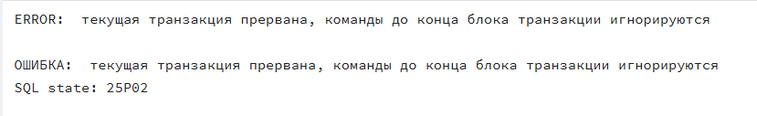


ЧАСТЬ 2. Уровни изоляции.

1. READ UNCOMMITTED / READ COMMITTED
Вывод: PostgreSQL не поддерживает грязное чтение — T2 видит только коммитнутые данные.

1.1. READ UNCOMMITTED: пытаемся обновить описание у растения с id = 1 без COMMIT и затем прочитать данные.

T1:
```sql
BEGIN TRANSACTION ISOLATION LEVEL READ UNCOMMITTED;

UPDATE main.plant
SET description = 'Новое описание для UNREAD COMMITTED'
WHERE id = 1;
```

T2:
```sql
BEGIN TRANSACTION ISOLATION LEVEL READ UNCOMMITTED;

SELECT id, name, description
FROM main.plant
WHERE id = 1;
```
Результат: T2 видит старые данные.
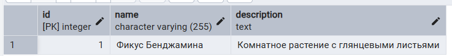


1.2. READ COMMITTED: пытаемся обновить описание у растения с id = 1 без COMMIT и затем прочитать данные.

T1:
```sql
BEGIN TRANSACTION ISOLATION LEVEL READ COMMITTED;

UPDATE main.plant
SET description = 'Новое описание для READ COMMITTED'
WHERE id = 1;
```

T2:
```sql
BEGIN TRANSACTION ISOLATION LEVEL READ COMMITTED;

SELECT id, name, description
FROM main.plant
WHERE id = 1;
```
Результат: T2 видит старые данные.
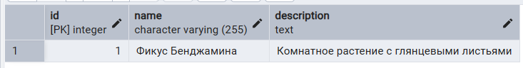


2. READ COMMITTED: неповторяющееся чтение.
Вывод: при READ COMMITTED второй SELECT видит обновленные данные.

2.1. Пытаемся обновить описание у растения с id = 1 с COMMIT и прочитать данные.

T1:
```sql
BEGIN TRANSACTION ISOLATION LEVEL READ COMMITTED;

SELECT id, name, description
FROM main.plant
WHERE id = 1;
```

T2:
```sql
BEGIN TRANSACTION ISOLATION LEVEL READ COMMITTED;

UPDATE main.plant
SET description = 'Новое описание от транзакции 2'
WHERE id = 1;

COMMIT;
```

T1:
```sql
SELECT id, name, description
FROM main.plant
WHERE id = 1;
```
Результат: Второй SELECT видит новые данные.
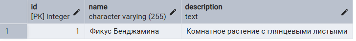


2.2. Пытаемся обновить требуемое освещение у растения с id = 2 с COMMIT и прочитать данные.

T1:
```sql
BEGIN TRANSACTION ISOLATION LEVEL READ COMMITTED;

SELECT id, name, sunlight_id
FROM main.plant
WHERE id = 2;
```

T2:
```sql
BEGIN TRANSACTION ISOLATION LEVEL READ COMMITTED;

UPDATE main.plant
SET sunlight_id = 3
WHERE id = 2;

COMMIT;
```

T1:
```sql
SELECT id, name, sunlight_id
FROM main.plant
WHERE id = 2;
```
Результат: Второй SELECT видит новые данные.
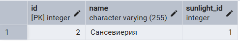
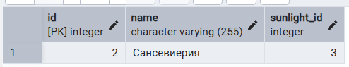


3. REPEATABLE READ
Вывод: T1 не видит изменения от T2 до завершения собственной транзакции.

3.1. Пытаемся обновить описание растения с id = 3 с COMMIT и прочитать данные.

T1:
```sql
BEGIN TRANSACTION ISOLATION LEVEL REPEATABLE READ;

SELECT id, name, description
FROM main.plant
WHERE id = 3;
```

T2:
```sql
BEGIN TRANSACTION ISOLATION LEVEL REPEATABLE READ;

UPDATE main.plant
SET description = 'Описание, изменённое в T2'
WHERE id = 3;

COMMIT;
```

T1:
```sql
SELECT id, name, description
FROM main.plant
WHERE id = 3;
```
Результат: Второй SELECT не видит новые данные.
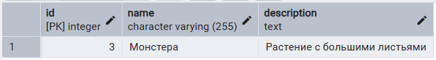
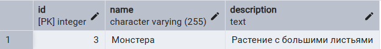


3.2. Фантомные данные: выводим все растения с размером size_id = 2 и пытаемся добавить новое растение с таким размером.

T1:
```sql
BEGIN TRANSACTION ISOLATION LEVEL REPEATABLE READ;

SELECT id, name, size_id
FROM main.plant
WHERE size_id = 2;
```

T2:
```sql
BEGIN TRANSACTION ISOLATION LEVEL REPEATABLE READ;

INSERT INTO main.plant (
    name,
    description,
    sunlight_id,
    watering_id,
    temperature_id,
    safety_id,
    difficulty_id,
    size_id,
    fertilizer_id
) VALUES (
    'Фантомное растение',
    'Описание фантомного растения',
    1, 1, 1, 1, 1, 2, 1
);

COMMIT;
```

T1:
```sql
SELECT id, name, size_id
FROM main.plant
WHERE size_id = 2
ORDER BY id;
```
Результат: Второй SELECT не видит новые данные.
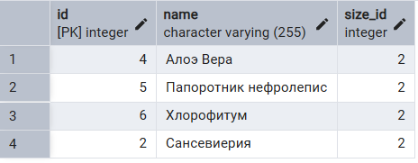
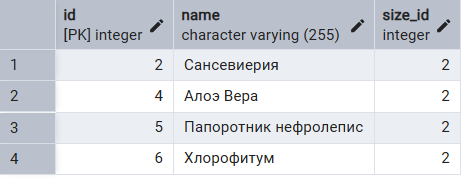


4. SERIALIZABLE
Вывод: возможен конфликт при одновременной вставке одинаковых данных, требуется повтор транзакции для второй вставки.

4.1. Пытаемся вставить два растения с одинаковым полем name.

T1:
```sql
BEGIN TRANSACTION ISOLATION LEVEL SERIALIZABLE;

SELECT * FROM main.plant WHERE name = 'растение2';
```

T2:
```sql
BEGIN TRANSACTION ISOLATION LEVEL SERIALIZABLE;

SELECT * FROM main.plant WHERE name = 'растение2';

INSERT INTO main.plant (
    name, description, sunlight_id, watering_id,
    temperature_id, safety_id, difficulty_id,
    size_id, fertilizer_id
) VALUES (
    'растение2',
    'Описание T2',
    1,1,1,1,1,1,1
);

COMMIT;
```

T1:
```sql
INSERT INTO main.plant (
    name, description, sunlight_id, watering_id,
    temperature_id, safety_id, difficulty_id,
    size_id, fertilizer_id
) VALUES (
    'растение2',
    'Описание T1',
    1,1,1,1,1,1,1
);

COMMIT;
```
Результат: Вторая вставка выдает ошибку.
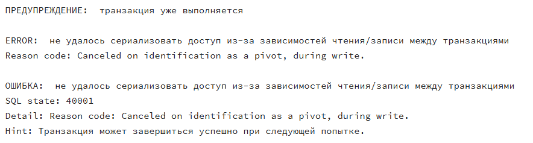


4.2. Откатываем транзакцию и повторяем вставку.

T1:
```sql
ROLLBACK;

BEGIN TRANSACTION ISOLATION LEVEL SERIALIZABLE;

SELECT * FROM main.plant WHERE name = 'растение2';

INSERT INTO main.plant (
    name, description, sunlight_id, watering_id,
    temperature_id, safety_id, difficulty_id,
    size_id, fertilizer_id
) VALUES (
    'растение2',
    'Описание T1',
    1,1,1,1,1,1,1
);

COMMIT;
```
Результат: Вторая вставка сработала.
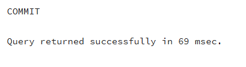


ЧАСТЬ 3. SAVEPOINT

1.1. Транзакция с одной точкой сохранения.
Вывод: Сохраняются только те изменения, что произошли до точки сохранения, если в запросе был откат до этой точки.

```sql
BEGIN;

INSERT INTO main.plant (
    name, description, sunlight_id, watering_id,
    temperature_id, safety_id, difficulty_id,
    size_id, fertilizer_id
) VALUES (
    'Растение 3',
    'Описание растения 3',
    1,1,1,1,1,1,1
);

SAVEPOINT first_savepoint;

INSERT INTO main.plant (
    name, description, sunlight_id, watering_id,
    temperature_id, safety_id, difficulty_id,
    size_id, fertilizer_id
) VALUES (
    'Растение 4',
    'Описание растения 4',
    1,1,1,1,1,1,1
);

ROLLBACK TO SAVEPOINT first_savepoint;

COMMIT;

SELECT id, name, description 
FROM main.plant;
```
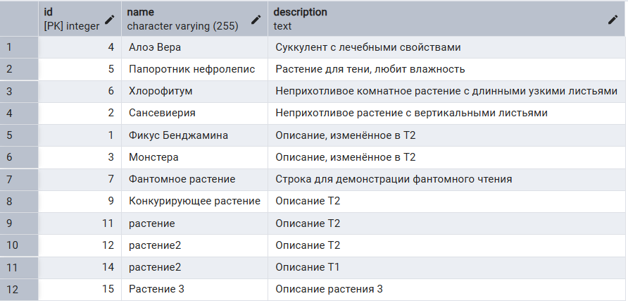


2.1. Транзакция с несколькими точками сохранения. 
Вывод: Сохраняются только те изменения, что произошли до точки сохранения, до которой был выполнен откат в запросе. 

T1:
```sql
BEGIN;

INSERT INTO main.plant (
    name, description, sunlight_id, watering_id,
    temperature_id, safety_id, difficulty_id,
    size_id, fertilizer_id
) VALUES (
    'Растение 4',
    'Описание растения 4',
    1,1,1,1,1,1,1
);

SAVEPOINT first_savepoint;

INSERT INTO main.plant (
    name, description, sunlight_id, watering_id,
    temperature_id, safety_id, difficulty_id,
    size_id, fertilizer_id
) VALUES (
    'Растение 5',
    'Описание растения 5',
    1,1,1,1,1,1,1
);

SAVEPOINT second_savepoint;

INSERT INTO main.plant (
    name, description, sunlight_id, watering_id,
    temperature_id, safety_id, difficulty_id,
    size_id, fertilizer_id
) VALUES (
    'Растение 6',
    'Описание растения 6',
    1,1,1,1,1,1,1
);

ROLLBACK TO SAVEPOINT first_savepoint;

COMMIT;

SELECT id, name, description 
FROM main.plant;

```

T2:
```sql
BEGIN;

INSERT INTO main.plant (
    name, description, sunlight_id, watering_id,
    temperature_id, safety_id, difficulty_id,
    size_id, fertilizer_id
) VALUES (
    'Растение 4',
    'Описание растения 4',
    1,1,1,1,1,1,1
);

SAVEPOINT first_savepoint;

INSERT INTO main.plant (
    name, description, sunlight_id, watering_id,
    temperature_id, safety_id, difficulty_id,
    size_id, fertilizer_id
) VALUES (
    'Растение 5',
    'Описание растения 5',
    1,1,1,1,1,1,1
);

SAVEPOINT second_savepoint;

INSERT INTO main.plant (
    name, description, sunlight_id, watering_id,
    temperature_id, safety_id, difficulty_id,
    size_id, fertilizer_id
) VALUES (
    'Растение 6',
    'Описание растения 6',
    1,1,1,1,1,1,1
);

ROLLBACK TO SAVEPOINT second_savepoint;

COMMIT;

SELECT id, name, description 
FROM main.plant;

```
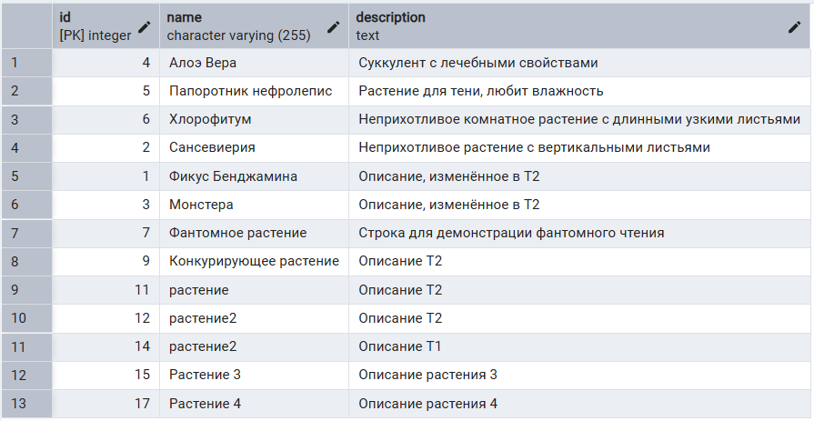
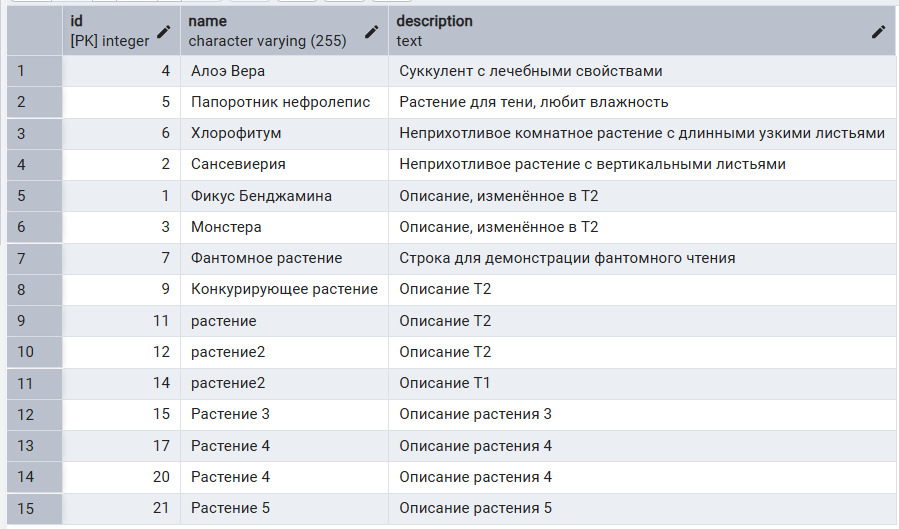