1.  Процедуры

1.1. Добавление нового растения

```sql
CREATE OR REPLACE PROCEDURE add_plant(
    p_name VARCHAR,
    p_description TEXT,
    p_sunlight_id INT,
    p_watering_id INT,
    p_temperature_id INT,
    p_safety_id INT,
    p_difficulty_id INT,
    p_size_id INT,
    p_fertilizer_id INT
)
LANGUAGE plpgsql
AS $$
BEGIN
    INSERT INTO main.plant (
        name, description, sunlight_id, watering_id, temperature_id,
        safety_id, difficulty_id, size_id, fertilizer_id)
    VALUES (
        p_name, p_description, p_sunlight_id, p_watering_id, p_temperature_id,
        p_safety_id, p_difficulty_id, p_size_id, p_fertilizer_id);
END;
$$;

CALL add_plant('Спатифиллум','Неприхотливое комнатное растение с красивыми белыми соцветиями',2, 2, 2, 2, 1, 2, 3);
```


1.2. Обновление инструкции по использованию удобрения для растения

 ```sql
CREATE OR REPLACE PROCEDURE update_fertilizer_usage_for_plant(
    p_plant_id INT,
    p_usage TEXT
)
LANGUAGE plpgsql 
AS $$
BEGIN
    UPDATE main.fertilizer
    SET usage = p_usage
    WHERE id = (SELECT fertilizer_id FROM main.plant WHERE id = p_plant_id);
END;
$$;

CALL update_fertilizer_usage_for_plant(1, 'Используйте ранней весной для стимуляции роста побегов');
 ```

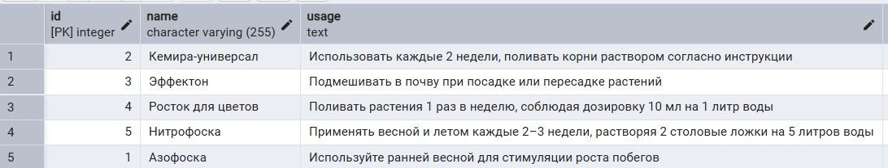

1.3. Обновление уровня сложности у растений, если оно не назначено

```sql
CREATE OR REPLACE PROCEDURE safe_assign_difficulty(p_difficulty_id INT)
LANGUAGE plpgsql
AS $$
BEGIN
    UPDATE main.plant
    SET difficulty_id = p_difficulty_id
    WHERE difficulty_id IS NULL;
END;
$$;

CALL safe_assign_difficulty(1);
```

До:

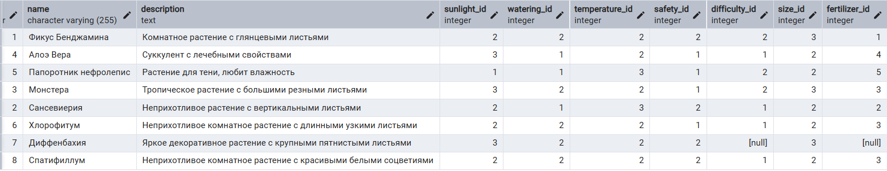

Результат выполнения:

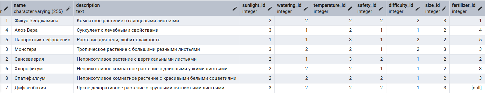

Просмотр всех процедур:

```sql
SELECT routine_name, routine_type
FROM information_schema.routines
WHERE routine_type = 'PROCEDURE' AND routine_schema = 'public';
```

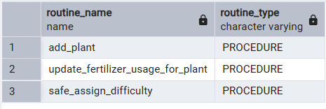

2. Функции

2.1. Получение имени растения по ID

```sql
CREATE OR REPLACE FUNCTION get_plant_name(p_plant_id INT)
RETURNS VARCHAR 
LANGUAGE plpgsql
AS $$
BEGIN
    RETURN (SELECT name FROM main.plant WHERE id = p_plant_id);
END;
$$;

SELECT get_plant_name(1) AS plant_name;
```

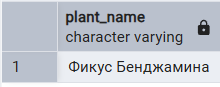

2.2. Подсчёт количества растений с конкретным уровнем сложности

```sql
CREATE OR REPLACE FUNCTION count_plants_by_difficulty(p_difficulty_id INT)
RETURNS INT 
LANGUAGE plpgsql
AS $$
BEGIN
    RETURN (SELECT COUNT(*) FROM main.plant WHERE difficulty_id = p_difficulty_id);
END;
$$;

SELECT count_plants_by_difficulty(2) AS count_of_plants;
```

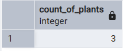

2.3. Получение инструкции удобрения по ID растения

```sql
CREATE OR REPLACE FUNCTION get_fertilizer_usage_by_plant(p_plant_id INT)
RETURNS TEXT
LANGUAGE plpgsql
AS $$
BEGIN
    RETURN (
        SELECT usage FROM main.fertilizer
        WHERE id = (SELECT fertilizer_id FROM main.plant WHERE id = p_plant_id)
    );
END;
$$;

SELECT get_fertilizer_usage_by_plant(1) AS fertilizer_usage_by_plant;
```

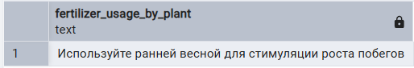

Функции с переменными

2.4. Проверка, относится ли растение к определённому уровню сложности

```sql
CREATE OR REPLACE FUNCTION is_plant_difficulty(p_plant_id INT, p_difficulty_id INT)
RETURNS BOOLEAN
LANGUAGE plpgsql
AS $$
DECLARE
    current_difficulty INT;
BEGIN
    SELECT difficulty_id INTO current_difficulty FROM main.plant WHERE id = p_plant_id;
    RETURN current_difficulty = p_difficulty_id;
END;
$$;

SELECT is_plant_difficulty(1, 1) AS plant_difficulty;
```

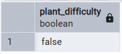

2.5.  Получение количества советов для растения

```SQL
CREATE OR REPLACE FUNCTION count_advice_for_plant(p_plant_id INT)
RETURNS INT
LANGUAGE plpgsql
AS $$
DECLARE
    cnt INT;
BEGIN
    SELECT COUNT(*) INTO cnt
    FROM links.plant_tip pt
    WHERE pt.plant_id = p_plant_id;
    RETURN cnt;
END;
$$;

SELECT count_advice_for_plant(1) AS count_of_advice;
```

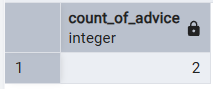

2.6. Получение количества растений с определённым типом освещения

```sql
CREATE OR REPLACE FUNCTION count_plants_by_sunlight(p_sunlight_id INT)
RETURNS INT 
LANGUAGE plpgsql
AS $$
DECLARE
    cnt INT;
BEGIN
    SELECT COUNT(*) INTO cnt FROM main.plant WHERE sunlight_id = p_sunlight_id;
    RETURN cnt;
END;
$$;

SELECT count_plants_by_sunlight(1) AS count_of_plant;
```

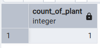

Просмотр всех функций:

```sql
SELECT routine_name, routine_type
FROM information_schema.routines
WHERE routine_type = 'FUNCTION' AND routine_schema = 'public';
```

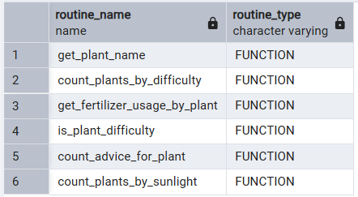

3. Блок DO

3.1. Вставка нескольких советов

```sql
DO $$
BEGIN
    INSERT INTO main.advice (tip_text) VALUES ('Обеспечьте растению достаточное количество естественного света, особенно утром и вечером');
    INSERT INTO main.advice (tip_text) VALUES ('Регулярно проветривайте помещение с растениями для предотвращения появления грибков и плесени');
END;
$$ LANGUAGE plpgsql;
```

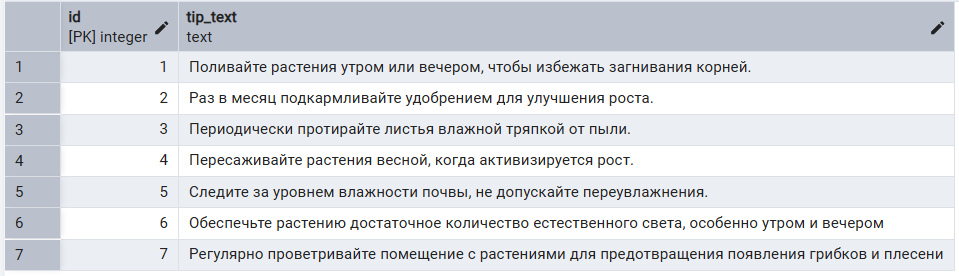

3.2. Обновление удобрения у растений, если удобрение не назначено

```sql
DO $$
BEGIN
    UPDATE main.plant
    SET fertilizer_id = (SELECT id FROM main.fertilizer LIMIT 1)
    WHERE fertilizer_id IS NULL;
END;
$$ LANGUAGE plpgsql;
```

До:

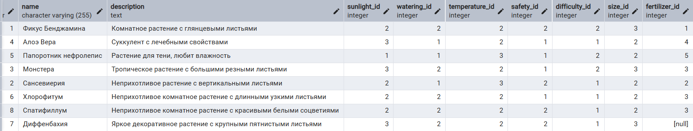

Результат выполнения:


3.3. Удаление уровней сложности без растений

```sql
DO $$
BEGIN
    DELETE FROM refs.difficulty
    WHERE id NOT IN (SELECT difficulty_id FROM main.plant WHERE difficulty_id IS NOT NULL);
END;
$$ LANGUAGE plpgsql;
```

До:

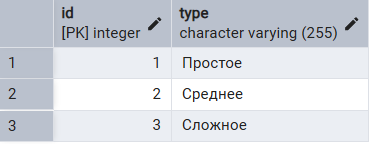

Результат выполнения:


4. IF

Добавление растения в зависимости от количества растений легких в уходе

```sql
DO $$
DECLARE
    easy_count INT;
BEGIN
    SELECT COUNT(*) INTO easy_count FROM main.plant WHERE difficulty_id = 1;
    IF easy_count < 3 THEN
        INSERT INTO main.plant (
            name, description, sunlight_id, watering_id, temperature_id,
            safety_id, difficulty_id, size_id, fertilizer_id
        ) VALUES (
		     'Замиокулькас', 
		     'Очень устойчивое к засухе, любит рассеянный свет', 
		     2, 1, 2, 1, 1, 2, 1
        );
	ELSE 
		 INSERT INTO main.plant (
            name, description, sunlight_id, watering_id, temperature_id,
            safety_id, difficulty_id, size_id, fertilizer_id
        ) VALUES (
            'Дипладения',
            'Вьющееся растение с крупными яркими цветками.',
            2, 2, 2, 2, 2, 2, 3
        );
    END IF;
END;
$$ LANGUAGE plpgsql;
```

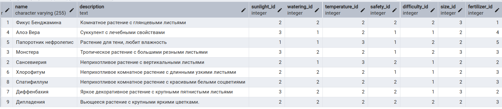

5. CASE

Присваивание описания определённому растению в зависимости от его размера

```sql
DO $$
DECLARE
    the_id INT := 1;
    new_description TEXT;
    size INT;
BEGIN
    SELECT size_id INTO size FROM main.plant WHERE id = the_id;
    new_description := CASE
        WHEN size = 1 THEN 'Компактное растение'
        WHEN size = 2 THEN 'Среднего размера'
        WHEN size = 3 THEN 'Крупное комнатное растение'
        ELSE 'Размер не определён'
    END;
    UPDATE main.plant SET description = new_description WHERE id = the_id;
END;
$$ LANGUAGE plpgsql;
```

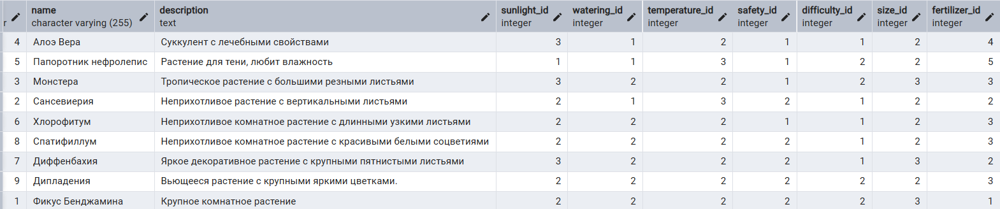

6. WHILE

6.1. Увеличение размера всех средних растений на единицу, пока такие растения есть

```sql
DO $$
DECLARE
    middle_id INT;
BEGIN
    SELECT id INTO middle_id FROM main.plant WHERE size_id = 2 LIMIT 1;
    WHILE middle_id IS NOT NULL LOOP
        UPDATE main.plant SET size_id = size_id + 1 WHERE id = middle_id;
        SELECT id INTO middle_id FROM main.plant WHERE size_id = 2 LIMIT 1;
    END LOOP;
END;
$$ LANGUAGE plpgsql;
```

До:


Результат выполнения:


6.2. Обновление уровня безопасности у растений с определённым значением

```sql
DO $$
DECLARE
    plant_to_fix INT;
BEGIN
    SELECT id INTO plant_to_fix FROM main.plant WHERE safety_id = 2 LIMIT 1;
    WHILE plant_to_fix IS NOT NULL LOOP
        UPDATE main.plant SET safety_id = 1 WHERE id = plant_to_fix;
        SELECT id INTO plant_to_fix FROM main.plant WHERE safety_id = 2 LIMIT 1;
    END LOOP;
END;
$$ LANGUAGE plpgsql;
```

До:

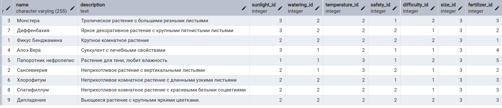

Результат выполнения:

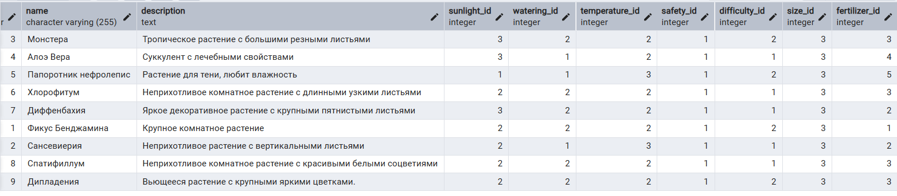

7.  EXCEPTION

7.1. Попытка удалить удобрение, если оно связано хотя бы с одним растением — выводим предупреждение

```sql
DO $$
BEGIN
    BEGIN
        DELETE FROM main.fertilizer WHERE id = 1;
    EXCEPTION
        WHEN foreign_key_violation THEN
            RAISE NOTICE 'Это удобрение используется у какого-то растения и не может быть удалено.';
    END;
END;
$$ LANGUAGE plpgsql;
```

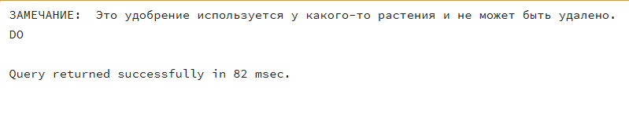

7.2. Попытка добавить растение, если уже есть такое имя — выводим предупреждение

```sql
DO $$
BEGIN
    BEGIN
        INSERT INTO main.plant (
            name, description, sunlight_id, watering_id, temperature_id,
            safety_id, difficulty_id, size_id, fertilizer_id
        ) VALUES (
            'Дипладения',
            'Вьющееся растение с крупными яркими цветками.',
            2, 2, 2, 1, 2, 3, 3
        );
    EXCEPTION
        WHEN unique_violation THEN
            RAISE NOTICE 'Растение с таким именем уже существует!';
    END;
END;
$$ LANGUAGE plpgsql;
```

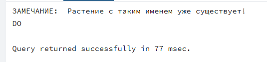

8. RAISE

8.1. Сообщение об ошибке, если в таблице нет ни одного растения с выбранным типом освещения

```sql
DO $$
DECLARE
    cnt INT;
BEGIN
    SELECT COUNT(*) INTO cnt FROM main.plant WHERE sunlight_id = 1;
    IF cnt = 0 THEN
        RAISE EXCEPTION 'Нет ни одного растения с sunlight_id = 1!';
    ELSE
        RAISE NOTICE 'Найдено растений с sunlight_id = 1: %', cnt;
    END IF;
END;
$$ LANGUAGE plpgsql;
```

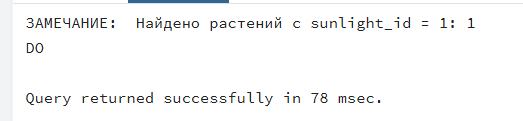

8.2. Сообщение об ошибке, если попытка добавить растение с размером вне диапазона 1–3

```sql
DO $$
DECLARE
    new_size_id INT := 5;
BEGIN
    IF new_size_id < 1 OR new_size_id > 3 THEN
        RAISE EXCEPTION 'Недопустимый размер растения (size_id=%).', new_size_id;
    ELSE
        INSERT INTO main.plant (
            name, description, sunlight_id, watering_id, temperature_id,
            safety_id, difficulty_id, size_id, fertilizer_id
        ) VALUES (
            'Тестовое растение',
            'Описание...',
            2, 2, 2, 2, 2, new_size_id, 2
        );
    END IF;
END;
$$ LANGUAGE plpgsql;
```

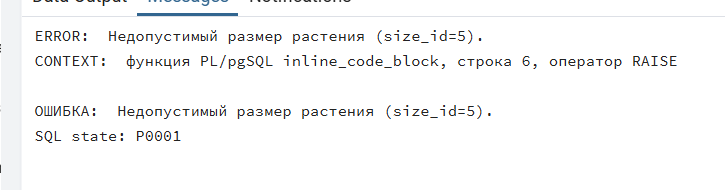