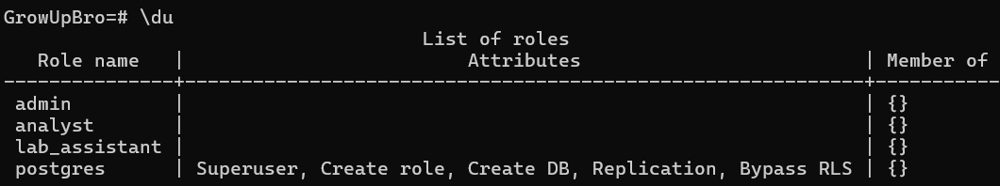
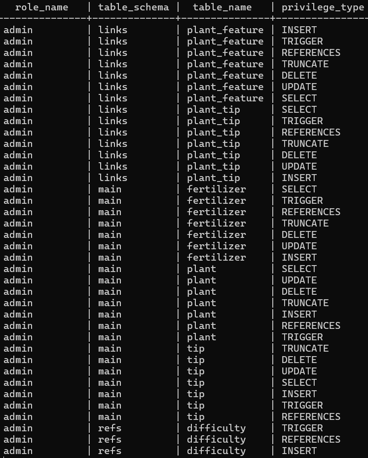
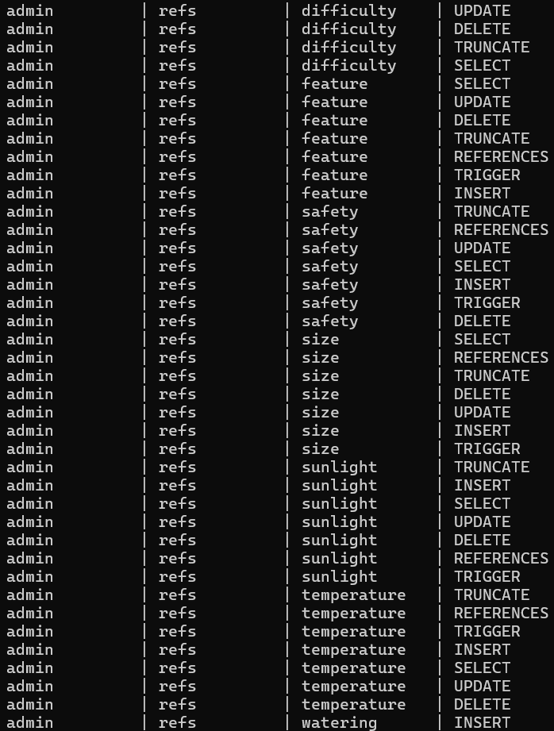
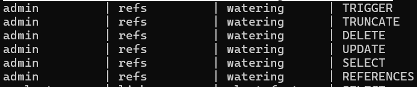
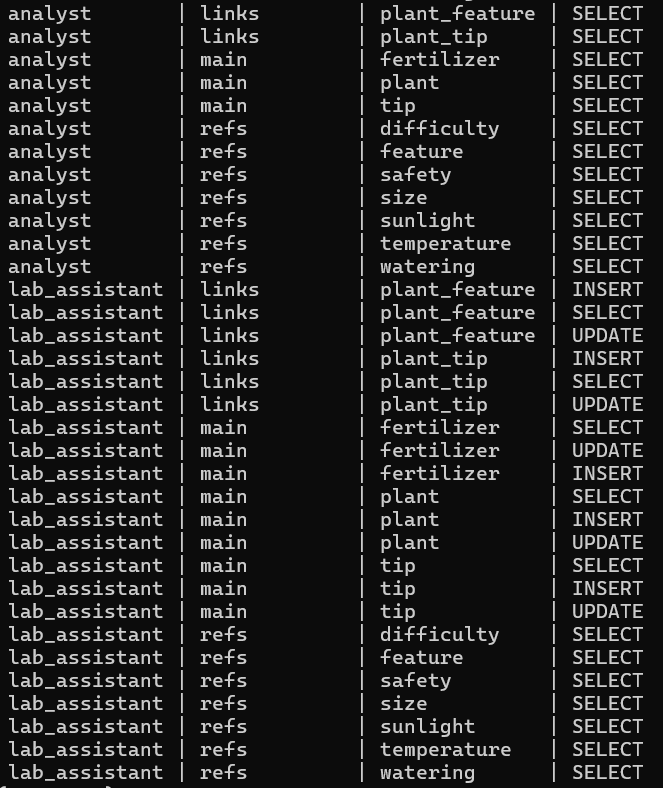
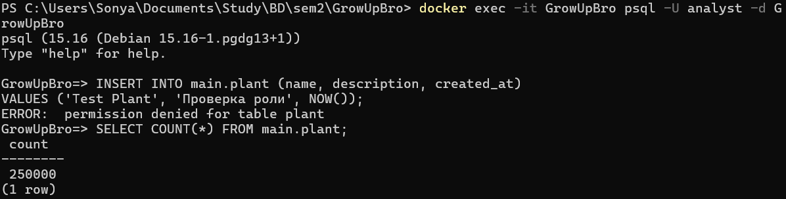
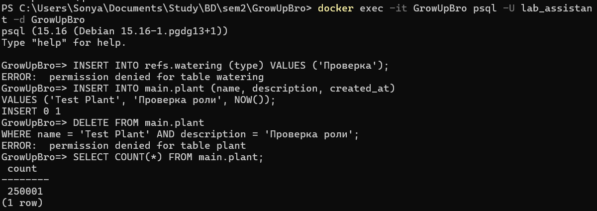

Для поднятия базы в Docker:
```bash
docker-compose up -d postgres pgadmin
docker-compose run --rm flyway
```

Все роли:



Проверка прав у каждой из ролей:
```bash
docker exec -it GrowUpBro psql -U postgres -d GrowUpBro
```
```sql
SELECT grantee AS role_name,
       table_schema,
       table_name,
       privilege_type
FROM information_schema.role_table_grants
WHERE table_schema NOT LIKE 'pg_%' AND grantee IN ('admin', 'analyst', 'lab_assistant')
ORDER BY grantee, table_schema, table_name;
```






Проверка прав analyst:
```bash
docker exec -it GrowUpBro psql -U analyst -d GrowUpBro
```
```sql
INSERT INTO main.plant (name, description, created_at)
VALUES ('Test Plant', 'Проверка роли', NOW());
```
```sql
SELECT COUNT(*) FROM main.plant;
```



Проверка прав lab_assistant:
```bash
docker exec -it GrowUpBro psql -U lab_assistant -d GrowUpBro
```
```sql
INSERT INTO refs.watering (type) VALUES ('Проверка');
```
```sql
INSERT INTO main.plant (name, description, created_at)
VALUES ('Test Plant', 'Проверка роли', NOW());
```
```sql
DELETE FROM main.plant 
WHERE name = 'Test Plant' AND description = 'Проверка роли';
```
```sql
SELECT COUNT(*) FROM main.plant;
```



Проверка прав admin:
```bash
docker exec -it GrowUpBro psql -U admin -d GrowUpBro
```
```sql
DELETE FROM main.plant 
WHERE name = 'Test Plant' AND description = 'Проверка роли';
```
```sql
SELECT COUNT(*) FROM main.plant;
```
