#### Запрос №1: оператор «=»
```sql
SELECT * FROM main.plant WHERE fertilizer_id = 150000;
CREATE INDEX idx_plant_fertilizer_id ON main.plant USING btree (fertilizer_id);
CREATE INDEX idx_plant_fertilizer_id ON main.plant USING hash (fertilizer_id);
```

1. Explain + analyze:
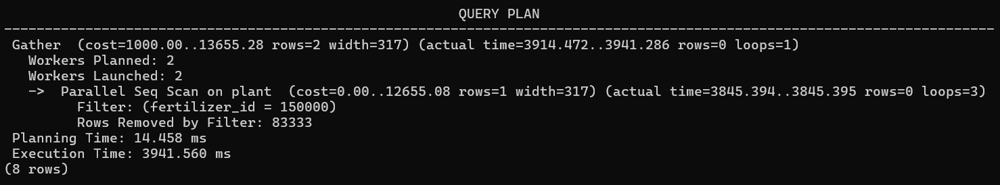

2. Explain + analyze + buffers:
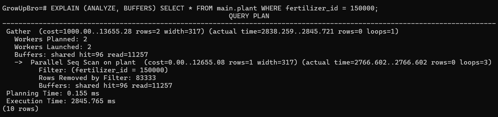

3. B-tree:
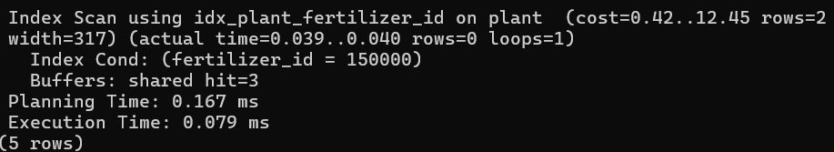
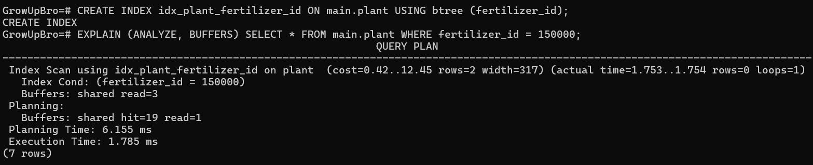

- При добавлении btree план изменился с Parallel Seq Scan на Index Scan, что увеличивает производительность.
- Стоимость и время выполнения уменьшились значительно, так как не приходится сканировать всю таблицу
- Количество shared hit также снизилось, так как считывается меньшее количество страниц данных

4. Hash:
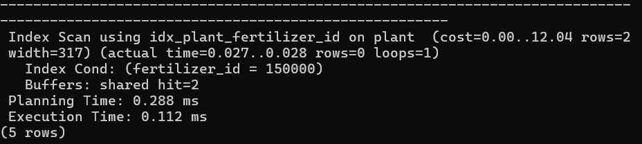
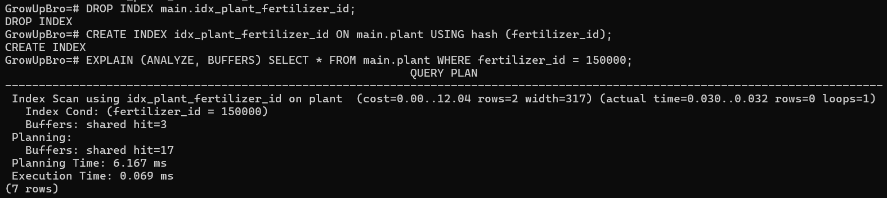

- При добавлении hash план изменился с Parallel Seq Scan на Index Scan, что увеличивает производительность.
- Стоимость и время выполнения уменьшились значительно, так как не приходится сканировать всю таблицу
- Количество shared hit также снизилось, так как считывается меньшее количество страниц данных


#### Запрос №2: оператор «>»
```sql
SELECT * FROM main.plant WHERE rating > 4.5;
CREATE INDEX idx_plant_rating ON main.plant USING btree (rating);
CREATE INDEX idx_plant_rating ON main.plant USING hash (rating);
```

1. Explain + analyze:
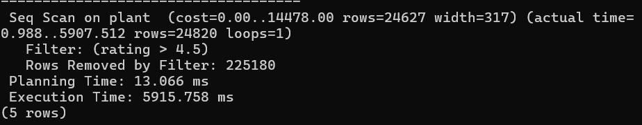

2. Explain + analyze + buffers:
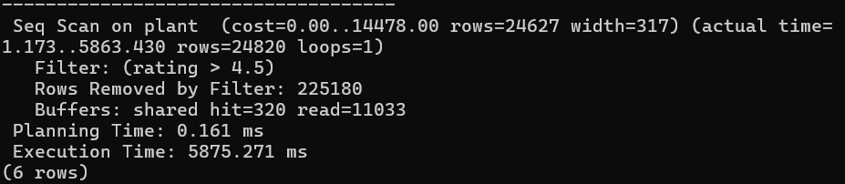

3. B-tree:
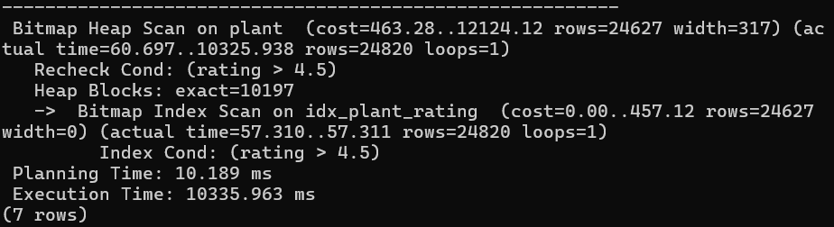
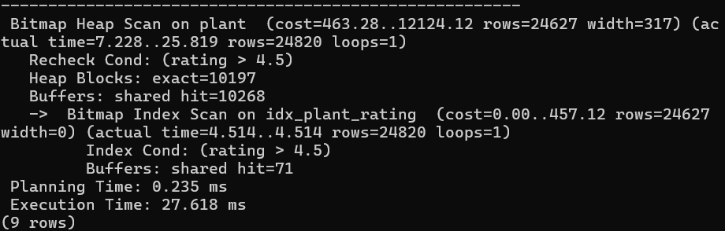

- План изменился с Seq Scan на Bitmap Heap Scan
- Стоимость и время выполнения значительно уменьшились

4. Hash — не используется, так как подходит только для точных сравнений:
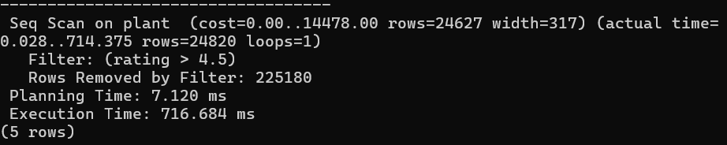
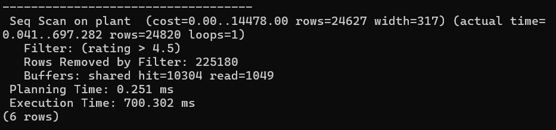

- План не изменился, остался Seq Scan


#### Запрос №3: оператор «<»
```sql
SELECT * FROM main.plant WHERE created_at < NOW() - INTERVAL '300 days';
CREATE INDEX idx_plant_created_at ON main.plant USING btree (created_at);
CREATE INDEX idx_plant_created_at ON main.plant USING hash (created_at);
```

1. Explain + analyze:
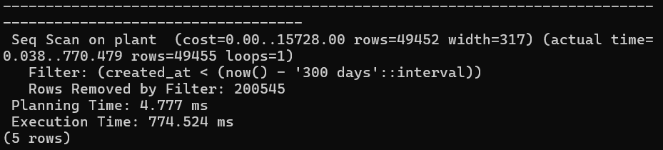

2. Explain + analyze + buffers:
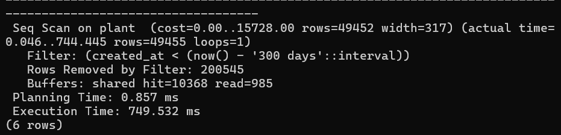

3. B-tree:
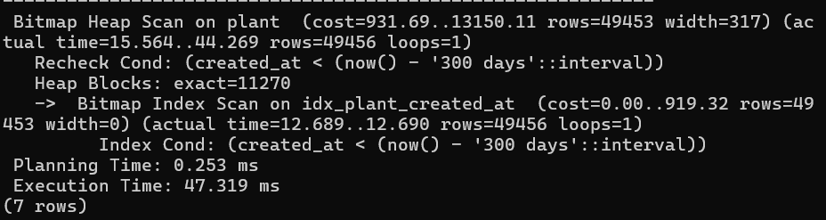
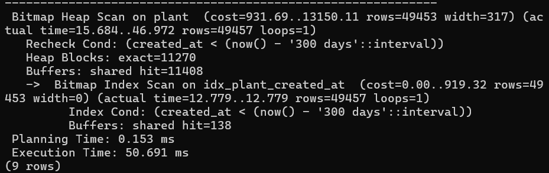

- План поменялся на Bitmap Index Scan
- Стоимость и время выполнения значительно упали

4. Hash — не используется, так как подходит только для точных сравнений:
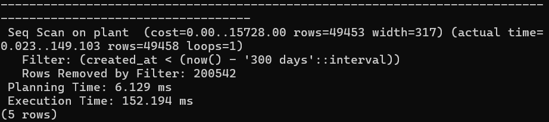
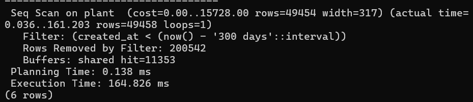

- План не изменился, остался Seq Scan


#### Запрос №4: оператор «LIKE 'abc%'»
```sql
SELECT * FROM main.plant WHERE name LIKE 'Plant 12%';
CREATE INDEX idx_plant_name_pattern ON main.plant USING btree (name text_pattern_ops);
CREATE INDEX idx_plant_name_pattern ON main.plant USING hash (name);
```

1. Explain + analyze:
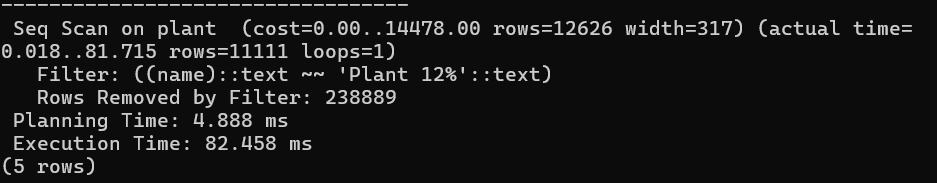

2. Explain + analyze + buffers:
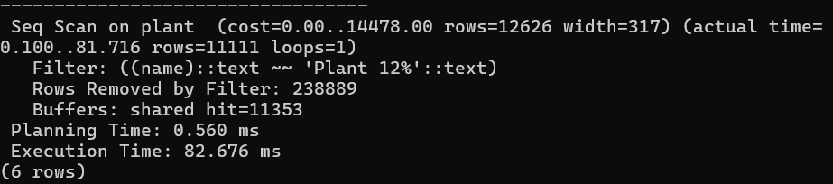

3. B-tree:
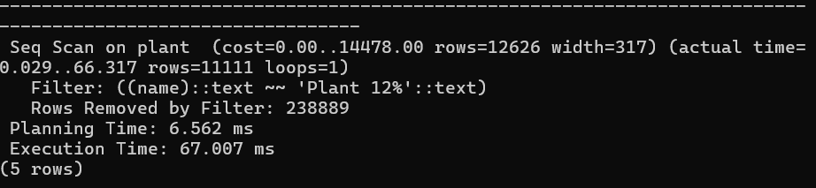
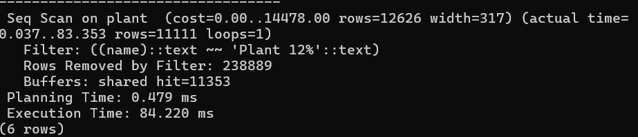

- План остается Seq Scan, так как индекс работает с диапазонными операциями
- Стоимость и время выполнения не изменились

4. Hash:
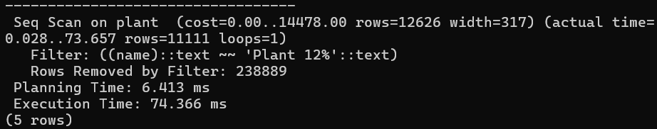
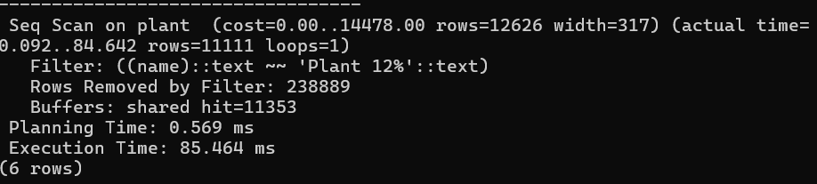

- План остается Seq Scan, так как индекс работает с конкретными сравнениями
- Стоимость и время выполнения не изменились


#### Запрос №5: оператор «LIKE '%abc'»
```sql
SELECT * FROM main.plant WHERE name LIKE '%999';
CREATE INDEX idx_plant_name_pattern ON main.plant USING btree (name text_pattern_ops);
CREATE INDEX idx_plant_name_pattern ON main.plant USING hash (name);
```

1. Explain + analyze:


2. Explain + analyze + buffers:
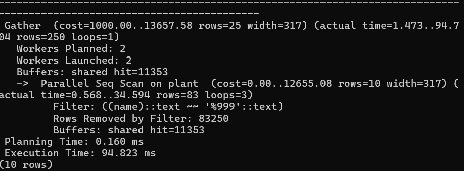

3. B-tree:
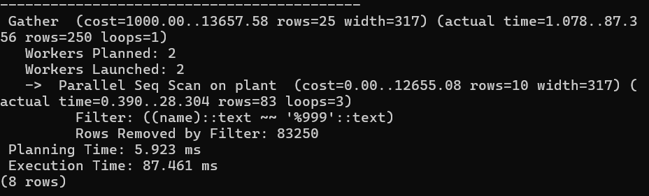
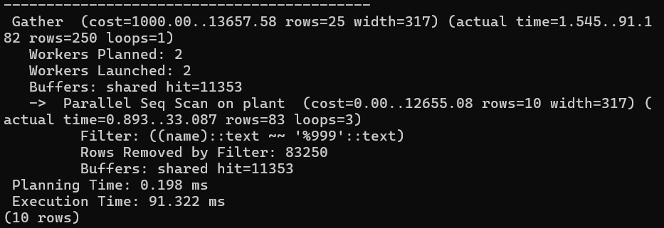

- План остается Parallel Seq Scan, так как индекс работает с диапазонными операциями
- Стоимость и время выполнения не изменились

4. Hash:
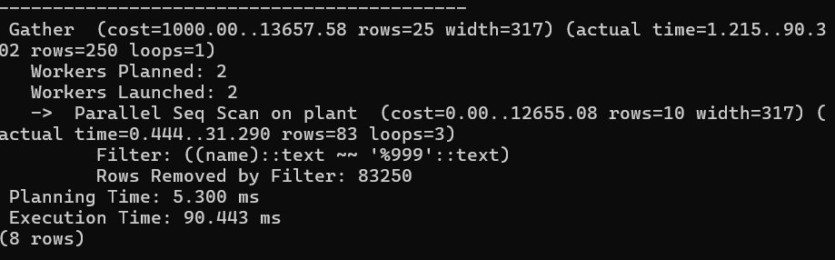


- План остается Parallel Seq Scan, так как индекс работает с конкретными сравнениями
- Стоимость и время выполнения не изменились


#### Запрос №6: оператор «IN»
```sql
SELECT * FROM main.plant WHERE fertilizer_id IN (10, 20000, 150000);
CREATE INDEX idx_plant_fertilizer_id ON main.plant USING btree (fertilizer_id);
CREATE INDEX idx_plant_fertilizer_id ON main.plant USING hash (fertilizer_id);
```

1. Explain + analyze:
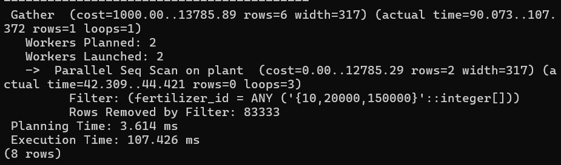

2. Explain + analyze + buffers:
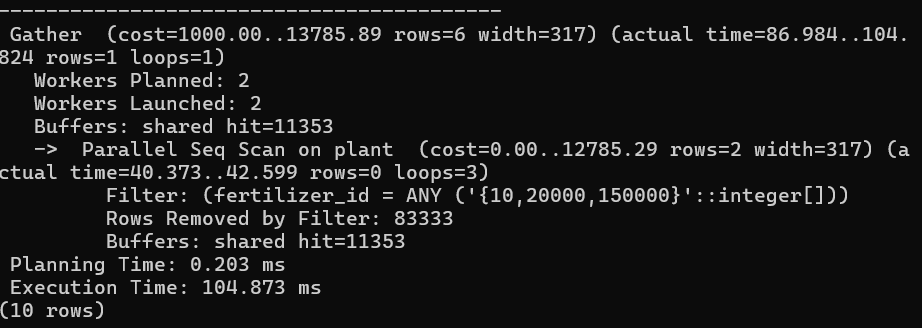

3. B-tree:
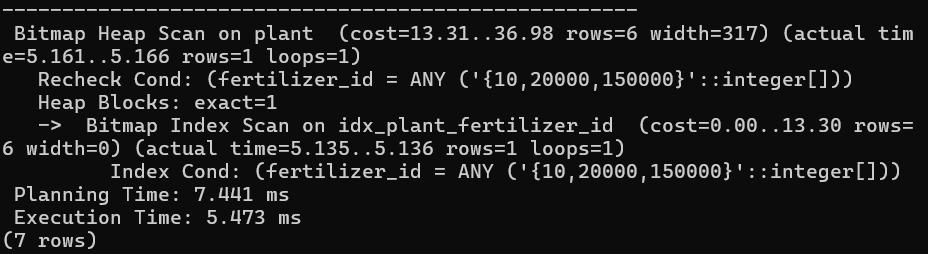
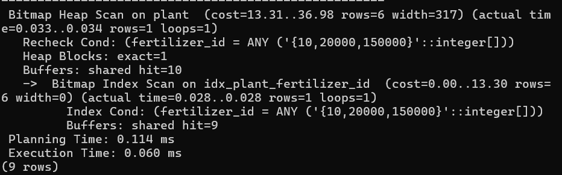

- План изменился с Parallel Index Scan на Bitmap Index Scan
- Стоимость и время выполнения значительно уменьшились

4. Hash:
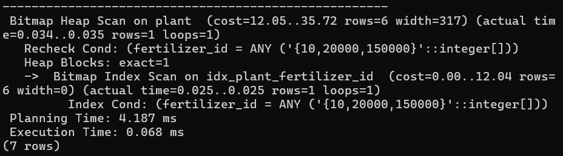
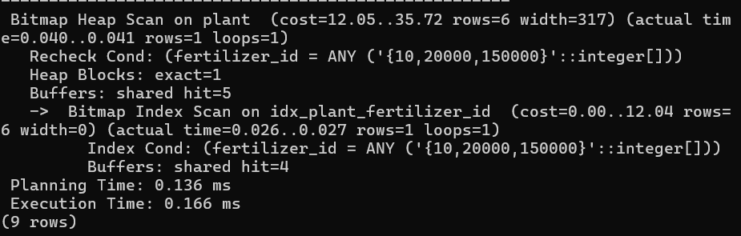

- План изменился с Parallel Index Scan на Bitmap Index Scan
- Стоимость и время выполнения значительно уменьшились


#### Доп запрос №7: составной индекс
```sql
SELECT * FROM main.plant WHERE fertilizer_id = 150000 AND rating > 4.5;
CREATE INDEX idx_plant_fertilizer_rating ON main.plant (fertilizer_id, rating);
```

1. Explain + analyze:
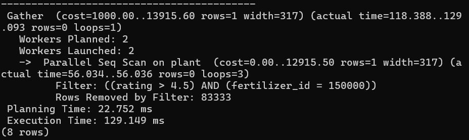

2. Explain + analyze + buffers:
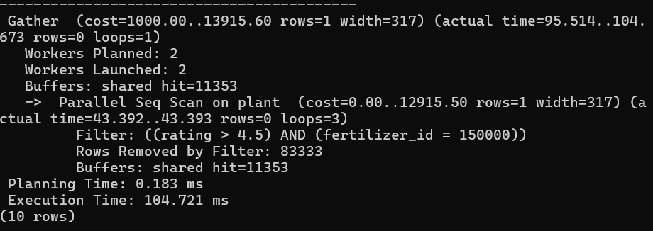

3. B-tree:
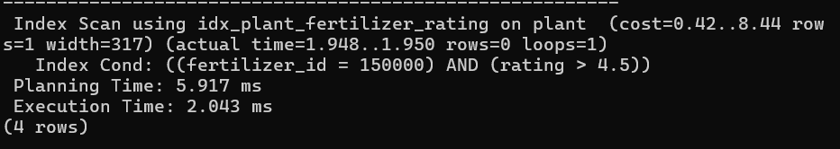
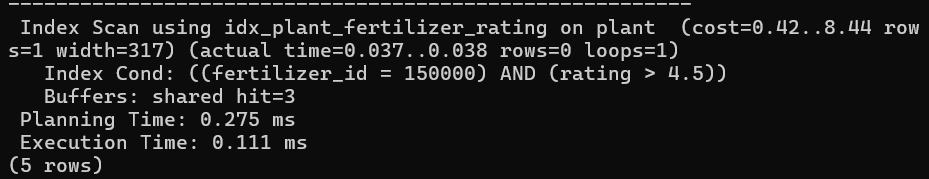

- План изменился с Parallel Seq Scan на Index Scan
- Стоимость и время выполнения уменьшились

4. Составной hash-индекс создать нельзя