## Gin и GiST


#### Gin
------


###### Запрос №1 — полнотекстовый поиск по search_vector растений.
```sql
EXPLAIN ANALYZE 
SELECT id, name 
FROM main.plant 
WHERE search_vector @@ to_tsquery('russian', 'растение & описание');
```
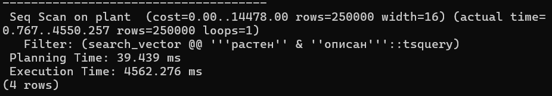

```sql
CREATE INDEX idx_plant_search_vector_gin ON main.plant USING GIN(search_vector);
```
```sql
EXPLAIN ANALYZE 
SELECT id, name 
FROM main.plant 
WHERE search_vector @@ to_tsquery('russian', 'растение & описание');
```
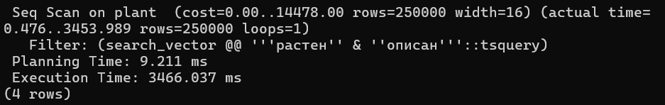

- При добавлении индекса по-прежнему используется Seq Scan, так как подходящих строк очень много → использовать индекс становится неэффективно
------


###### Запрос №2 — поиск по JSONB дополнительным характеристикам
```sql
EXPLAIN ANALYZE
SELECT id, name 
FROM main.plant
WHERE metadata @> '{"color": "red"}';
```
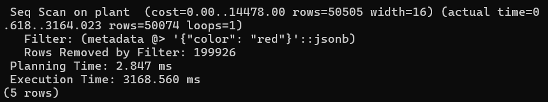

```sql
CREATE INDEX idx_plant_metadata_gin ON main.plant USING GIN(metadata);
```
```sql
EXPLAIN ANALYZE
SELECT id, name 
FROM main.plant
WHERE metadata @> '{"color": "red"}';
```
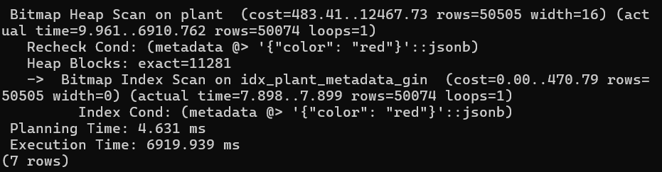

- При добавлении индекса используется Bitmap Heap Scan, но подходящих строк по-прежнему много, поэтому последовательное сканирование строк с помощью Seq Scan выигрывает по времени выполнения — ему не приходится строить битовую карту блоков, а затем считывать эти строки и перепроверять условие
------


###### Запрос №3 — поиск по тегам
```sql
EXPLAIN ANALYZE
SELECT id, name
FROM main.plant
WHERE tags && ARRAY['indoor','flowering'];
```
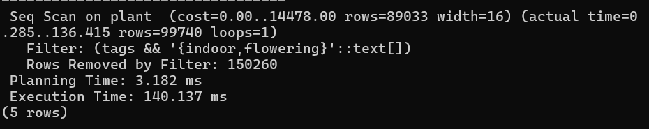

```sql
CREATE INDEX idx_plant_tags_gin ON main.plant USING GIN(tags);
```
```sql
EXPLAIN ANALYZE
SELECT id, name
FROM main.plant
WHERE tags && ARRAY['indoor','flowering'];
```
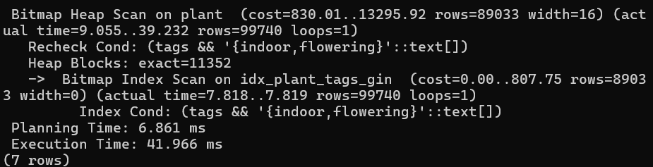

- После добавления индекса используется Bitmap Index Scan, время выполнения сокращается почти в 4 раза
------


###### Запрос №4 — поиск по составу composition удобрения
```sql
EXPLAIN ANALYZE
SELECT id, name 
FROM main.fertilizer
WHERE composition @> '{"N": 5}';
```
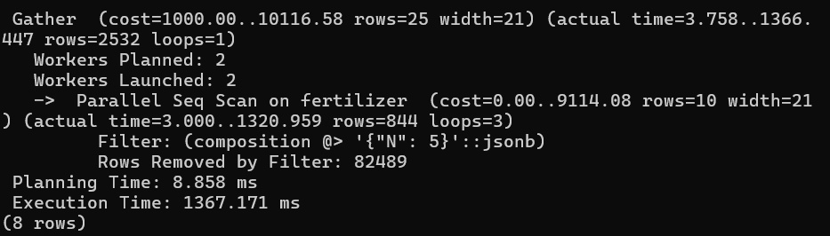

```sql
CREATE INDEX idx_fertilizer_composition_gin ON main.fertilizer USING GIN(composition);
```
```sql
EXPLAIN ANALYZE
SELECT id, name 
FROM main.fertilizer
WHERE composition @> '{"N": 5}';
```
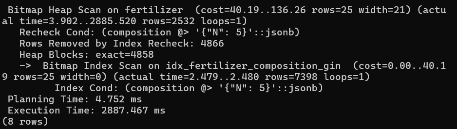

- При добавлении индекса используется Bitmap Heap Scan, но подходящих строк по-прежнему много, поэтому последовательное сканирование строк с помощью Parallel Seq Scan выигрывает по времени выполнения — ему не приходится строить битовую карту блоков, а затем считывать эти строки заново и перепроверять условие
------


###### Запрос №5 — поиск советов по JSONB дополнительным данным
```sql
EXPLAIN ANALYZE
SELECT id, tip_text
FROM main.tip
WHERE metadata @> '{"duration_days": 10}';
```
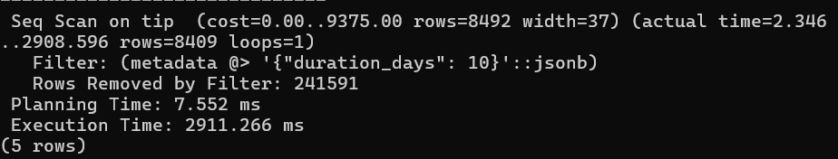

```sql
CREATE INDEX idx_tip_metadata_gin ON main.tip USING GIN(metadata);
```
```sql
EXPLAIN ANALYZE
SELECT id, tip_text
FROM main.tip
WHERE metadata @> '{"duration_days": 10}';
```
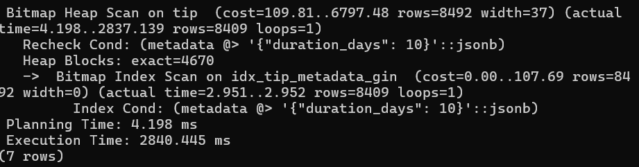

- При добавлении индекса используется Bitmap Heap Scan, но выигрыш по времени не большой


#### GiST
------


###### Запрос №1 — поиск растений по периоду роста
```sql
EXPLAIN ANALYZE
SELECT id, name
FROM main.plant
WHERE growth_period && daterange('2026-03-01','2026-06-01');
```
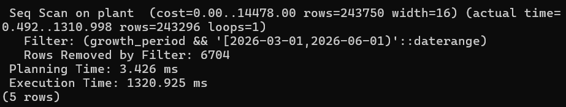

```sql
CREATE INDEX idx_plant_growth_period_gist ON main.plant USING GiST(growth_period);
```
```sql
EXPLAIN ANALYZE
SELECT id, name
FROM main.plant
WHERE growth_period && daterange('2026-03-01','2026-06-01');
```
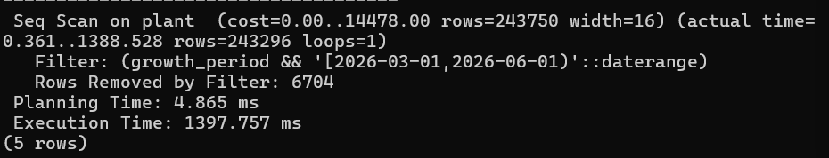

- Используется Seq Scan после добавления индекса, так как выборка строк слишком большая
------


###### Запрос №2 — поиск растений по зоне теплицы
```sql
EXPLAIN ANALYZE
SELECT id, name
FROM main.plant
WHERE greenhouse_zone <@ circle(point(50,25), 20);
```
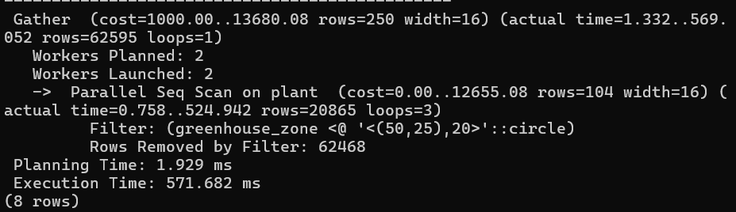

```sql
CREATE INDEX idx_plant_greenhouse_zone_gist ON main.plant USING GiST(greenhouse_zone);
```
```sql
EXPLAIN ANALYZE
SELECT id, name
FROM main.plant
WHERE greenhouse_zone <@ circle(point(50,25), 20);
```
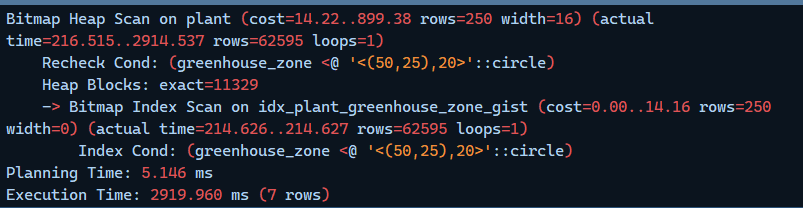

- Используется Bitmap Index Scan, но из-за чтений с диска выигрыш времени небольшой
------


###### Запрос №3 — поиск советов по периоду актуальности
```sql
EXPLAIN ANALYZE
SELECT id, tip_text
FROM main.tip
WHERE valid_period && daterange('2026-03-01','2026-05-01');
```
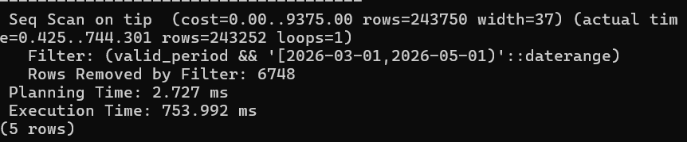

```sql
CREATE INDEX idx_tip_valid_period_gist ON main.tip USING GiST(valid_period);
```
```sql
EXPLAIN ANALYZE
SELECT id, tip_text
FROM main.tip
WHERE valid_period && daterange('2026-03-01','2026-05-01');
```
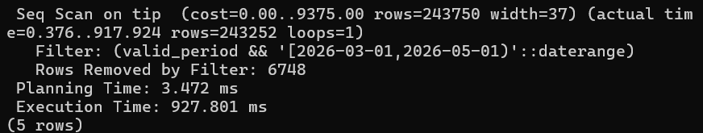

- Из-за большой выборки после добавления индекса используется Seq Scan
------


###### Запрос №4 — поиск дополнительный характеристик по активному периоду
```sql
EXPLAIN ANALYZE
SELECT id, name
FROM refs.feature
WHERE active_period && daterange('2026-03-01','2026-06-01');
```
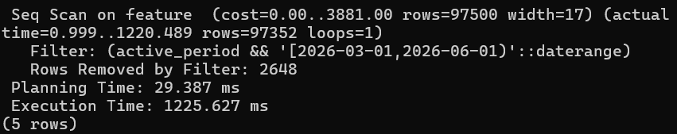

```sql
CREATE INDEX idx_feature_active_period_gist ON refs.feature USING GiST(active_period);
```
```sql
EXPLAIN ANALYZE
SELECT id, name
FROM refs.feature
WHERE active_period && daterange('2026-03-01','2026-06-01');
```
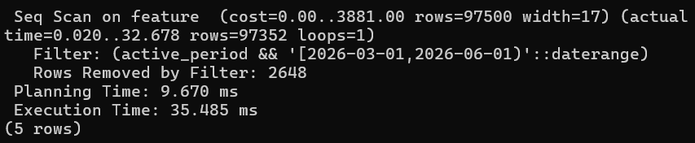

- Из-за большой выборки после добавления индекса используется Seq Scan
------


###### Запрос №5 — сравнение дополнительных характеристик по интенсивности
```sql
EXPLAIN ANALYZE
SELECT id, name
FROM refs.feature
WHERE int4range(intensity_level, intensity_level) && int4range(3,5);
```
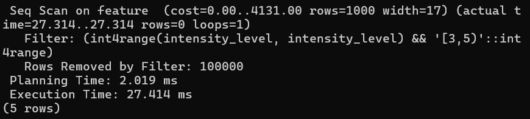

```sql
CREATE INDEX idx_feature_intensity_gist ON refs.feature USING GiST(int4range(intensity_level,intensity_level));
```
```sql
EXPLAIN ANALYZE
SELECT id, name
FROM refs.feature
WHERE int4range(intensity_level, intensity_level) && int4range(3,5);
```
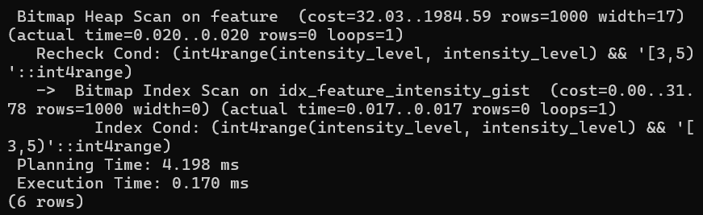

- После добавления индекса используется Bitmap Index Scan и сокращается время выполнения запроса
------


## JOIN


###### Запрос №1 — нахождение удобрения для каждого растения
```sql
EXPLAIN ANALYZE
SELECT p.id AS plant_id,
    p.name AS plant_name,
    f.name AS fertilizer_name,
    f.price
FROM main.plant p
LEFT JOIN main.fertilizer f ON p.fertilizer_id = f.id
LIMIT 10;
```
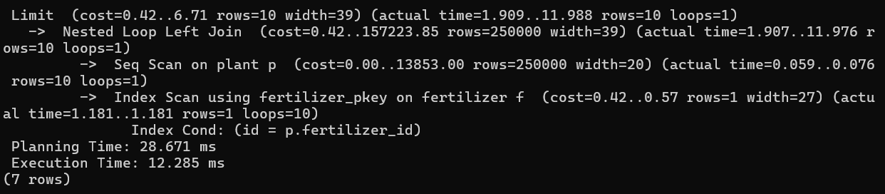

- Используется Nested Loop: для растения из plant (перебор через Seq Scan) находится удобрение из fertilizer через индекс по первчиному ключу id
- Время выполнения маленькое, так как искомая таблица маленькая
------


###### Запрос №2 — для каждого растения ищем все советы (many-to-many)
```sql
EXPLAIN ANALYZE
SELECT
    p.name AS plant_name,
    t.tip_text AS tip
FROM main.plant p
JOIN links.plant_tip pt ON p.id = pt.plant_id
JOIN main.tip t ON pt.tip_id = t.id;
```
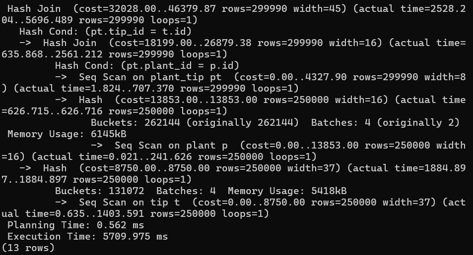

- Для перебора строк используется Seq Scan, так как подходящих индексов на таблицах нет
- Для соединения используется Hash Join, так как обе таблицы большие, без индексов и используют сравнение в условии, а хэш-таблицы имеют поиск по ключу за О(1)
------


###### Запрос №3 — соединяем дополнительные характеристики с растениями через связующую таблицу
```sql
EXPLAIN ANALYZE
SELECT
    p.name AS plant_name,
    ftr.name AS feature_name,
    ftr.intensity_level,
    ftr.plant_part
FROM main.plant p
JOIN links.plant_feature pf ON p.id = pf.plant_id
JOIN refs.feature ftr ON pf.feature_id = ftr.id
WHERE ftr.intensity_level > 3
LIMIT 15;
```
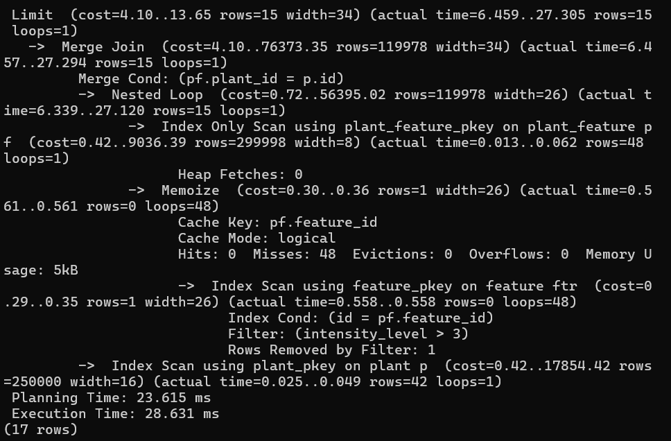

- В таблицах поиск идет через индекс по первичному ключу
- Используется Merge Join, так как индексы по первичному ключу отсортированы по ключу соединения
------


###### Запрос №4 — соединие с фильтром по JSONB
```sql
EXPLAIN ANALYZE
SELECT
    p.name AS plant_name,
    p.metadata->>'height' AS height,
    f.name AS fertilizer_name,
    f.composition->>'N' AS nitrogen
FROM main.plant p
JOIN main.fertilizer f ON p.fertilizer_id = f.id
WHERE (p.metadata->>'height')::numeric > 50;
```
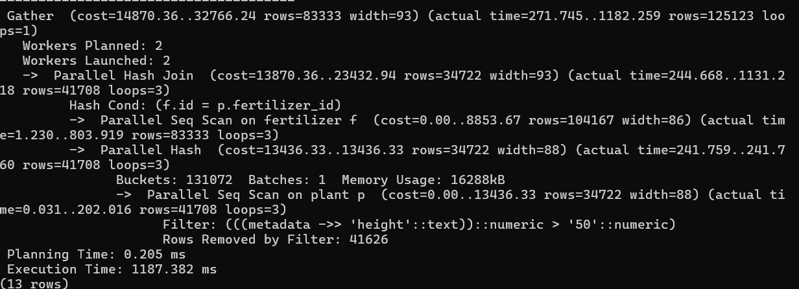

- Таблицы сканируются Parallel Seq Scan, так как нет индексов
- Соединение производится на основе Parallel Hash Join, так как используется точное сравнение
------


###### Запрос №5 — соединие с фильтром по JSONB
```sql
EXPLAIN ANALYZE
SELECT
    p.name AS plant_name,
    f.name AS fertilizer_name,
    f.price
FROM main.plant p
JOIN main.fertilizer f ON p.fertilizer_id = f.id
WHERE f.price < 20;
```
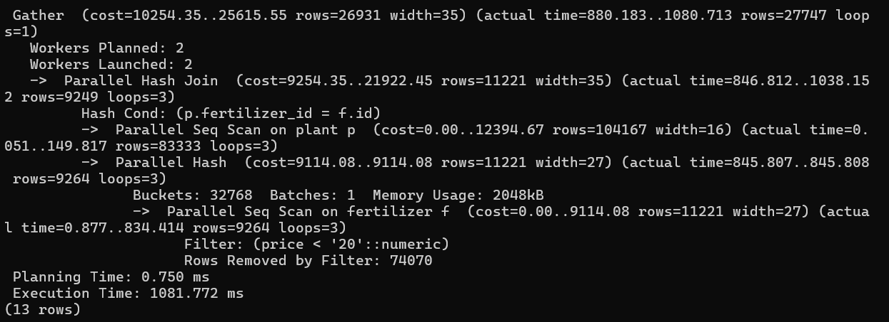

- Используется Hash Join, так как таблицы большие
- Сами таблицы считываются через Parallel Seq Scan, так как нет подходящих индексов
------


## Сборка Prometheus/Grafana/postgres-exporter


###### №1 — запуск
```bash
docker-compose up -d
```


###### №2 — проверка, что все работает
```bash
http://localhost:9187/metrics — все метрики из Postgres

http://localhost:9090 — Prometheus
Если в Status → Targets отображает UP, то метрики собираются.

http://localhost:3000 — Grafana
Для подключения Prometheus: Connections → Data sources → Add data source → Prometheus → http://prometheus:9090 в «Connection» → «Save & test»
Для создая дашборда: Dashboards → New dashboard → Add visualization → Prometheus
```


###### №3 — графики
```bash
pg_version_static → pg_version — версия postgres
pg_active_sessions_active_sessions — активные сессии
pg_queries_stats_select — график с SELECT
pg_queries_stats_insert — график с INSERT
pg_queries_stats_delete — график с DELETE
process_cpu_seconds_total — CPU Usage
```
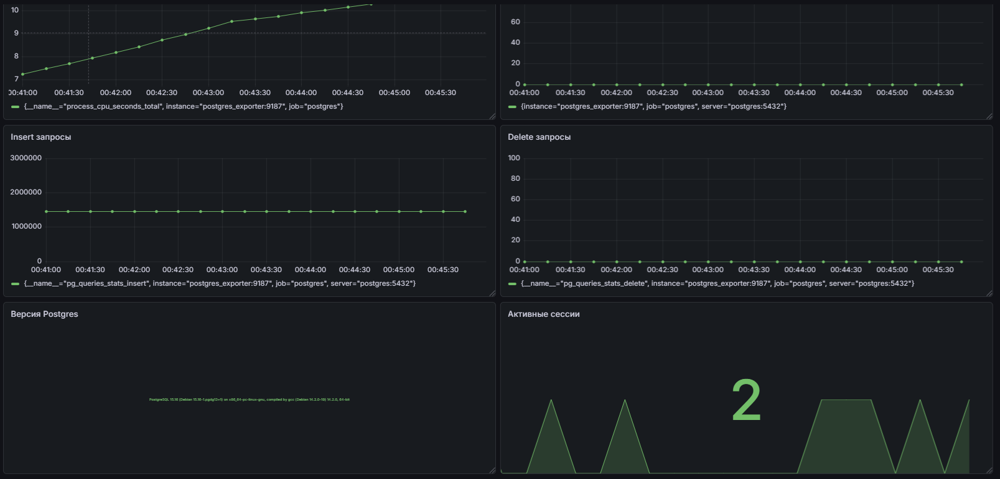