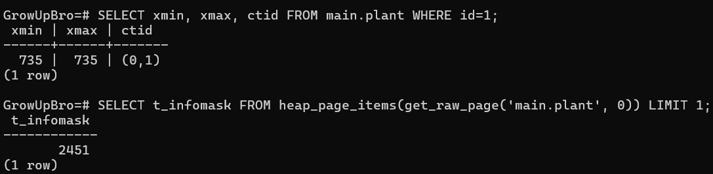
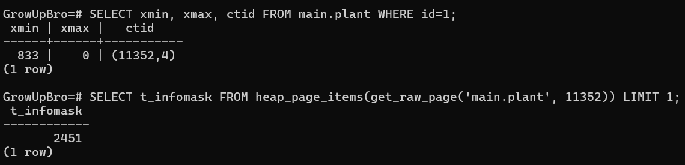
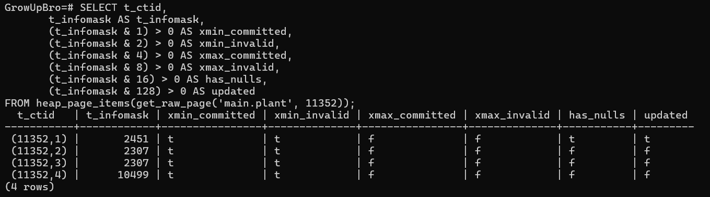
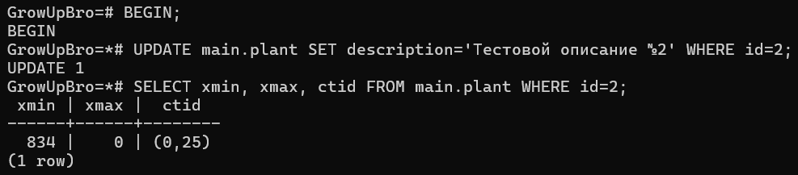
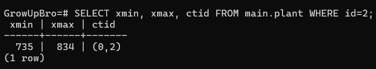
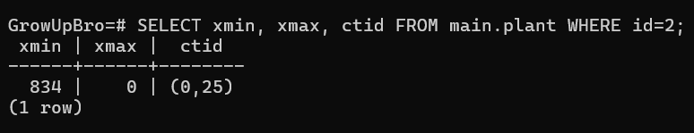
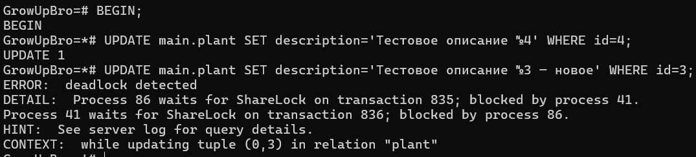
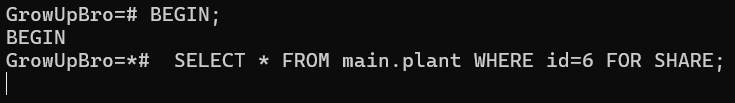
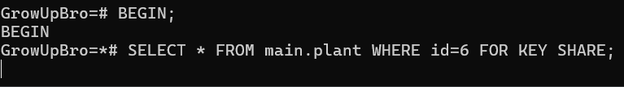
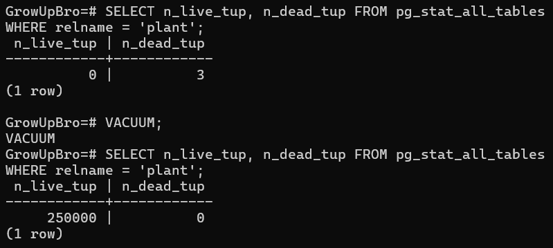

## MVCC

#### 1. Смоделировать обновление данных и посмотреть на параметры xmin, xmax, ctid, t_infomask
```sql
SELECT xmin, xmax, ctid FROM main.plant WHERE id=1;
SELECT t_infomask FROM heap_page_items(get_raw_page('main.plant', 0)) LIMIT 1;
```


```sql
UPDATE main.plant SET description='Тестовое описание' WHERE id=1;
```

```sql
SELECT xmin, xmax, ctid FROM main.plant WHERE id=1;
SELECT t_infomask FROM heap_page_items(get_raw_page('main.plant', 11352)) LIMIT 1;
```


- xmin новой строки — ID текущей транзакции
- xmax новой строки — 0, так как она является актуальной
- ctid поменялся
------


#### 2. Понять, что хранится в t_infomask
t_infomask — это 16-битная маска, в которой каждый бит отвечает за определенное состояние строки:
- 0 — HEAP_XMIN_COMMITTED — Транзакция xmin, которая вставила строку, подтверждена
- 1 — HEAP_XMIN_INVALID — Транзакция xmin недействительна, то есть строка мертвая
- 2 —	HEAP_XMAX_COMMITTED — Транзакция xmax подтверждена
- 3 — HEAP_XMAX_INVALID — Транзакция xmax недействительна
- 4 — HEAP_HASNULL — Строка содержит хотя бы одно поле с NULL
- 5 —	HEAP_HASVARWIDTH — Строка содержит хотя бы одно поле типа text, bytea, varchar
- 6 — HEAP_LOCKED — Строка заблокирована
- 7 —	HEAP_UPDATED — Строка была обновлена
- 8 —	HEAP_MOVED_OFF — Строка перемещена на другую страницу
- 9 —	HEAP_MOVED_IN —	Строка была перемещена сюда
- 10 — HEAP_ONLY_TUPLE — Строка — “heap-only tuple”
- 11 — HEAP_XMAX_LOCK_ONLY — xmax — только блокировка, нет реального удаления
- 12 — HEAP_XMAX_EXCL_LOCK — xmax от DELETE, UPDATE
- 13 — HEAP_XMAX_KEYSHR_LOCK — xmax — разделяемая блокировка ключа (например, SELECT FOR KEY SHARE)
- 14 — HEAP_XMAX_SHR_LOCK	xmax — обычная разделяемая блокировка
- 15 — HEAP_XMAX_MULTIXACT — xmax участвует в MultiXact (несколько транзакций заблокировали строку)

Для проверки:
```sql
SELECT t_ctid,
       t_infomask AS t_infomask,
       (t_infomask & 1) > 0 AS xmin_committed,
       (t_infomask & 2) > 0 AS xmin_invalid,
       (t_infomask & 4) > 0 AS xmax_committed,
       (t_infomask & 8) > 0 AS xmax_invalid,
       (t_infomask & 16) > 0 AS has_nulls,
       (t_infomask & 128) > 0 AS updated
FROM heap_page_items(get_raw_page('main.plant', 11352));
```

------


#### 3. Посмотреть на параметры из №1 в разных транзакциях

Открываем первую транзакцию, изменяем и смотрим на параметры:
```sql
BEGIN;
UPDATE main.plant SET description='Тестовой описание №2' WHERE id=2;
SELECT xmin, xmax, ctid FROM main.plant WHERE id=2;
```


Открываем вторую транзацию и смотрим на параметры:
```sql
SELECT xmin, xmax, ctid FROM main.plant WHERE id=2;
```


Коммитим первую:
```sql
COMMIT;
```

Смотрим вторую транзакцию:
```sql
SELECT xmin, xmax, ctid FROM main.plant WHERE id=2;
```


- До коммита новая строка еще не отображается, но xmax старой уже стал равен ID транзакции
- После коммита становится доступна новая версия строки, в которой xmin равен ID транзакции, а xmax — пустой
------


#### 4. Смоделировать дедлок, описать результаты

Открываем первую транзакцию и изменяем данные:
```sql
BEGIN;
UPDATE main.plant SET description='Тестовое описание №3' WHERE id=3;
```

Открываем вторую транзацию и изменяем другие данные:
```sql
BEGIN;
UPDATE main.plant SET description='Тестовое описание №4' WHERE id=4;
```

В первой транзакции изменяем вторые данные:
```sql
UPDATE main.plant SET description='Тестовое описание №4 — новое' WHERE id=4;
```

Во второй транзакции изменяем первый данные:
```sql
UPDATE main.plant SET description='Тестовое описание №3 — новое' WHERE id=3;
```


- При втором изменении в первой транзакции она уходит в режим ожидания завершения второй транзакции, чтобы обновить строку с id=4
- Вторая транзакция запрашивает доступ к изменению строки, заблокированной первой транзакцией, с id=3
- Получаем deadlock → ошибка
------


#### 5. Режимы блокировки на уровне строк

Открываем первую транзакцию и запрашиваем данные с FOR UPDATE:
```sql
BEGIN;
SELECT * FROM main.plant WHERE id=6 FOR UPDATE;
```

Открываем вторую транзацию и запрашиваем данные c FOR SHARE:
```sql
BEGIN;
 SELECT * FROM main.plant WHERE id=6 FOR SHARE;
```

- Строка заблокирована первой транзакцией, поэтому получить запрашиваемые строки во второй не получается


Открываем первую транзакцию и запрашиваем данные с FOR UPDATE:
```sql
BEGIN;
SELECT * FROM main.plant WHERE id=6 FOR UPDATE;
```

Открываем вторую транзацию и запрашиваем данные c FOR KEY SHARE:
```sql
BEGIN;
SELECT * FROM main.plant WHERE id=6 FOR KEY SHARE;
```

- Для FOR KEY SHARE нужен неизменяемый ключ. В FOR UPDATE ключ измениться может, поэтому строка второй транзакции не отдается
------


#### 6. Очистка данных

```sql
SELECT n_live_tup, n_dead_tup FROM pg_stat_all_tables WHERE relname = 'plant';
```
```sql
VACUUM;
```
```sql
SELECT n_live_tup, n_dead_tup FROM pg_stat_all_tables WHERE relname = 'plant';
```
