## Посмотреть на изменение LSN и WAL после изменения данных

#### a. Сравнение LSN до и после INSERT
```sql
SELECT pg_current_wal_lsn() AS lsn_before;
```
```sql
INSERT INTO main.plant (name, description) VALUES ('Test plant for LSN', 'LSN test');
```
```sql
SELECT pg_current_wal_lsn() AS lsn_after;
SELECT pg_wal_lsn_diff(pg_current_wal_lsn(), '0/32373D10') AS wal_bytes_generated;
```
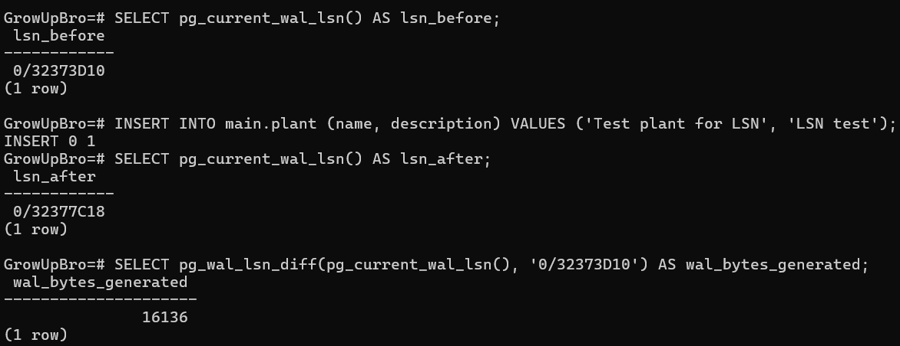

- LSN до INSERT: 0/32373D10
- LSN после INSERT: 0/32377C18
- При вставке одной строки было записано 16136 байт в WAL, так как помимо самих данных записывается дополнительная служебная информация


#### b. Сравнение WAL до и после commit
```sql
BEGIN;
```
```sql
SELECT pg_current_wal_lsn() AS lsn_before;
INSERT INTO main.tip (tip_text) VALUES ('Test tip for WAL');
SELECT pg_current_wal_lsn() AS lsn_before_commit;
```
```sql
COMMIT;
```
```sql
SELECT pg_current_wal_lsn() AS lsn_after_commit;
SELECT pg_wal_lsn_diff('0/3237BCE0', '0/3237BC80');
```
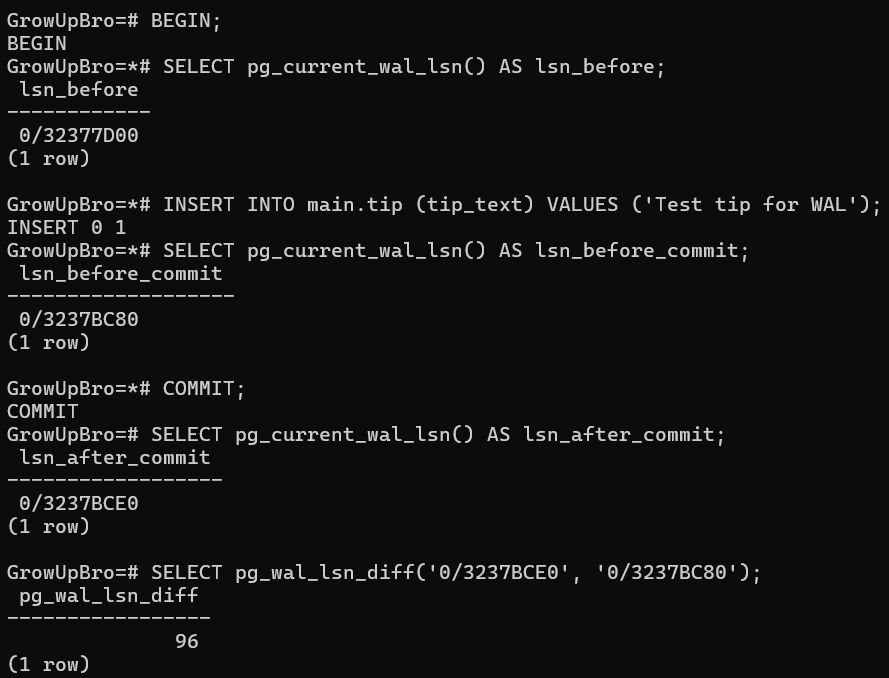

- LSN до изменений: 0/32377D00
- LSN до комита: 0/3237BC80
- LSN после комита: 0/3237BCE0
- Операция «Commit» тоже записывается в WAL, но занимает маленький объем (96 байт)


#### c. Анализ WAL размера после массовой операции
```sql
SELECT pg_current_wal_lsn() AS lsn_before;
```
```sql
INSERT INTO main.plant (name, description)
SELECT 
    'Plant ' || generate_series,
    'Insert test for c'
FROM generate_series(1, 100);
```
```sql
SELECT pg_current_wal_lsn() AS lsn_after;
```
```sql
SELECT pg_wal_lsn_diff('0/348AE500', '0/34850FC8' ) AS wal_bytes_bulk;
```
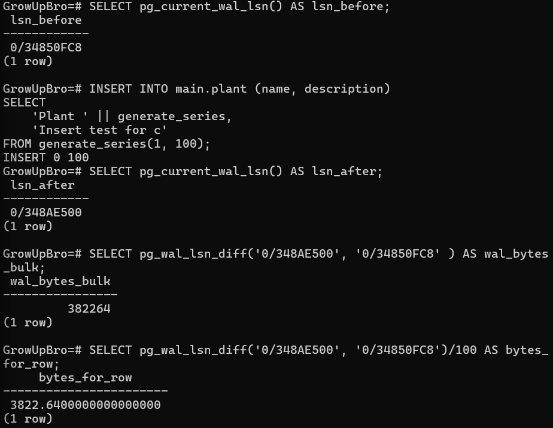

- LSN до комита: 0/34850FC8
- LSN после комита: 0/348AE500
- Всего было записано 382264 байт, то есть по ~3822,6 байт на одну строку
- WAL растет с ростом количества операций, однако массовая вставка работает эффективнее одиночного insert (3822,6 байт против 16136 байт на одну строку)
------


## Сделать дамп БД и накатить его на новую чистую БД

#### a. Dump только структуры базы
```bash
docker exec -t GrowUpBro pg_dump -U postgres -d GrowUpBro --schema-only > structure_dump.sql
```
```sql
CREATE DATABASE GrowUpBro_test_a;
\c growupbro_test_a;
```
```bash
Get-Content .\structure_dump.sql | docker exec -i GrowUpBro psql -U postgres -d growupbro_test_a
docker exec -it GrowUpBro psql -U postgres -d growupbro_test_a
```
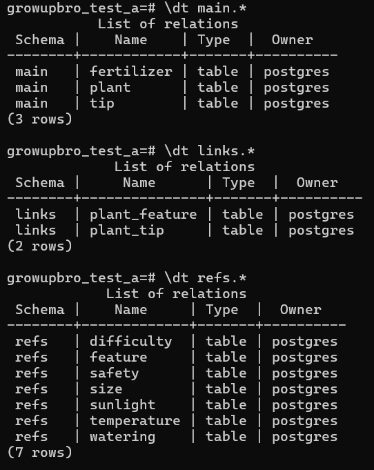

- LSN до INSERT: 0/32373D10
- LSN после INSERT: 0/32377C18
- При вставке одной строки было записано 16136 байт в WAL, так как помимо самих данных записывается дополнительная служебная информация


#### b. Dump одной таблицы
```bash
docker exec -t GrowUpBro pg_dump -U postgres -d GrowUpBro -t main.plant > table_dump.sql
```
```sql
CREATE DATABASE GrowUpBro_test_b;
\c growupbro_test_b;
```
```bash
docker exec -i GrowUpBro psql -U postgres -d growupbro_test_b -c "CREATE SCHEMA main;"
Get-Content .\table_dump.sql | docker exec -i GrowUpBro psql -U postgres -d growupbro_test_b
```
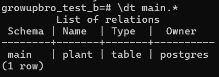
------


## Создать несколько seed

#### a. Добавление тестовых данных
```bash
docker exec -t GrowUpBro pg_dump -U postgres -d GrowUpBro --schema-only > structure_dump.sql
```
```sql
CREATE DATABASE GrowUpBro_test_a;
\c growupbro_test_a;
```
```bash
Get-Content .\structure_dump.sql | docker exec -i GrowUpBro psql -U postgres -d growupbro_test_a
docker exec -it GrowUpBro psql -U postgres -d growupbro_test_a
```


- LSN до INSERT: 0/32373D10
- LSN после INSERT: 0/32377C18
- При вставке одной строки было записано 16136 байт в WAL, так как помимо самих данных записывается дополнительная служебная информация


#### b. Dump одной таблицы
```bash
docker exec -t GrowUpBro pg_dump -U postgres -d GrowUpBro -t main.plant > table_dump.sql
```
```sql
CREATE DATABASE GrowUpBro_test_b;
\c growupbro_test_b;
```
```bash
docker exec -i GrowUpBro psql -U postgres -d growupbro_test_b -c "CREATE SCHEMA main;"
Get-Content .\table_dump.sql | docker exec -i GrowUpBro psql -U postgres -d growupbro_test_b
```

------


## Создать несколько seed

#### a. Вставка растений — файл plant_seed.sql.

После первого запуска:
```sql
SELECT COUNT(*) FROM refs.sunlight
UNION ALL
SELECT COUNT(*) FROM refs.watering
UNION ALL
SELECT COUNT(*) FROM refs.temperature
UNION ALL
SELECT COUNT(*) FROM refs.safety
UNION ALL
SELECT COUNT(*) FROM refs.difficulty
UNION ALL
SELECT COUNT(*) FROM refs.size;
```
```sql
SELECT COUNT(*) FROM main.fertilizer;
```
```sql
SELECT COUNT(*) FROM main.plant;
```
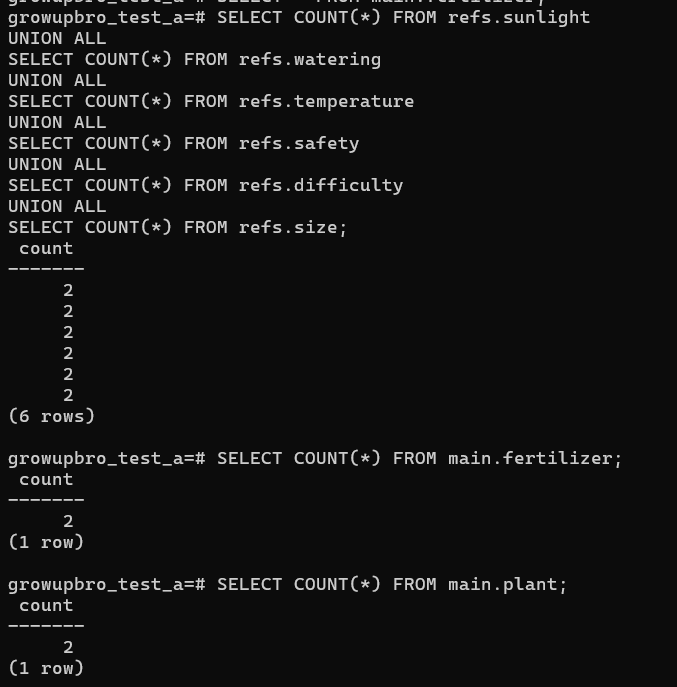

После второго запуска:
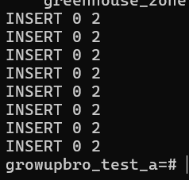
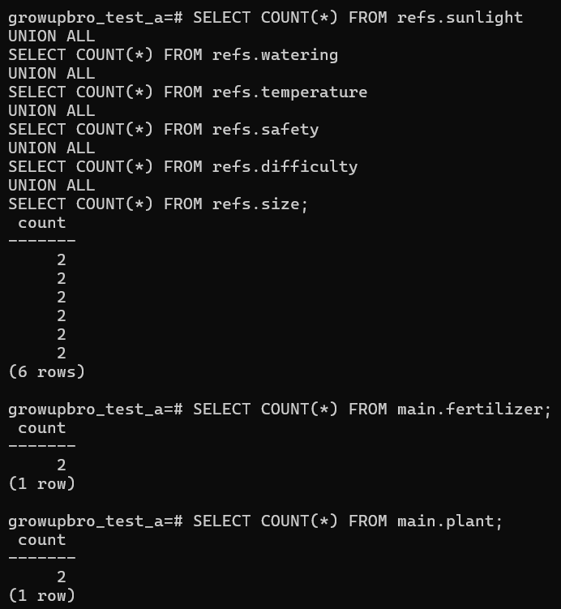


#### b. Вставка дополнительных характеристик — файл feature_seed.sql.

После первого запуска:
```sql
SELECT COUNT(*) FROM refs.sunlight
UNION ALL
SELECT COUNT(*) FROM refs.watering
UNION ALL
SELECT COUNT(*) FROM refs.temperature
UNION ALL
SELECT COUNT(*) FROM refs.safety
UNION ALL
SELECT COUNT(*) FROM refs.difficulty
UNION ALL
SELECT COUNT(*) FROM refs.size
UNION ALL
SELECT COUNT(*) FROM main.fertilizer
UNION ALL
SELECT COUNT(*) FROM main.plant
UNION ALL
SELECT COUNT(*) FROM refs.feature
UNION ALL
SELECT COUNT(*) FROM links.plant_feature;
```
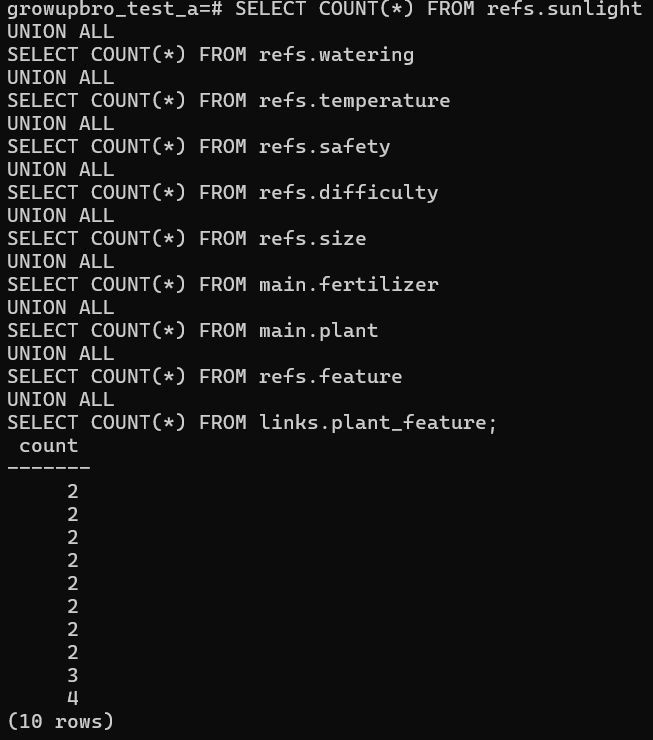

После второго запуска:
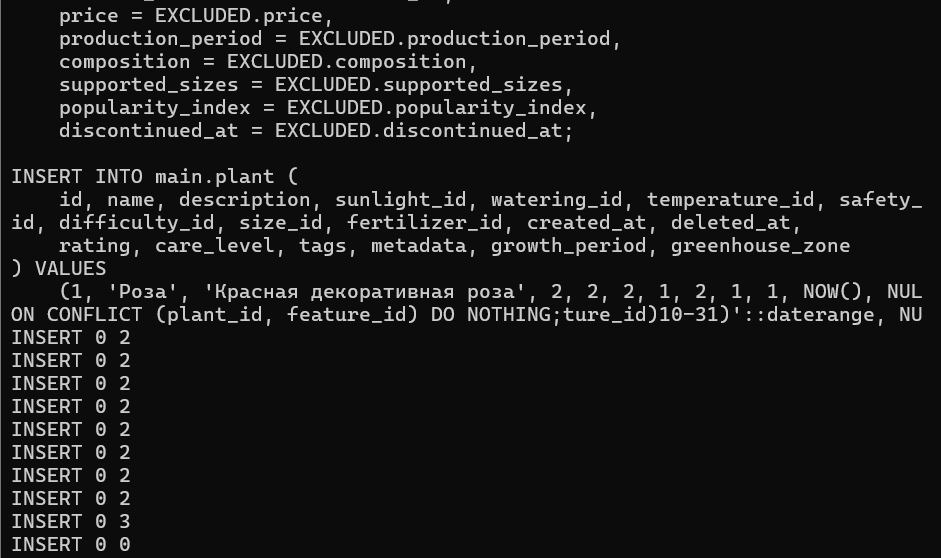
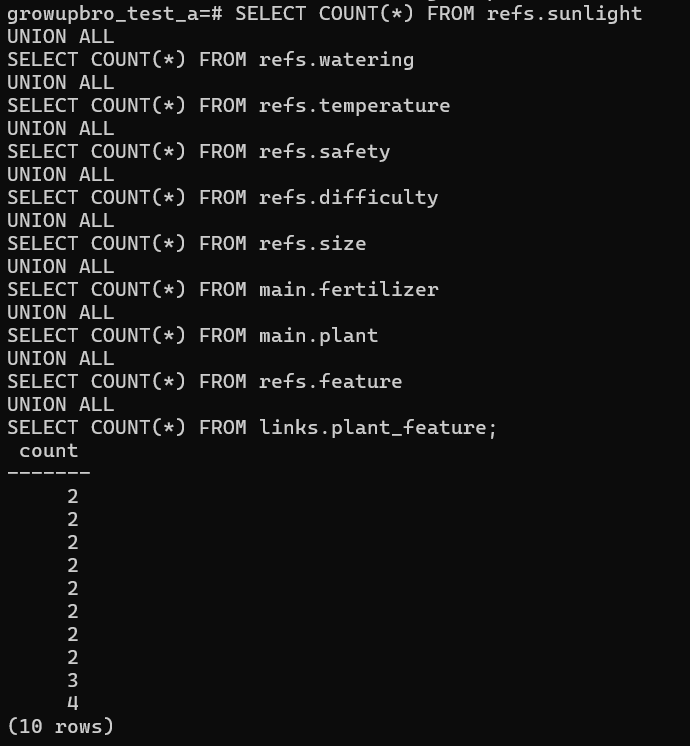


#### c. Вставка советов — файл tip_seed.sql

После первого запуска:
```sql
SELECT COUNT(*) FROM refs.sunlight
UNION ALL
SELECT COUNT(*) FROM refs.watering
UNION ALL
SELECT COUNT(*) FROM refs.temperature
UNION ALL
SELECT COUNT(*) FROM refs.safety
UNION ALL
SELECT COUNT(*) FROM refs.difficulty
UNION ALL
SELECT COUNT(*) FROM refs.size
UNION ALL
SELECT COUNT(*) FROM main.fertilizer
UNION ALL
SELECT COUNT(*) FROM main.plant
UNION ALL
SELECT COUNT(*) FROM main.tip
UNION ALL
SELECT COUNT(*) FROM links.plant_tip;    
```
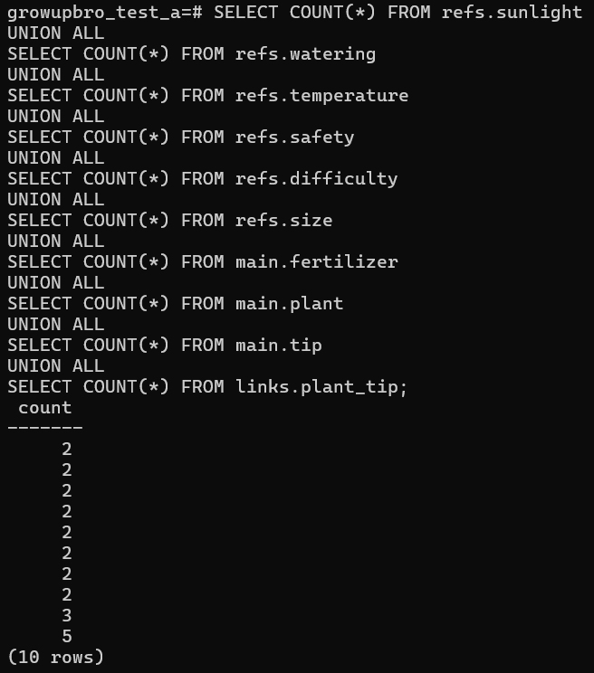

После второго запуска:
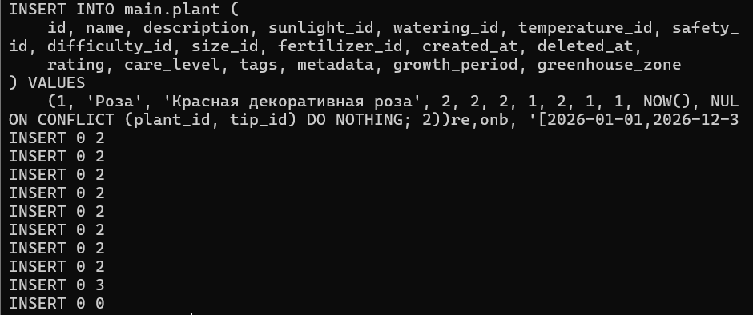
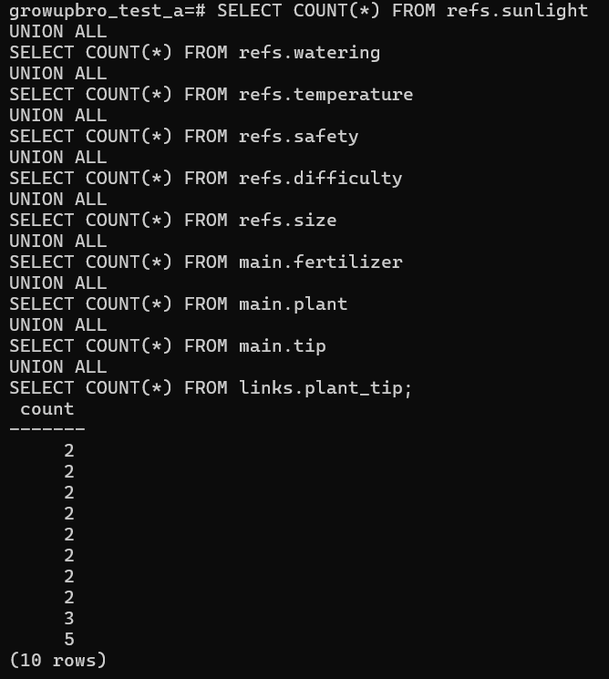