## Нарисовать архитектуру

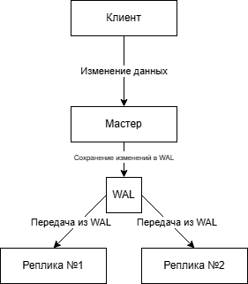
------


## Настроить потоковую репликацию

В docker-compose.yml добавляем:
```
services:
  postgres:
    image: postgres:15
    container_name: GrowUpBro
    environment:
      POSTGRES_USER: postgres
      POSTGRES_PASSWORD: postgres_pass
      POSTGRES_DB: GrowUpBro
    ports:
      - "5432:5432"
    volumes:
      - ./data:/var/lib/postgresql/data
    command: >
      postgres
      -c listen_addresses='*'
      -c wal_level=replica
      -c max_wal_senders=5
      -c wal_keep_size=64MB
      -c archive_mode=on
      -c archive_command='cd .'

  replica1:
    image: postgres:15
    container_name: ReplicationReplica1
    environment:
      POSTGRES_USER: postgres
      POSTGRES_PASSWORD: postgres_pass
      POSTGRES_DB: GrowUpBro
    ports:
      - "5433:5432"
    volumes:
      - ./replica1/data:/var/lib/postgresql/data
      - ./replica1/postgres.conf:/etc/postgresql/postgres.conf
    depends_on:
      - postgres
    command: postgres -c config_file=/etc/postgresql/postgres.conf

  replica2:
    image: postgres:15
    container_name: ReplicationReplica2
    environment:
      POSTGRES_USER: postgres
      POSTGRES_PASSWORD: postgres_pass
      POSTGRES_DB: GrowUpBro
    ports:
      - "5434:5432"
    volumes:
      - ./replica2/data:/var/lib/postgresql/data
      - ./replica2/postgres.conf:/etc/postgresql/postgres.conf
    depends_on:
      - postgres
    command: postgres -c config_file=/etc/postgresql/postgres.conf
```


Создаем папки /replica1 и /replica2 с файлами postgresql.conf:
```
listen_addresses = '*'
hot_standby = on
```
```
listen_addresses = '*'
hot_standby = on
```
В папки реплик добавляем папку /data


В /master/data/postgresql.conf добавляем:
```
wal_level = replica
max_wal_senders = 10
max_replication_slots = 10
listen_addresses = '*'
```

В /master/data/pg_hba.conf добавляем:
```
host replication replicator 0.0.0.0/0 md5
```


Для поднятия:
```bash
docker-compose up -d postgres pgadmin
docker-compose logs postgres # Для проверки, что мастер запустился
```

Создаем пользователя-репликатора:
```bash
docker exec -it GrowUpBro psql -U postgres
```
```sql
CREATE ROLE replicator WITH REPLICATION LOGIN PASSWORD 'pass';
```

Проверяем, что роль появилась:
```sql
\du replicator
```
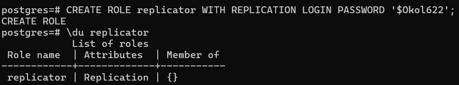


Проверяем, чтобы папки replica1/data и replica2/data были пустыми:
```bash
rm -rf ./replica1/data/*
rm -rf ./replica2/data/*
```


Поднимаем временный контейнер replica1:
```bash
docker run -it --rm --network growupbro_default --volume ./replica1/data:/var/lib/postgresql/data postgres:15 pg_basebackup -h postgres -D /var/lib/postgresql/data -U replicator -P -R
```
В replica1\data появляются папки «pg_*» и прочее

Аналогично для второй реплики:
```bash
docker run -it --rm --network growupbro_default --volume ./replica2/data:/var/lib/postgresql/data postgres:15 pg_basebackup -h postgres -D /var/lib/postgresql/data -U replicator -P -R
```


Запускаем реплики:
```bash
docker-compose up -d
```

Проверяем, что репликация работает:
```bash
docker exec -it GrowUpBro psql -U postgres
```
```sql
SELECT application_name, state, sync_state FROM pg_stat_replication;
```
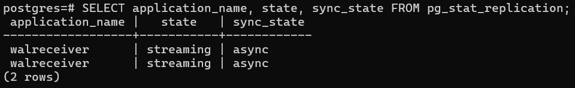

Проверяем, что данные на репликах есть:
```bash
docker exec -it ReplicationReplica1 psql -U postgres -d GrowUpBro
```
```sql
SELECT COUNT(*) FROM main.plant;
```
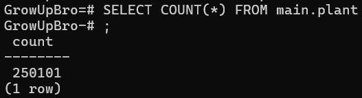
------


## Проверка репликации данных

#### Вставка данных на мастер:
```bash
docker exec -it GrowUpBro psql -U postgres -d GrowUpBro
```
```sql
INSERT INTO main.plant (name, description) VALUES ('TestPlant', 'Описание тестового растения');
```
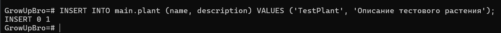


#### Проверка наличия вставленной строки на репликах:
```bash
docker exec -it ReplicationReplica1 psql -U postgres -d GrowUpBro
```
```sql
SELECT * FROM main.plant WHERE name='TestPlant';
```
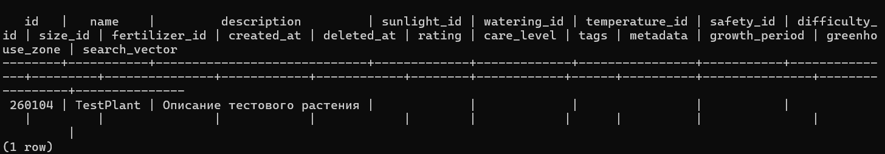


#### Попытка вставить данные на реплики:
```bash
docker exec -it ReplicationReplica1 psql -U postgres -d GrowUpBro
```
```sql
INSERT INTO main.plant (name, description) VALUES ('TestPlant2', 'Описание тестового растения2');
```
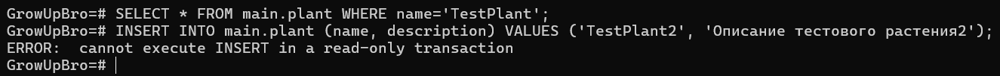

- Вставка на реплику запрещена
------


## Анализ replication lag

#### Нагрузка INSERT на мастере:
```bash
docker exec -it GrowUpBro psql -U postgres -d GrowUpBro
```
```sql
CREATE TABLE main.test (
    id bigserial primary key,
    created_at timestamptz default now(),
    description text
);

DO $$
BEGIN
    FOR i IN 1..10000 LOOP
        INSERT INTO main.test (description)
        VALUES ('test_' || i);
    END LOOP;
END;
$$;
```


#### Проверка lag на мастере:
```bash
docker exec -it GrowUpBro psql -U postgres -d GrowUpBro
```
```sql
SELECT application_name, state, sync_state, write_lag, flush_lag, replay_lag
FROM pg_stat_replication;
```
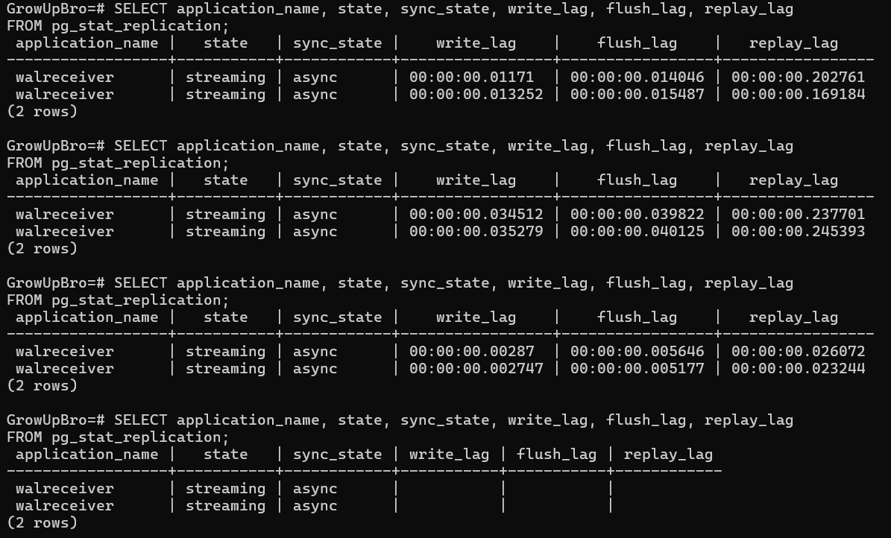


#### Проверка lag на реплике:
```bash
docker exec -it ReplicationReplica1 psql -U postgres -d GrowUpBro
```
```sql
SELECT now() - pg_last_xact_replay_timestamp() AS lag_time;
```
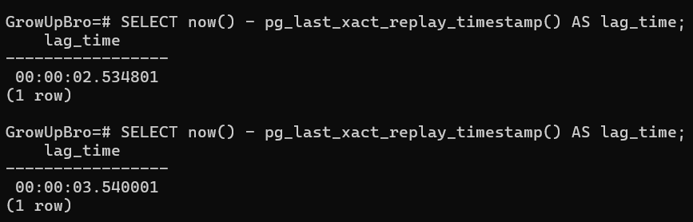

- Для нагрузки создана отдельная таблица main.test. Дважды выполнялась вставка 10_000 строк в таблицу
- В моменты нагрузки значение replay_lag увеличивается, но после окончания вставок постепенно уменьшается, то есть реплика начинает догонять мастер
- Значение lag_time также растет с повышением нагрузки
------


## Настроить логическую репликацию

В docker-compose.yml добавляем:
```
  postgres:
    image: postgres:15
    container_name: GrowUpBro
    environment:
      POSTGRES_USER: postgres
      POSTGRES_PASSWORD: postgres_pass
      POSTGRES_DB: GrowUpBro
    ports:
      - "5432:5432"
    volumes:
      - ./data:/var/lib/postgresql/data
    command: >
      postgres
      -c listen_addresses='*'
      -с wal_level=logical
      -c max_wal_senders=5
      -c wal_keep_size=64MB
      -c archive_mode=on
      -c archive_command='cd .'
      -c max_replication_slots=10
      -c max_logical_replication_workers=10

  replica3:
    image: postgres:15
    container_name: LogicalReplica
    environment:
      POSTGRES_USER: postgres
      POSTGRES_PASSWORD: postgres_pass
      POSTGRES_DB: GrowUpBro
    ports:
      - "5435:5432"
    volumes:
      - ./replica3:/var/lib/postgresql/data
    depends_on:
      - postgres
```

В /master/data/postgresql.conf:
```
wal_level = logical # Было replica
max_replication_slots = 10
max_logical_replication_workers = 10
```

Перезапускаем мастер:
```bash
docker-compose restart postgres
```

Добавляем пользователя-репликатора:
```bash
docker exec -it GrowUpBro psql -U postgres
```
```sql
CREATE ROLE replicator WITH REPLICATION LOGIN PASSWORD 'pass';
GRANT SELECT, INSERT, UPDATE, DELETE ON public.test_public_1 TO replicator;
GRANT SELECT, INSERT, UPDATE, DELETE ON public.test_public_2 TO replicator;
GRANT USAGE ON SCHEMA public TO replicator;
```

Создаем publication на мастере:
```bash
docker exec -it GrowUpBro psql -U postgres -d GrowUpBro
```
```sql
CREATE TABLE public.test_public_1 (
    id serial PRIMARY KEY,
    name text,
    description text
);

CREATE TABLE public.test_public_2 (
    id serial PRIMARY KEY,
    description text,
    created_at timestamptz DEFAULT now()
);

INSERT INTO public.test_public_1 (name, description) VALUES ('Name1', 'Desc1');
INSERT INTO public.test_public_2 (description) VALUES ('Desc2');
```
```sql
CREATE PUBLICATION test_pub FOR TABLE public.test_public_1, public.test_public_2;
```

Создаем subscription на реплике:
```bash
docker-compose up -d
docker exec -it LogicalReplica psql -U postgres -d GrowUpBro
```
```sql
CREATE TABLE public.test_public_1 (
    id serial PRIMARY KEY,
    name text,
    description text
);

CREATE TABLE public.test_public_2 (
    id serial PRIMARY KEY,
    description text,
    created_at timestamptz DEFAULT now()
);
```
```sql
CREATE SUBSCRIPTION test_sub CONNECTION 'host=postgres port=5432 user=replicator password=pass dbname=GrowUpBro' PUBLICATION test_pub WITH (copy_data = true);
```
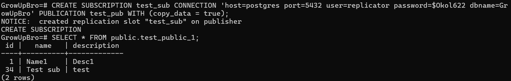


#### Данные реплицируются:

На мастере:
```bash
docker exec -it GrowUpBro psql -U postgres -d GrowUpBro
```
```sql
INSERT INTO test_public_1 (name, description) VALUES ('TestName', 'TestDesc');
```
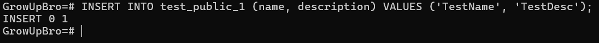

На реплике:
```bash
docker exec -it LogicalReplica psql -U postgres -d GrowUpBro
```
```sql
SELECT * FROM public.test_public_1 WHERE name = 'TestName';
```
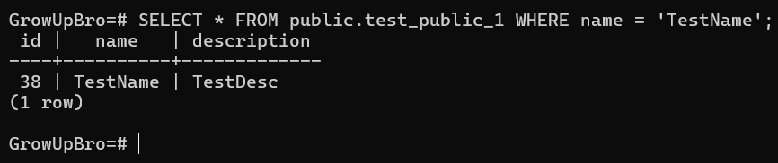


#### DDL не реплицируется:

На мастере:
```bash
docker exec -it GrowUpBro psql -U postgres -d GrowUpBro
```
```sql
ALTER TABLE test_public_2 ADD COLUMN source text DEFAULT 'master';
```
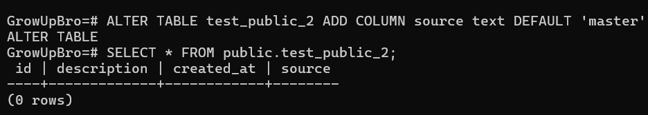

На реплике:
```bash
docker exec -it LogicalReplica psql -U postgres -d GrowUpBro
```
```sql
SELECT * FROM test_public_2;
```
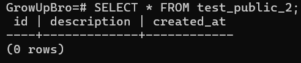


#### Проверка REPLICA INDENTITY:

На мастере:
```bash
docker exec -it GrowUpBro psql -U postgres -d GrowUpBro
```
```sql
CREATE TABLE public.no_pk_table (
    id integer,
    name text
);
ALTER PUBLICATION test_pub ADD TABLE public.no_pk_table;
INSERT INTO no_pk_table (id, name) VALUES (3, 'Test3');
```

На реплике:
```bash
docker exec -it LogicalReplica psql -U postgres -d GrowUpBro
```
```sql
CREATE TABLE public.no_pk_table (
    id integer,
    name text
);

ALTER SUBSCRIPTION test_sub REFRESH PUBLICATION WITH (copy_data = true);
```

На мастере update:
```bash
docker exec -it GrowUpBro psql -U postgres -d GrowUpBro
```
```sql
UPDATE no_pk_table SET name = 'Updated' WHERE id=3;
```
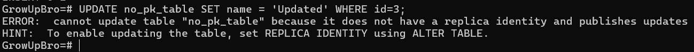

- UPDATE требует Replica Identity для таблиц в publication. Без PK блокируется обновление даже на мастере, так как непонятно, какую именно строку с id = 3 нужно обновить.


#### Проверка отсутствия DDL:

На мастере:
```bash
docker exec -it GrowUpBro psql -U postgres -d GrowUpBro
```
```sql
ALTER TABLE no_pk_table ADD COLUMN source text DEFAULT 'master';
SELECT * FROM no_pk_table;
```
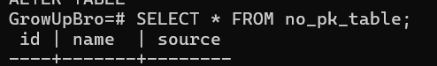

На реплике:
```bash
docker exec -it LogicalReplica psql -U postgres -d GrowUpBro
```
```sql
SELECT * FROM no_pk_table;
```
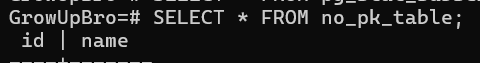


#### Проверка replication status:

На реплике:
```bash
docker exec -it LogicalReplica psql -U postgres -d GrowUpBro
```
```sql
SELECT subname, received_lsn, last_msg_send_time, last_msg_receipt_time, latest_end_lsn, latest_end_time
FROM pg_stat_subscription;
SELECT srrelid::regclass, srsubstate FROM pg_subscription_rel;
```
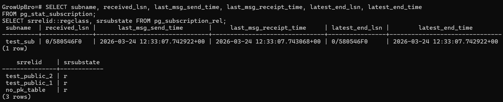

```sql
SELECT subname, pid FROM pg_stat_subscription;
```
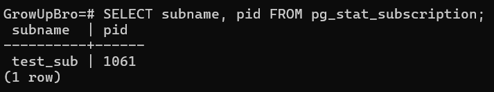

- У всех таблиц статус «r», то есть они готовы к репликации
- pid не null -> подписка активна


#### Как могут пригодится pg_dump/pg_restore для данного вида репликации?

pg_dump/pg_restore используется для создания схемы таблиц на реплике, так как логическая репликация переносит только DML-данные, DDL игнорирует