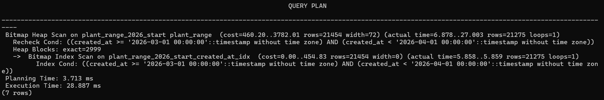
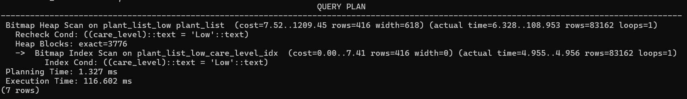
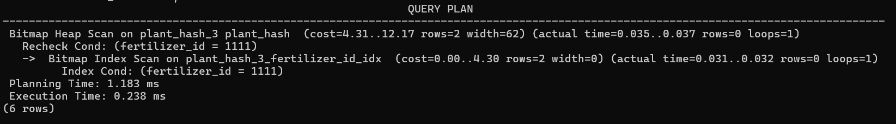
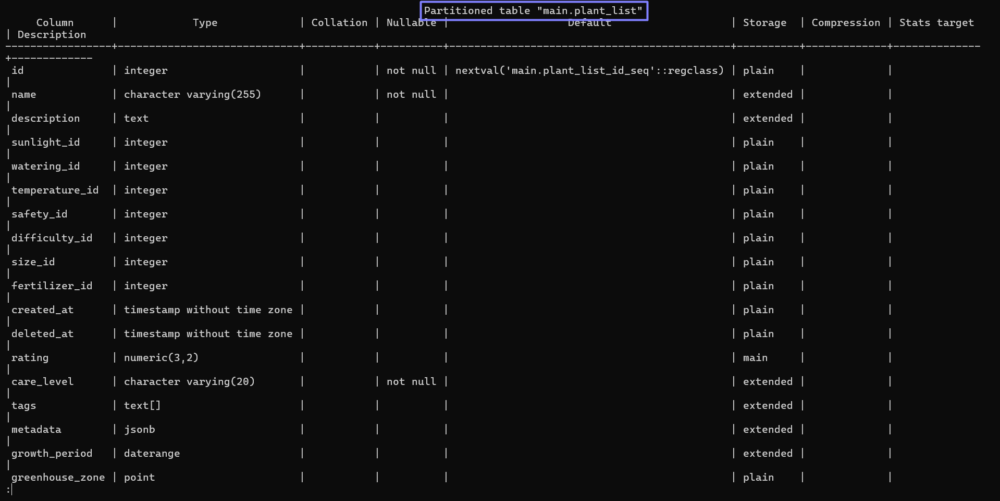
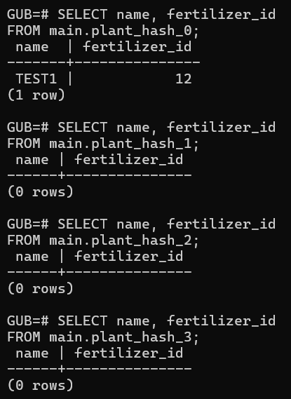
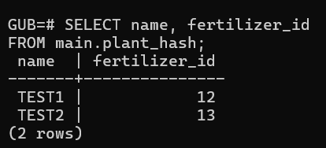
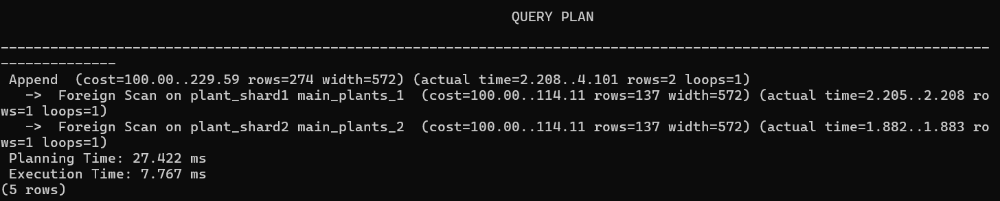
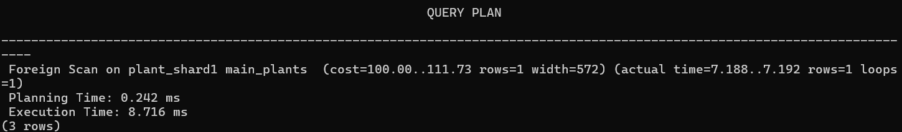
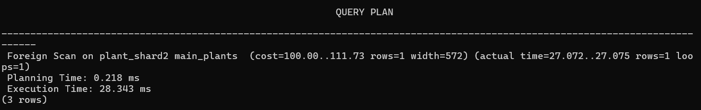

## Секционирование: RANGE / LIST / HASH

### 1. RANGE
Создаем секционированную по created_at таблицу plant:
```sql
CREATE TABLE main.plant_range (
	id SERIAL,
	name VARCHAR(255) NOT NULL,
	description TEXT,
	sunlight_id INT REFERENCES refs.sunlight(id),
    watering_id INT REFERENCES refs.watering(id),
    temperature_id INT REFERENCES refs.temperature(id),
    safety_id INT REFERENCES refs.safety(id),
    difficulty_id INT REFERENCES refs.difficulty(id),
    size_id INT REFERENCES refs.size(id),
    fertilizer_id INT REFERENCES main.fertilizer(id), 
    created_at TIMESTAMP,
	deleted_at TIMESTAMP NULL,
	rating NUMERIC(3,2),
	care_level VARCHAR(20),
	tags TEXT[],
	metadata JSONB,
	growth_period DATERANGE,
	greenhouse_zone POINT,
	search_vector tsvector, 
	PRIMARY KEY(id, created_at)
) PARTITION BY RANGE (created_at);
```

Добавляем секции по месяцам:
```sql
CREATE TABLE main.plant_range_2025_start
PARTITION OF main.plant_range
FOR VALUES FROM ('2025-01-01') TO ('2025-07-01');

CREATE TABLE main.plant_range_2025_end
PARTITION OF main.plant_range
FOR VALUES FROM ('2025-07-01') TO ('2026-01-01');

CREATE TABLE main.plant_range_2026_start
PARTITION OF main.plant_range
FOR VALUES FROM ('2026-01-01') TO ('2026-07-01');

CREATE TABLE main.plant_range_2026_end
PARTITION OF main.plant_range
FOR VALUES FROM ('2026-07-01') TO ('2027-01-01');

CREATE TABLE main.plant_range_default 
PARTITION OF main.plant_range DEFAULT;
```

Копируем данные из main.plant:
```sql
INSERT INTO main.plant_range 
SELECT id, name, description, sunlight_id, watering_id, temperature_id, safety_id, difficulty_id, size_id, fertilizer_id, 
		created_at, deleted_at, rating, care_level, tags, metadata, growth_period, greenhouse_zone, search_vector
FROM main.plant
WHERE created_at IS NOT NULL;
```

Создаем индекс:
```sql
CREATE INDEX idx_plant_created_at ON main.plant_range USING btree (created_at);
```

Запрос:
```sql
EXPLAIN ANALYZE
SELECT name, description, rating, created_at
FROM main.plant_range
WHERE created_at >= '2026-03-01' AND created_at < '2026-04-01';
```

- Partition pruning есть — рассматривается только plant_range_2026_start
- Участвует 1 партиция
- Используется добавленный индекс


### 2. LIST
Создаем секционированную по care_level таблицу plant:
```sql
CREATE TABLE main.plant_list (
	id SERIAL,
	name VARCHAR(255) NOT NULL,
	description TEXT,
	sunlight_id INT REFERENCES refs.sunlight(id),
    watering_id INT REFERENCES refs.watering(id),
    temperature_id INT REFERENCES refs.temperature(id),
    safety_id INT REFERENCES refs.safety(id),
    difficulty_id INT REFERENCES refs.difficulty(id),
    size_id INT REFERENCES refs.size(id),
    fertilizer_id INT REFERENCES main.fertilizer(id), 
    created_at TIMESTAMP,
	deleted_at TIMESTAMP NULL,
	rating NUMERIC(3,2),
	care_level VARCHAR(20),
	tags TEXT[],
	metadata JSONB,
	growth_period DATERANGE,
	greenhouse_zone POINT,
	search_vector tsvector, 
	PRIMARY KEY(id, care_level)
) PARTITION BY LIST (care_level);
```

Добавляем секции:
```sql
CREATE TABLE main.plant_list_high
PARTITION OF main.plant_list
FOR VALUES IN ('High');

CREATE TABLE main.plant_list_medium
PARTITION OF main.plant_list
FOR VALUES IN ('Medium');

CREATE TABLE main.plant_list_low
PARTITION OF main.plant_list
FOR VALUES IN ('Low');

CREATE TABLE main.plant_list_default 
PARTITION OF main.plant_list DEFAULT;
```

Копируем данные из main.plant:
```sql
INSERT INTO main.plant_list
SELECT id, name, description, sunlight_id, watering_id, temperature_id, safety_id, difficulty_id, size_id, fertilizer_id, 
		created_at, deleted_at, rating, care_level, tags, metadata, growth_period, greenhouse_zone, search_vector
FROM main.plant
WHERE care_level IS NOT NULL;
```

Создаем индекс:
```sql
CREATE INDEX idx_plant_care_level ON main.plant_list (care_level);
```

Запрос:
```sql
EXPLAIN ANALYZE
SELECT name, description, rating, care_level
FROM main.plant_list
WHERE care_level = 'Low';
```

- Partition pruning есть — рассматривается только plant_list_low
- Участвует 1 партиция
- Используется добавленный индекс


### 3. HASH
Создаем секционированную по fertilizer_id таблицу plant:
```sql
CREATE TABLE main.plant_hash (
	id SERIAL,
	name VARCHAR(255) NOT NULL,
	description TEXT,
	sunlight_id INT REFERENCES refs.sunlight(id),
    watering_id INT REFERENCES refs.watering(id),
    temperature_id INT REFERENCES refs.temperature(id),
    safety_id INT REFERENCES refs.safety(id),
    difficulty_id INT REFERENCES refs.difficulty(id),
    size_id INT REFERENCES refs.size(id),
    fertilizer_id INT REFERENCES main.fertilizer(id), 
    created_at TIMESTAMP,
	deleted_at TIMESTAMP NULL,
	rating NUMERIC(3,2),
	care_level VARCHAR(20),
	tags TEXT[],
	metadata JSONB,
	growth_period DATERANGE,
	greenhouse_zone POINT,
	search_vector tsvector, 
	PRIMARY KEY(id, fertilizer_id)
) PARTITION BY HASH (fertilizer_id);
```

Добавляем секции:
```sql
CREATE TABLE main.plant_hash_0
PARTITION OF main.plant_hash
FOR VALUES WITH (MODULUS 4, REMAINDER 0);

CREATE TABLE main.plant_hash_1
PARTITION OF main.plant_hash
FOR VALUES WITH (MODULUS 4, REMAINDER 1);

CREATE TABLE main.plant_hash_2
PARTITION OF main.plant_hash
FOR VALUES WITH (MODULUS 4, REMAINDER 2);

CREATE TABLE main.plant_hash_3
PARTITION OF main.plant_hash
FOR VALUES WITH (MODULUS 4, REMAINDER 3);
```

Копируем данные из main.plant:
```sql
INSERT INTO main.plant_hash
SELECT id, name, description, sunlight_id, watering_id, temperature_id, safety_id, difficulty_id, size_id, fertilizer_id, 
		created_at, deleted_at, rating, care_level, tags, metadata, growth_period, greenhouse_zone, search_vector
FROM main.plant
WHERE fertilizer_id IS NOT NULL;
```

Создаем индекс:
```sql
CREATE INDEX idx_plant_fertilizer_id ON main.plant_hash (fertilizer_id);
```

Запрос:
```sql
EXPLAIN ANALYZE
SELECT name, description, rating, fertilizer_id
FROM main.plant_hash
WHERE fertilizer_id = 1111;
```

- Partition pruning есть — рассматривается только plant_hash_3
- Участвует 1 партиция
- Используется добавленный индекс


## Секционирование и физическая репликация

### Проверить, что секционирование есть на репликах
Заходим на реплику:
```bash
docker exec -it replica1 psql -U postgres -d GUB
```

Смотрим подробную информацию про одну из секционированных таблиц:
```sql
\d+ main.plant_list
```

- В начале результата написано «Partitioned table», значит, секционирование реплицируется


### Почему репликация «не знает» про секции?
Физическая репликация работает с помощью WAL. Главный сервер определяет, в какую именно партицию должна попасть добавляемая строка, и фиксирует изменения конкретной таблицы в WAL. Реплика получает данные, применяя записи из WAL, не анализируя исходный SQL-запрос и не проверяя логику маршрутизации по ключу секций. На реплику копируются только изменения в имеющихся таблицах, а не логика получения этих изменений.


## Логическая репликация и секционирование publish_via_partition_root = on / off

### publish_via_partition_root = off
Заходим на реплику:
```bash
docker exec -it replica3 psql -U postgres -d GUB
```

Вручную добавляем таблицы для каждой секции:
```sql
CREATE TABLE main.plant_hash_0 (
	id SERIAL,
	name VARCHAR(255) NOT NULL,
	description TEXT,
	sunlight_id INT REFERENCES refs.sunlight(id),
    watering_id INT REFERENCES refs.watering(id),
    temperature_id INT REFERENCES refs.temperature(id),
    safety_id INT REFERENCES refs.safety(id),
    difficulty_id INT REFERENCES refs.difficulty(id),
    size_id INT REFERENCES refs.size(id),
    fertilizer_id INT REFERENCES main.fertilizer(id), 
    created_at TIMESTAMP,
	deleted_at TIMESTAMP NULL,
	rating NUMERIC(3,2),
	care_level VARCHAR(20),
	tags TEXT[],
	metadata JSONB,
	growth_period DATERANGE,
	greenhouse_zone POINT,
	search_vector tsvector
);

CREATE TABLE main.plant_hash_1 (
	id SERIAL,
	name VARCHAR(255) NOT NULL,
	description TEXT,
	sunlight_id INT REFERENCES refs.sunlight(id),
    watering_id INT REFERENCES refs.watering(id),
    temperature_id INT REFERENCES refs.temperature(id),
    safety_id INT REFERENCES refs.safety(id),
    difficulty_id INT REFERENCES refs.difficulty(id),
    size_id INT REFERENCES refs.size(id),
    fertilizer_id INT REFERENCES main.fertilizer(id), 
    created_at TIMESTAMP,
	deleted_at TIMESTAMP NULL,
	rating NUMERIC(3,2),
	care_level VARCHAR(20),
	tags TEXT[],
	metadata JSONB,
	growth_period DATERANGE,
	greenhouse_zone POINT,
	search_vector tsvector
);

CREATE TABLE main.plant_hash_2 (
	id SERIAL,
	name VARCHAR(255) NOT NULL,
	description TEXT,
	sunlight_id INT REFERENCES refs.sunlight(id),
    watering_id INT REFERENCES refs.watering(id),
    temperature_id INT REFERENCES refs.temperature(id),
    safety_id INT REFERENCES refs.safety(id),
    difficulty_id INT REFERENCES refs.difficulty(id),
    size_id INT REFERENCES refs.size(id),
    fertilizer_id INT REFERENCES main.fertilizer(id), 
    created_at TIMESTAMP,
	deleted_at TIMESTAMP NULL,
	rating NUMERIC(3,2),
	care_level VARCHAR(20),
	tags TEXT[],
	metadata JSONB,
	growth_period DATERANGE,
	greenhouse_zone POINT,
	search_vector tsvector
);

CREATE TABLE main.plant_hash_3 (
	id SERIAL,
	name VARCHAR(255) NOT NULL,
	description TEXT,
	sunlight_id INT REFERENCES refs.sunlight(id),
    watering_id INT REFERENCES refs.watering(id),
    temperature_id INT REFERENCES refs.temperature(id),
    safety_id INT REFERENCES refs.safety(id),
    difficulty_id INT REFERENCES refs.difficulty(id),
    size_id INT REFERENCES refs.size(id),
    fertilizer_id INT REFERENCES main.fertilizer(id), 
    created_at TIMESTAMP,
	deleted_at TIMESTAMP NULL,
	rating NUMERIC(3,2),
	care_level VARCHAR(20),
	tags TEXT[],
	metadata JSONB,
	growth_period DATERANGE,
	greenhouse_zone POINT,
	search_vector tsvector
);
```

На главном сервере создаем публикацию:
```sql
CREATE PUBLICATION gub_pub_hash FOR TABLE main.plant_hash;
```

На реплике создаем подписку:
```sql
CREATE SUBSCRIPTION gub_sub_hash CONNECTION 'host=primary port=5432 dbname=GUB user=postgres password=postgres_pass' PUBLICATION gub_pub_hash;
```

На главном сервере добавляем данные:
```sql
INSERT INTO main.plant_hash (name, fertilizer_id) VALUES ('TEST1', 12);
```

Проверяем данные на реплике:
```sql
SELECT name, fertilizer_id
FROM main.plant_hash_0;

SELECT name, fertilizer_id
FROM main.plant_hash_1;

SELECT name, fertilizer_id
FROM main.plant_hash_2;

SELECT name, fertilizer_id
FROM main.plant_hash_3;
```

- Строка вставилась только в таблицу main.plant_hash_0, что соответствует ожиданиям


### publish_via_partition_root = on
Заходим на реплику:
```bash
docker exec -it replica3 psql -U postgres -d GUB
```

Вручную добавляем таблицу main.plant_hash, аналогичную таблице на главном сервере:
```sql
CREATE TABLE main.plant_hash (
	id SERIAL,
	name VARCHAR(255) NOT NULL,
	description TEXT,
	sunlight_id INT REFERENCES refs.sunlight(id),
    watering_id INT REFERENCES refs.watering(id),
    temperature_id INT REFERENCES refs.temperature(id),
    safety_id INT REFERENCES refs.safety(id),
    difficulty_id INT REFERENCES refs.difficulty(id),
    size_id INT REFERENCES refs.size(id),
    fertilizer_id INT REFERENCES main.fertilizer(id), 
    created_at TIMESTAMP,
	deleted_at TIMESTAMP NULL,
	rating NUMERIC(3,2),
	care_level VARCHAR(20),
	tags TEXT[],
	metadata JSONB,
	growth_period DATERANGE,
	greenhouse_zone POINT,
	search_vector tsvector
);
```

На главном сервере создаем публикацию:
```sql
CREATE PUBLICATION gub_pub_hash_on FOR TABLE main.plant_hash WITH (publish_via_partition_root = true);
```

На реплике создаем подписку:
```sql
CREATE SUBSCRIPTION gub_sub_hash_on CONNECTION 'host=primary port=5432 dbname=GUB user=postgres password=postgres_pass' PUBLICATION gub_pub_hash_on;
```

На главном сервере добавляем данные:
```sql
INSERT INTO main.plant_hash (name, fertilizer_id) VALUES ('TEST2', 13);
```

Проверяем данные на реплике:
```sql
SELECT name, fertilizer_id
FROM main.plant_hash;
```

- Строка вставилась в таблицу main.plant_hash, что соответствует ожиданиям


## Шардирование через postgres_fdw

### Самостоятельно реализовать: 2 шарда и 1 router (FDW)
В docker-compose.yml создаем 2 шарда и 1 роутер:
```yml
services:
  router:
    image: postgres:15
    container_name: router
    environment:
      POSTGRES_DB: GUB
      POSTGRES_USER: postgres
      POSTGRES_PASSWORD: postgres_pass
    ports:
      - "5437:5432"
    volumes:
      - pgdata_router:/var/lib/postgresql/data

  shard1:
    image: postgres:15
    container_name: shard1
    environment:
      POSTGRES_DB: GUB
      POSTGRES_USER: postgres
      POSTGRES_PASSWORD: postgres_pass
    ports:
      - "5438:5432"
    volumes:
      - pgdata_shard1:/var/lib/postgresql/data

  shard2:
    image: postgres:15
    container_name: shard2
    environment:
      POSTGRES_DB: GUB
      POSTGRES_USER: postgres
      POSTGRES_PASSWORD: postgres_pass
    ports:
      - "5439:5432"
    volumes:
      - pgdata_shard2:/var/lib/postgresql/data

volumes:
  pgdata_router:
  pgdata_shard1:
  pgdata_shard2:
```

Заходим в шарды и создаем таблицы с органичениями на значение id:
```bash
docker exec -it shard1 psql -U postgres -d GUB
```
```sql
CREATE TABLE plant (
	id SERIAL CHECK (id = 1),
	name VARCHAR(255) NOT NULL,
	description TEXT,
	sunlight_id INT,
    watering_id INT,
    temperature_id INT,
    safety_id INT,
    difficulty_id INT 
);
```

```bash
docker exec -it shard2 psql -U postgres -d GUB
```
```sql
CREATE TABLE plant (
	id SERIAL CHECK (id = 2),
	name VARCHAR(255) NOT NULL,
	description TEXT,
	sunlight_id INT,
    watering_id INT,
    temperature_id INT,
    safety_id INT,
    difficulty_id INT 
);
```

Заходим в роутер:
```bash
docker exec -it router psql -U postgres -d GUB
```

Включаем расширение postgres_fdw:
```sql
CREATE EXTENSION postgres_fdw;
```

Подключаем созданные шарды и выдаем права на них:
```sql
CREATE SERVER shard1_server FOREIGN DATA WRAPPER postgres_fdw OPTIONS (host 'shard1', dbname 'GUB', port '5432');
CREATE SERVER shard2_server FOREIGN DATA WRAPPER postgres_fdw OPTIONS (host 'shard2', dbname 'GUB', port '5432');

CREATE USER MAPPING FOR postgres SERVER shard1_server OPTIONS (user 'postgres', password 'postgres_pass');
CREATE USER MAPPING FOR postgres SERVER shard2_server OPTIONS (user 'postgres', password 'postgres_pass');
```

Создаем таблицу на роутере:
```sql
CREATE TABLE main_plants (
	id SERIAL,
	name VARCHAR(255) NOT NULL,
	description TEXT,
	sunlight_id INT,
    watering_id INT,
    temperature_id INT,
    safety_id INT,
    difficulty_id INT
) PARTITION BY LIST (id);
```

Подключаем созданные шарды в качестве партиций:
```sql
CREATE FOREIGN TABLE plant_shard1 PARTITION OF main_plants FOR VALUES IN (1) SERVER shard1_server OPTIONS (table_name 'plant');
CREATE FOREIGN TABLE plant_shard2 PARTITION OF main_plants FOR VALUES IN (2) SERVER shard2_server OPTIONS (table_name 'plant');
```

Вставляем данные на роутер:
```sql
INSERT INTO main_plants (name, description)
VALUES ('Test1', 'Desc1');

INSERT INTO main_plants (name, description)
VALUES ('Test2', 'Desc2');
```

### Cделать запросы и посмотреть на план запроса
Ищем все вставленные данные:
```sql
EXPLAIN ANALYZE
SELECT * FROM main_plants;
```

- Данные ищутся на обоих шардах

Ищем вставленные данные с id = 1:
```sql
EXPLAIN ANALYZE
SELECT * FROM main_plants
WHERE id = 1;
```

- Данные ищутся на первом шарде

Ищем вставленные данные с id = 2:
```sql
EXPLAIN ANALYZE
SELECT * FROM main_plants
WHERE id = 2;
```

- Данные ищутся на втором шарде