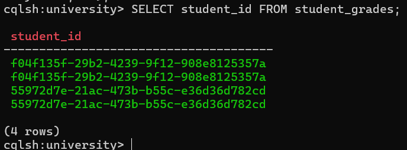
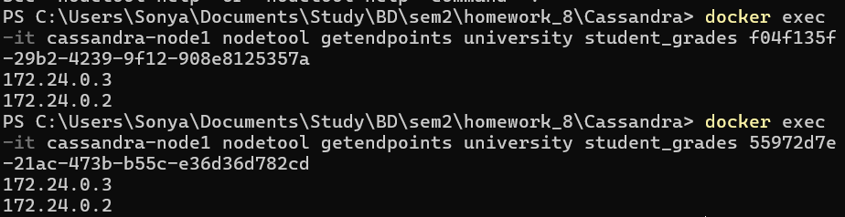
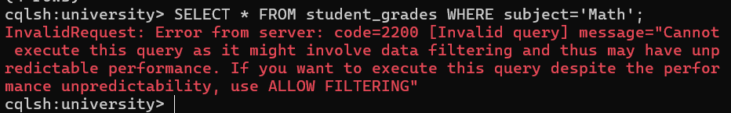
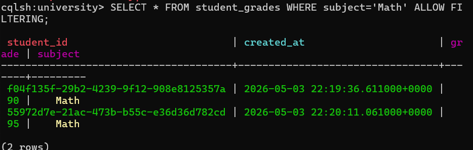

## Cassandra

### Задание 1. Инициализация БД с репликацией

Создаем docker-compose.yml
```yaml
services:  
  node1:  
    image: cassandra:latest  
    container_name: cassandra-node1  
    ports:  
      - "9042:9042"  
    volumes:  
      - cassandra_node1_data:/var/lib/cassandra  
    environment:  
      - CASSANDRA_CLUSTER_NAME=TestCluster  
      - CASSANDRA_ENDPOINT_SNITCH=GossipingPropertyFileSnitch  
      - MAX_HEAP_SIZE=256M  
      - HEAP_NEWSIZE=64M  
    healthcheck:  
      test: ["CMD-SHELL", "nodetool status | grep -E '^UN'"]  
      interval: 15s  
      timeout: 10s  
      retries: 10  
  
  node2:  
    image: cassandra:latest  
    container_name: cassandra-node2  
    volumes:  
      - cassandra_node2_data:/var/lib/cassandra  
    environment:  
      - CASSANDRA_CLUSTER_NAME=TestCluster  
      - CASSANDRA_SEEDS=node1  
      - CASSANDRA_ENDPOINT_SNITCH=GossipingPropertyFileSnitch  
      - MAX_HEAP_SIZE=256M  
      - HEAP_NEWSIZE=64M  
    depends_on:  
      node1:  
        condition: service_healthy  
  
volumes:  
  cassandra_node1_data:  
  cassandra_node2_data:
```

Запускаем контейнер через Docker
```bash
docker compose up -d
```

Подключаемся к контейнеру
```bash
docker exec -it cassandra-node1 cqlsh
```

Создаем Keyspace `university` с фактором репликации 2
```bash
CREATE KEYSPACE university
WITH replication = {'class': 'SimpleStrategy', 'replication_factor': 2};
```

Переключаемся на созданный Keyspace
```bash
USE university;
```


### Задание 2. Создание таблицы и данных

Создаем таблицу «student_grades: student_id(uuid), created_at, subject, grade» с ключами Partition Key — student_id, Clustering Key — created_at
```bash
CREATE TABLE student_grades (
    student_id uuid,
    created_at timestamp,
    subject text,
    grade int,
    PRIMARY KEY (student_id, created_at)
) WITH CLUSTERING ORDER BY (created_at DESC);
```

Вставляем 1 студента
```bash
INSERT INTO student_grades (student_id, created_at, subject, grade) VALUES (uuid(), toTimestamp(now()), 'Math', 90);
INSERT INTO student_grades (student_id, created_at, subject, grade) VALUES (f04f135f-29b2-4239-9f12-908e8125357a, toTimestamp(now()), 'History', 85);
```

Вставляем 2 студента
```bash
INSERT INTO student_grades (student_id, created_at, subject, grade) VALUES (uuid(), toTimestamp(now()), 'Math', 95);
INSERT INTO student_grades (student_id, created_at, subject, grade) VALUES (55972d7e-21ac-473b-b55c-e36d36d782cd, toTimestamp(now()), 'Physics', 88);
```


### Задание 3. Проверка распределения данных

Получаем UUID всех студентов
```bash
SELECT student_id FROM student_grades;
```


Выполняем команду для получения ip нод с данными каждого UUID
```bash
docker exec -it cassandra-node1 nodetool getendpoints university student_grades f04f135f-29b2-4239-9f12-908e8125357a
docker exec -it cassandra-node1 nodetool getendpoints university student_grades 55972d7e-21ac-473b-b55c-e36d36d782cd
```



### Задание 4. Работа с фильтрацией

Пробуем выполнить поиск по предмету
```bash
SELECT * FROM student_grades WHERE subject='Math';
```


Пробуем выполнить тот же запрос с ALLOW FILTERING
```bash
SELECT * FROM student_grades WHERE subject='Math' ALLOW FILTERING;
```

- ALLOW FILTERING позволяет осуществлять поиск по неключевым полям