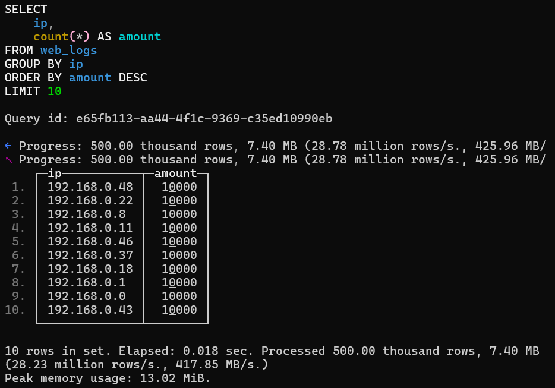
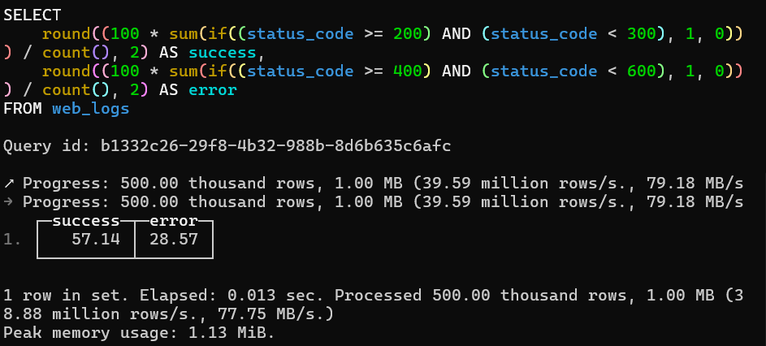
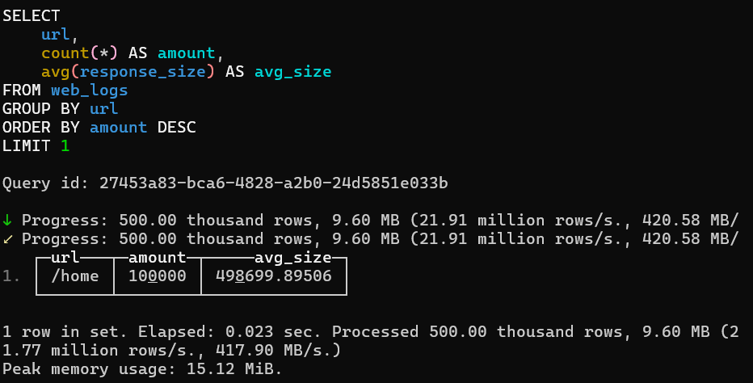
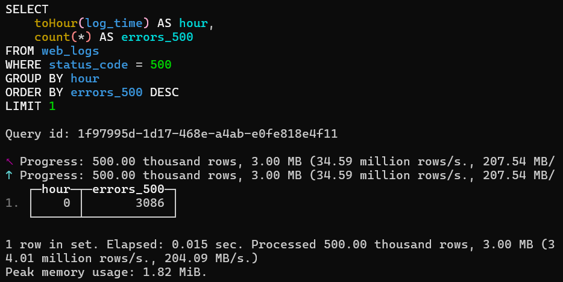
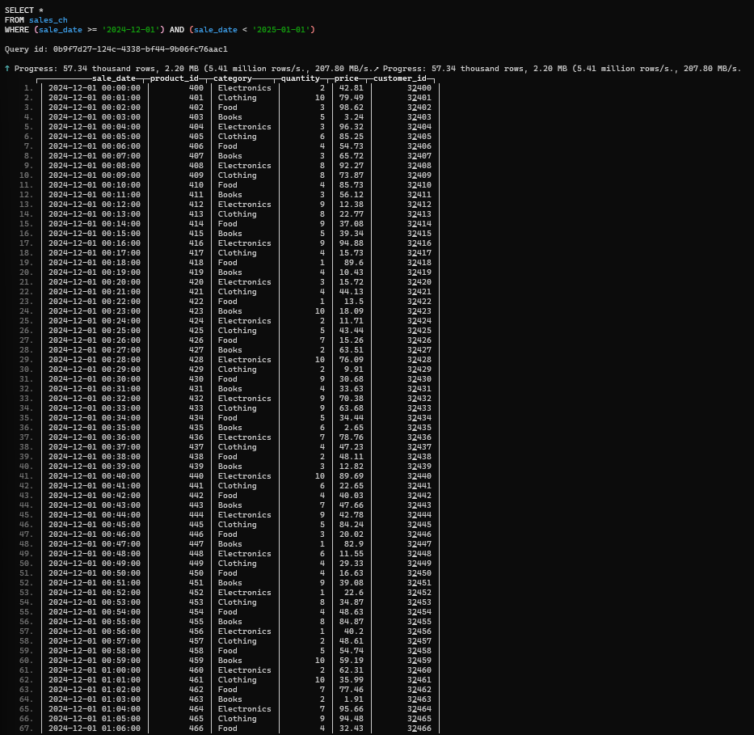
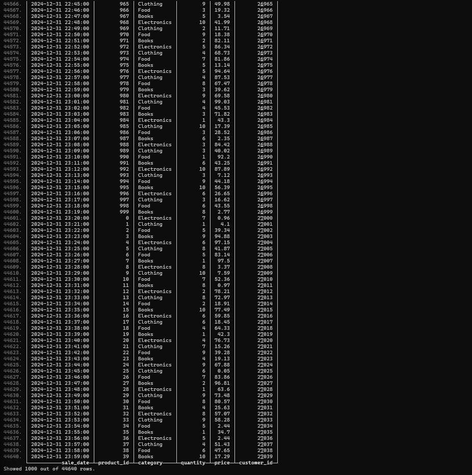
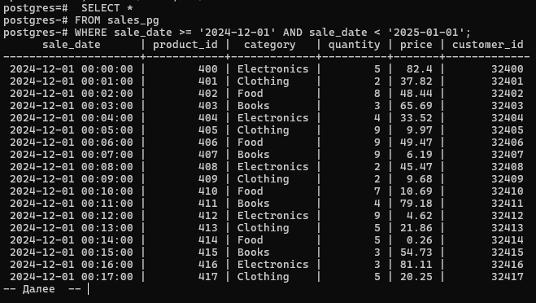
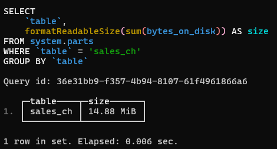
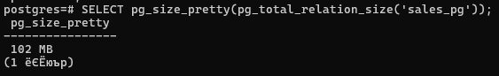
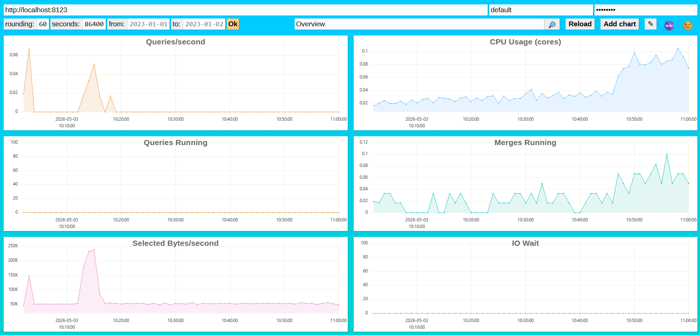

## ClickHouse

### Задание 0. Запуск через Docker

Создаем docker-compose.yml
```yaml
services:
  clickhouse:
    image: clickhouse/clickhouse-server:latest
    container_name: clickhouse-lab
    ports:
      - '8123:8123'
      - '9000:9000'
    environment:
      CLICKHOUSE_DB: default
      CLICKHOUSE_USER: default
      CLICKHOUSE_PASSWORD: password
    volumes:
      - clickhouse_data:/var/lib/clickhouse
    ulimits:
      nofile:
        soft: 262144
        hard: 262144

  postgres:
    image: postgres:16
    container_name: postgres-lab
    ports:
      - '5432:5432'
    environment:
      POSTGRES_DB: postgres
      POSTGRES_USER: postgres
      POSTGRES_PASSWORD: postgres
    volumes:
      - postgres_data:/var/lib/postgresql/data

volumes:
  clickhouse_data:
  postgres_data:
```

Запускаем контейнер через Docker
```bash
docker compose up -d
```

Подключаемся к контейнеру
```bash
docker exec -it clickhouse-lab clickhouse-client --password password
```


### Задание 1. Написать запросы

Задаем структуру
```bash
CREATE TABLE web_logs (
    log_time DateTime,
    ip String,
    url String,
    status_code UInt16,
    response_size UInt64
) ENGINE = MergeTree()
ORDER BY (log_time, status_code);

INSERT INTO web_logs
SELECT
    toDateTime('2024-03-01 00:00:00') + INTERVAL number SECOND,
    concat('192.168.0.', toString(number % 50)),
    arrayElement(['/home', '/api/users', '/api/orders', '/admin', '/products'], number % 5 + 1),
    arrayElement([200, 200, 200, 404, 500, 301, 200], number % 7 + 1),
    rand() % 1000000
FROM numbers(500000);
```

1. Найдем топ-10 IP-адресов по количеству запросов
```bash
SELECT ip, count(*) AS amount
FROM web_logs
GROUP BY ip
ORDER BY amount DESC
LIMIT 10;
```


2. Посчитаем процент успешных запросов (2xx) и ошибочных (4xx, 5xx)
```bash
SELECT
    round(100 * sum(if(status_code >= 200 AND status_code < 300, 1, 0)) / count(), 2) AS success,
    round(100 * sum(if(status_code >= 400 AND status_code < 600, 1, 0)) / count(), 2) AS error
FROM web_logs;
```


3. Найдем самый популярный URL и средний размер ответа для него
```bash
SELECT
    url,
    count(*) AS amount,
    avg(response_size) AS avg_size
FROM web_logs
GROUP BY url
ORDER BY amount DESC
LIMIT 1;
```


4. Определим час с наибольшим количеством ошибок 500
```bash
SELECT toHour(log_time) AS hour, count(*) AS errors_500
FROM web_logs
WHERE status_code = 500
GROUP BY hour
ORDER BY errors_500 DESC
LIMIT 1;
```



### Задание 2. Сравнить с PostgreSQL

Для ClickHouse
```bash
CREATE TABLE sales_ch (
    sale_date DateTime,
    product_id UInt64,
    category String,
    quantity UInt32,
    price Float64,
    customer_id UInt64
) ENGINE = MergeTree()
ORDER BY (sale_date);

INSERT INTO sales_ch
SELECT
    toDateTime('2024-01-01 00:00:00') + INTERVAL number MINUTE,
    number % 1000,
    arrayElement(['Electronics', 'Clothing', 'Food', 'Books'], number % 4 + 1),
    rand() % 10 + 1,
    round(rand() % 10000 / 100, 2),
    number % 50000
FROM numbers(1000000);
```

Результат:
```bash
1000000 rows in set. Elapsed: 0.200 sec. Processed 1.00 million rows, 8.00 MB (5.01 million rows/s., 40.09 MB/s.)
Peak memory usage: 61.32 MiB.
```

Для PostgreSQL
```bash
CREATE TABLE sales_pg (
    sale_date timestamp,
    product_id bigint,
    category text,
    quantity integer,
    price float8,
    customer_id bigint
);

CREATE INDEX idx_sales_pg_date ON sales_pg(sale_date);
CREATE INDEX idx_sales_pg_product ON sales_pg(product_id);

INSERT INTO sales_pg
SELECT
    '2024-01-01 00:00:00'::timestamp + (n || ' minutes')::interval,
    n % 1000,
    CASE (n % 4)
        WHEN 0 THEN 'Electronics'
        WHEN 1 THEN 'Clothing'
        WHEN 2 THEN 'Food'
        ELSE 'Books'
    END,
    (random() * 9 + 1)::integer,
    round((random() * 100)::numeric, 2),
    n % 50000
FROM generate_series(1, 1000000) AS n;
```

Результат:
```bash
INSERT 0 1000000
Время: 18388,691 мс (00:18,389)
```

###### Продажи за последний месяц

Для ClickHouse
```bash
SELECT *
FROM sales_ch
WHERE sale_date >= '2024-12-01' AND sale_date < '2025-01-01';
```



Для PostgreSQL
```bash
SELECT *
FROM sales_pg
WHERE sale_date >= '2024-12-01' AND sale_date < '2025-01-01';
```


###### Размер данных

Для ClickHouse
```bash
SELECT 
    table, 
    formatReadableSize(sum(bytes_on_disk)) AS size
FROM system.parts
WHERE table = 'sales_ch'
GROUP BY table;
```


Для PostgreSQL
```bash
SELECT pg_size_pretty(pg_total_relation_size('sales_pg'));
```


###### Выводы

1. Какая СУБД быстрее вставила 1 млн строк?
Быстрее сработал ClickHouse: он вставил 1 млн строк за 0,2 секунды, PostgreSQL же вставил за 18 секунд.

2. Во сколько раз ClickHouse сжал данные эффективнее?
Размер данных в ClickHouse — 14,88 Mb, в PostgreSQL — 102Mb, то есть ClickHouse сжал данные почти в 7 раз лучше.

3. Какой вывод можно сделать о выборе СУБД для аналитики?
ClickHouse лучше подходит для аналитики и больших объемов данных, PostgreSQL — для транзакционных действий.

4. Разница ClickHouse и PostgreSQL
- ClickHouse — колоночная, PostgreSQL — строчная
- ClickHouse — быстрые агрегаты, PostgreSQL — гибкая логика и транзакции
- ClickHouse — OLAP, PostgreSQL — OLTP


### Задание 3. Изучить dashboard
