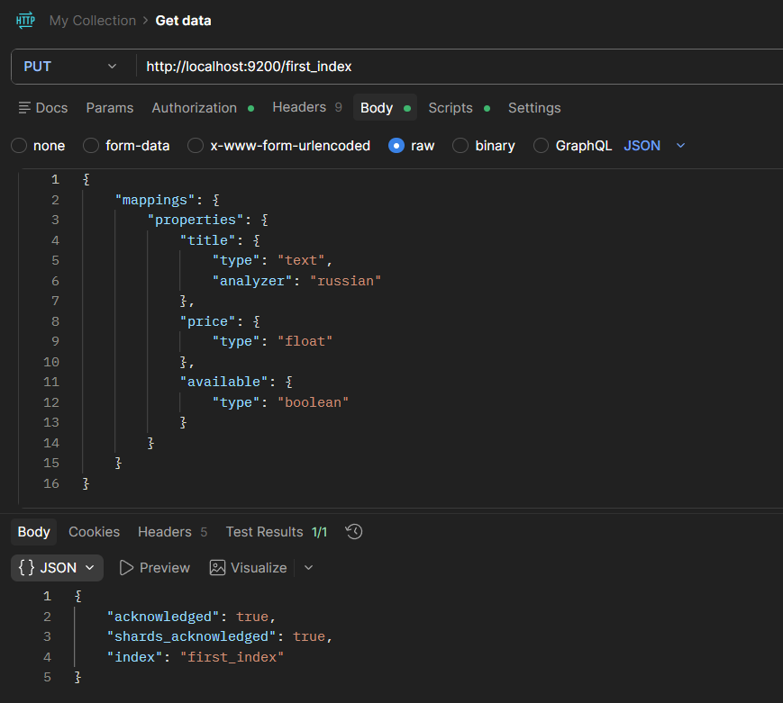
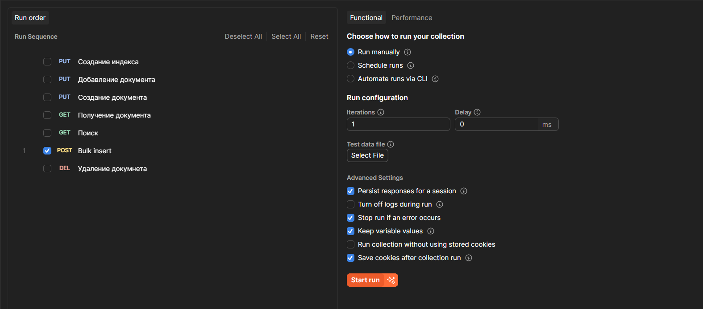
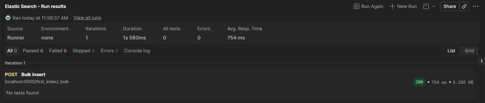
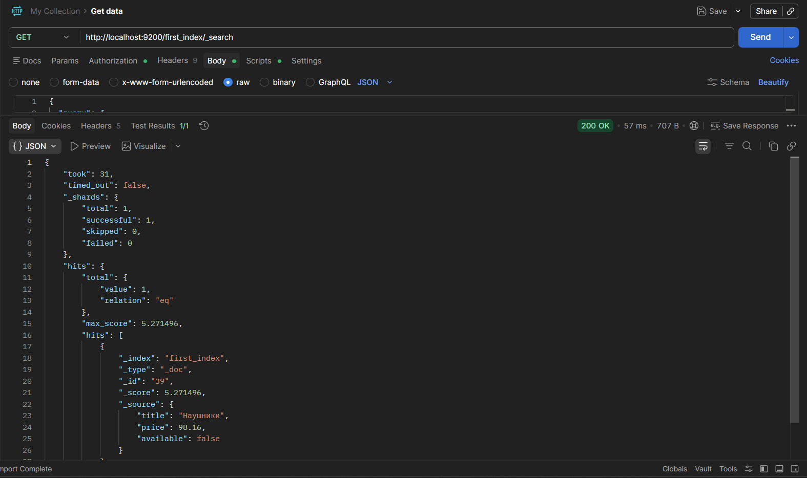
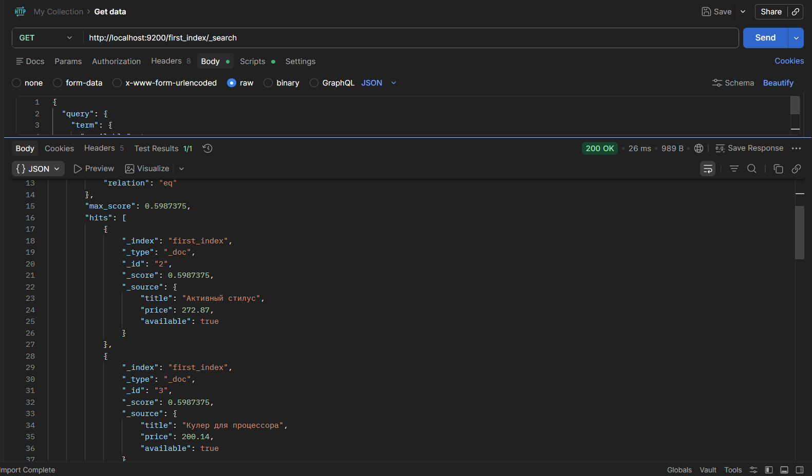
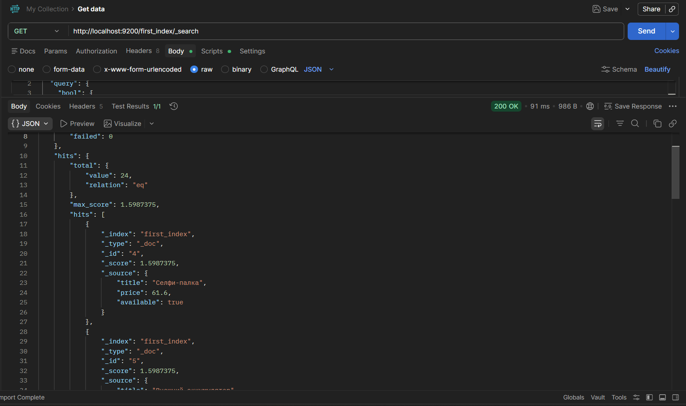

## Elasticsearch

### Задание 1. Запуск через Docker

Запускаем контейнер через Docker
```bash
docker run -p 9200:9200 -e "discovery.type=single-node" elasticsearch:7.17.22
```

Для проверки необходимо перейти по ссылке «http://localhost:9200». Должно отображаться следующее:
```json
{
  "name" : "e6a2022df0c0",
  "cluster_name" : "docker-cluster",
  "cluster_uuid" : "gOYTrRgSThmP7_zaIv60TA",
  "version" : {
    "number" : "7.17.22",
    "build_flavor" : "default",
    "build_type" : "docker",
    "build_hash" : "38e9ca2e81304a821c50862dafab089ca863944b",
    "build_date" : "2024-06-06T07:35:17.876121680Z",
    "build_snapshot" : false,
    "lucene_version" : "8.11.3",
    "minimum_wire_compatibility_version" : "6.8.0",
    "minimum_index_compatibility_version" : "6.0.0-beta1"
  },
  "tagline" : "You Know, for Search"
}
```


### Задание 2. Создать индекс

С помощью Postman делаем Put-запрос на адрес «http://localhost:9200/first_index» с телом
```json
{
    "mappings": {
        "properties": {
            "title": {
                "type": "text",
                "analyzer": "russian"
            },
            "price": {
                "type": "float"
            },
            "available": {
                "type": "boolean"
            }
        }
    }
}
```



### Задание 3. Добавить документы

В Postman File → Import, импортируем ElasticSearch Postman collection.json. Для полученной коллекции выбираем Run и оставляем только Post-запрос на bulk insert, запускаем




### Задание 4. Написать запросы

###### Поиск по названию с помощью match

Найдем документы с названием «Наушники». С помощью Postman делаем Get-запрос на адрес «http://localhost:9200/first_index/_search» с телом
```json
{
  "query": {
    "match": {
      "title": "Наушники"
    }
  }
}
```


###### Фильтр по цене с помощью range

Найдем документы с ценой от 50 до 200. С помощью Postman делаем Get-запрос на адрес «http://localhost:9200/first_index/_search» с телом
```json
{
  "query": {
    "range": {
      "price": {
        "gte": 50,
        "lte": 200
      }
    }
  }
}
```

Найденные документы:
```json
{
    "took": 11,
    "timed_out": false,
    "_shards": {
        "total": 1,
        "successful": 1,
        "skipped": 0,
        "failed": 0
    },
    "hits": {
        "total": {
            "value": 56,
            "relation": "eq"
        },
        "max_score": 1.0,
        "hits": [
            {
                "_index": "first_index",
                "_type": "_doc",
                "_id": "4",
                "_score": 1.0,
                "_source": {
                    "title": "Селфи-палка",
                    "price": 61.6,
                    "available": true
                }
            },
            {
                "_index": "first_index",
                "_type": "_doc",
                "_id": "5",
                "_score": 1.0,
                "_source": {
                    "title": "Внешний аккумулятор",
                    "price": 198.49,
                    "available": true
                }
            },
            {
                "_index": "first_index",
                "_type": "_doc",
                "_id": "6",
                "_score": 1.0,
                "_source": {
                    "title": "Смарт-часы",
                    "price": 181.26,
                    "available": true
                }
            },
            {
                "_index": "first_index",
                "_type": "_doc",
                "_id": "7",
                "_score": 1.0,
                "_source": {
                    "title": "Мышь беспроводная",
                    "price": 94.08,
                    "available": false
                }
            },
            {
                "_index": "first_index",
                "_type": "_doc",
                "_id": "8",
                "_score": 1.0,
                "_source": {
                    "title": "Внешний диск 2TB",
                    "price": 177.49,
                    "available": true
                }
            },
            {
                "_index": "first_index",
                "_type": "_doc",
                "_id": "9",
                "_score": 1.0,
                "_source": {
                    "title": "Процессор",
                    "price": 125.64,
                    "available": false
                }
            },
            {
                "_index": "first_index",
                "_type": "_doc",
                "_id": "11",
                "_score": 1.0,
                "_source": {
                    "title": "Оптический привод",
                    "price": 139.59,
                    "available": false
                }
            },
            {
                "_index": "first_index",
                "_type": "_doc",
                "_id": "16",
                "_score": 1.0,
                "_source": {
                    "title": "Процессор",
                    "price": 173.85,
                    "available": false
                }
            },
            {
                "_index": "first_index",
                "_type": "_doc",
                "_id": "18",
                "_score": 1.0,
                "_source": {
                    "title": "Оптический привод",
                    "price": 139.59,
                    "available": false
                }
            },
            {
                "_index": "first_index",
                "_type": "_doc",
                "_id": "21",
                "_score": 1.0,
                "_source": {
                    "title": "Внешний диск 2TB",
                    "price": 94.84,
                    "available": false
                }
            }
        ]
    }
}
```

###### Фильтр по доступности с помощью term

Найдем документы с доступными товарами. С помощью Postman делаем Get-запрос на адрес «http://localhost:9200/first_index/_search» с телом
```json
{
  "query": {
    "term": {
      "available": true
    }
  }
}
```


###### Фильтр по доступности с помощью term и цене с помощью range

Найдем документы с доступными товарами, цена которых входит в промежуток [50; 200]. С помощью Postman делаем Get-запрос на адрес «http://localhost:9200/first_index/_search» с телом
```json
{
  "query": {
    "bool": {
      "must": [
        {
          "range": {
            "price": {
              "gte": 50,
              "lte": 200
            }
          }
        },
        {
          "term": {
            "available": true
          }
        }
      ]
    }
  }
}
```
