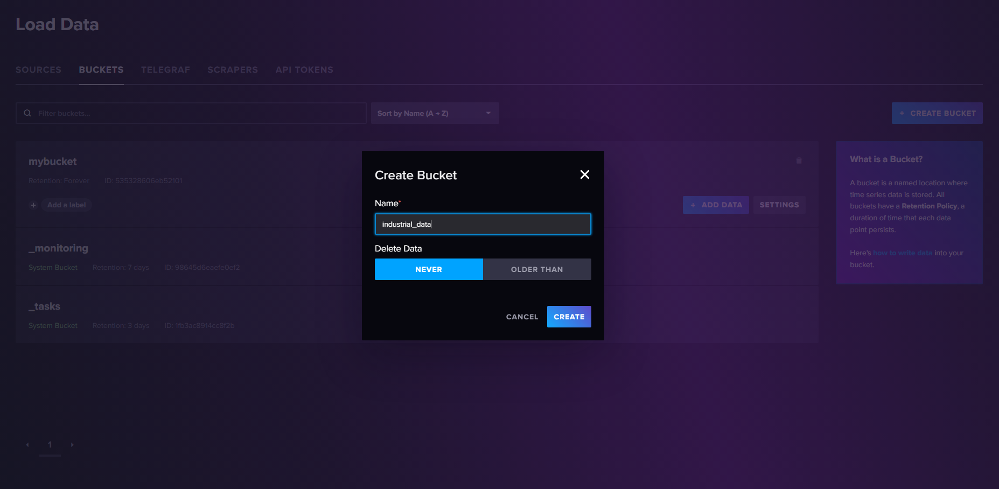
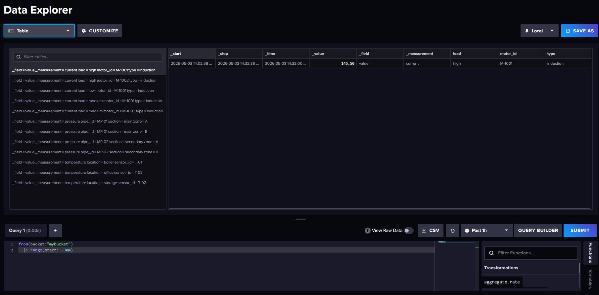
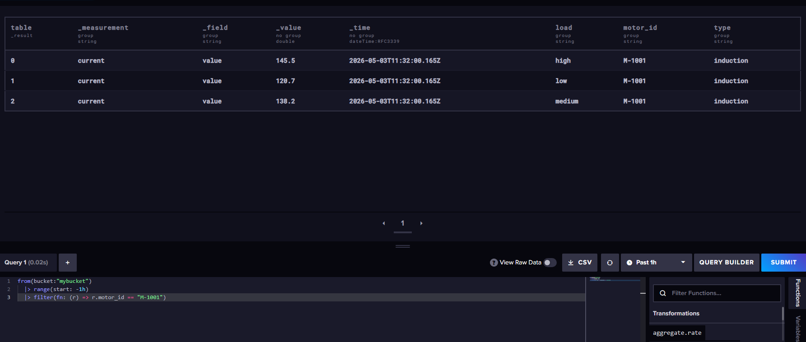
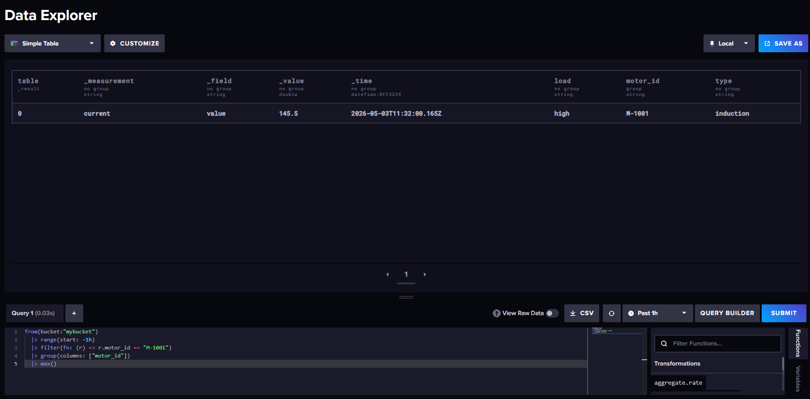
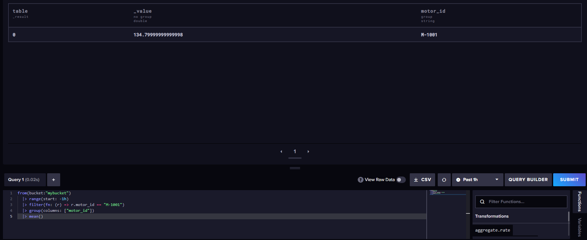
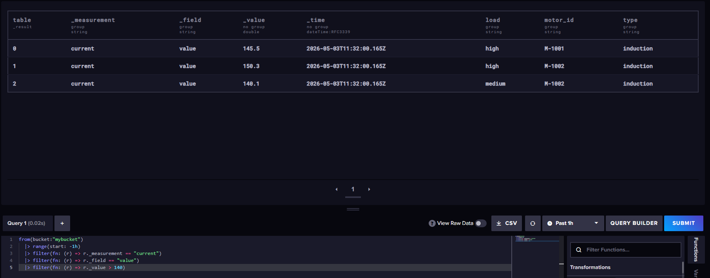
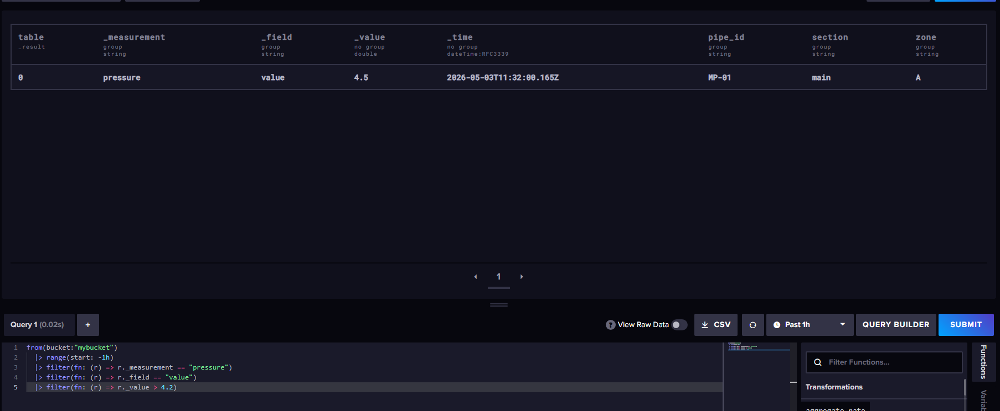
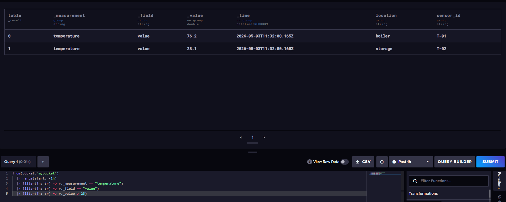
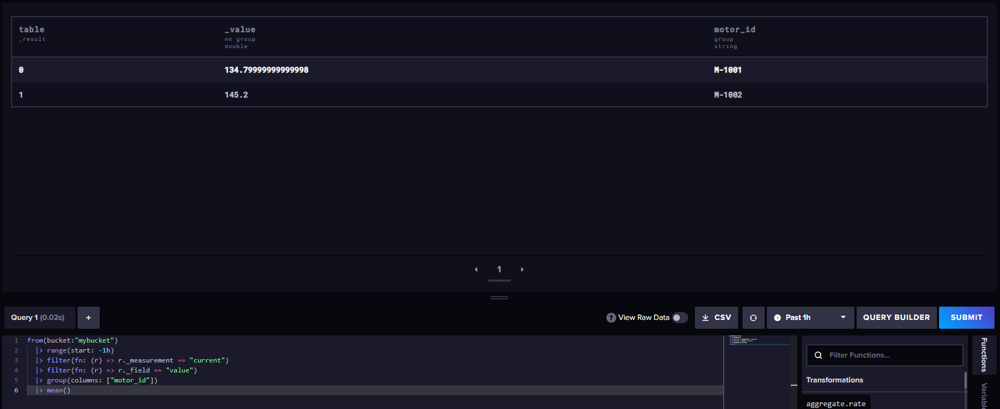
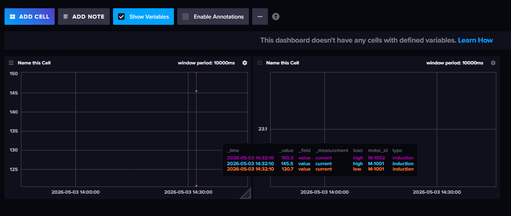

## InfluxDB

### Задание 1. Запуск через Docker

Создаем docker-compose.yml
```yaml
version: '3.9'

services:
  influxdb:
    image: influxdb:2.7
    container_name: influxdb
    ports:
      - "8086:8086"
    environment:
      - DOCKER_INFLUXDB_INIT_MODE=setup
      - DOCKER_INFLUXDB_INIT_USERNAME=admin
      - DOCKER_INFLUXDB_INIT_PASSWORD=admin123456
      - DOCKER_INFLUXDB_INIT_ORG=myorg
      - DOCKER_INFLUXDB_INIT_BUCKET=mybucket
      - DOCKER_INFLUXDB_INIT_ADMIN_TOKEN=my-token-123
    volumes:
      - influxdb-data:/var/lib/influxdb

volumes:
  influxdb-data:
```

Запускаем контейнер через Docker
```bash
docker compose up -d
```

Авторизуемся в веб-интерфейсе http://localhost:8086 с данными admin-admin123456


### Задание 2. Создать базу через веб-интерфейс

В веб-интерфейсе — Buckets → Create Bucket → Create



### Задание 3. Наполнить данными датчиков

В веб-интерфейсе — база mybucket → Add data → Line Protocol → Enter manually → Write Data
```
current,motor_id=M-1001,type=induction,load=high value=145.5
current,motor_id=M-1001,type=induction,load=medium value=138.2
current,motor_id=M-1001,type=induction,load=low value=120.7
current,motor_id=M-1002,type=induction,load=high value=150.3
current,motor_id=M-1002,type=induction,load=medium value=140.1
pressure,pipe_id=MP-01,section=main,zone=A value=4.2
pressure,pipe_id=MP-01,section=main,zone=A value=4.5
pressure,pipe_id=MP-01,section=main,zone=B value=4.1
pressure,pipe_id=MP-02,section=secondary,zone=A value=3.9
pressure,pipe_id=MP-02,section=secondary,zone=B value=4.0
temperature,sensor_id=T-01,location=boiler value=75.5
temperature,sensor_id=T-01,location=boiler value=76.2
temperature,sensor_id=T-02,location=storage value=22.8
temperature,sensor_id=T-02,location=storage value=23.1
temperature,sensor_id=T-03,location=office value=21.5
```


### Задание 4. Написать базовые запросы

В веб-интерфейсе — база mybucket → Script Editor → Submit

###### Просмотреть все данные за последние 30 минут
```bash
from(bucket:"mybucket")
  |> range(start: -30m)
```


###### Посмотреть измерения только 1 датчика
```bash
from(bucket:"mybucket")
  |> range(start: -1h)
  |> filter(fn: (r) => r.motor_id == "M-1001")
```


###### Максимальное значение на 1 датчике
```bash
from(bucket:"mybucket")
  |> range(start: -1h)
  |> filter(fn: (r) => r.motor_id == "M-1001")
  |> group(columns: ["motor_id"])
  |> max()
```


###### Среднее значение на датчике
```bash
from(bucket:"mybucket")
  |> range(start: -1h)
  |> filter(fn: (r) => r.motor_id == "M-1001")
  |> group(columns: ["motor_id"])
  |> mean()
```


###### Аналитический запрос для тока (current > 140)
```bash
from(bucket:"mybucket")
  |> range(start: -1h)
  |> filter(fn: (r) => r._measurement == "current")
  |> filter(fn: (r) => r._field == "value")
  |> filter(fn: (r) => r._value > 140)
```


###### Аналитический запрос для давления (pressure > 4.2)
```bash
from(bucket:"mybucket")
  |> range(start: -1h)
  |> filter(fn: (r) => r._measurement == "pressure")
  |> filter(fn: (r) => r._field == "value")
  |> filter(fn: (r) => r._value > 4.1)
```


###### Аналитический запрос для температуры (temperature > 23)
```bash
from(bucket:"mybucket")
  |> range(start: -1h)
  |> filter(fn: (r) => r._measurement == "temperature")
  |> filter(fn: (r) => r._field == "value")
  |> filter(fn: (r) => r._value > 23)
```


###### Агрегация данных — средний ток по каждому мотору
```bash
from(bucket:"mybucket")
  |> range(start: -1h)
  |> filter(fn: (r) => r._measurement == "current")
  |> filter(fn: (r) => r._field == "value")
  |> group(columns: ["motor_id"])
  |> mean()
```



### Задание 5. Создать dashboard с 1-2 графиками

В веб-интерфейсе — Dashboards → Create Dashboard → Add Cell → база mybucket
