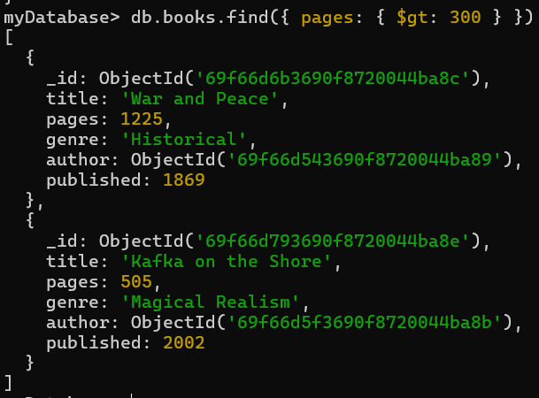
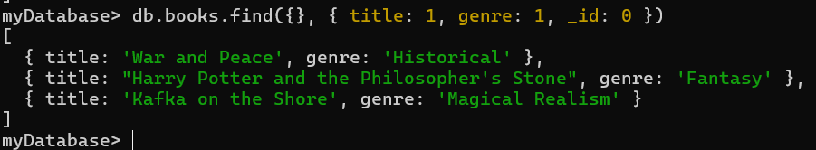
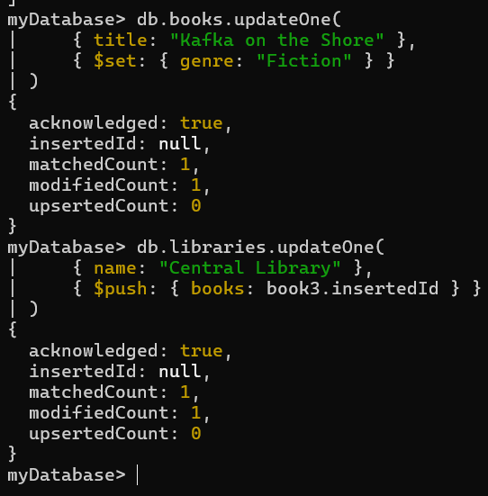
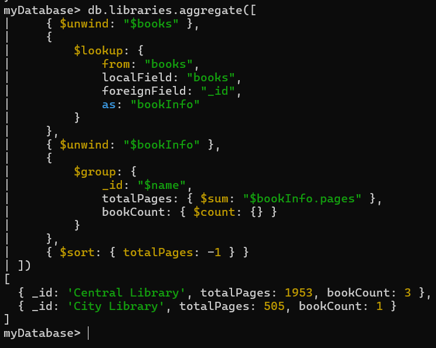

## MongoDB

### Задание 1. Запуск через Docker

Создаем docker-compose.yml
```yaml
services:
  mongodb:
    image: mongo:8
    environment:
      - MONGO_INITDB_ROOT_USERNAME=root
      - MONGO_INITDB_ROOT_PASSWORD=root
    ports:
      - "27017:27017"
    volumes:
      - mongodb-data:/data/db
    networks:
      - mongodb-network

volumes:
  mongodb-data:

networks:
  mongodb-network:
    driver: bridge
```

Запускаем контейнер через Docker
```bash
docker compose up -d
```

Узнаем Id контейнера
```bash
docker ps
```

Подключаемся к контейнеру
```bash
docker exec -it 252bed4c9fe0 mongosh -u root -p root
```

Создаем базу
```bash
use myDatabase
```


### Задание 2. Создать три коллекции

Создаем 3 коллекции — авторы, книги и библиотеки
```bash
db.createCollection("authors")
db.createCollection("books")
db.createCollection("libraries")
```

Добавляем авторов
```bash
const author1 = db.authors.insertOne({
    name: "Lev Tolstoy",
    country: "Russia",
    birthYear: 1828
});

const author2 = db.authors.insertOne({
    name: "J.K. Rowling",
    country: "UK",
    birthYear: 1965
});

const author3 = db.authors.insertOne({
    name: "Haruki Murakami",
    country: "Japan",
    birthYear: 1949
});
```

Добавляем связь книг и авторов по ObjectId
```bash
const book1 = db.books.insertOne({
    title: "War and Peace",
    pages: 1225,
    genre: "Historical",
    author: author1.insertedId,
    published: 1869
});

const book2 = db.books.insertOne({
    title: "Harry Potter and the Philosopher's Stone",
    pages: 223,
    genre: "Fantasy",
    author: author2.insertedId,
    published: 1997
});

const book3 = db.books.insertOne({
    title: "Kafka on the Shore",
    pages: 505,
    genre: "Magical Realism",
    author: author3.insertedId,
    published: 2002
});
```

Наполняем данными библиотеки с использованием массива книг
```bash
db.libraries.insertOne({
    name: "Central Library",
    city: "Moscow",
    books: [book1.insertedId, book2.insertedId],
    openHours: { start: "09:00", end: "20:00" }
});

db.libraries.insertOne({
    name: "City Library",
    city: "Tokyo",
    books: [book3.insertedId],
    openHours: { start: "10:00", end: "18:00" }
});
```


### Задание 3. Написать 2 find-запроса

Найдем все книги, в которых более 300 страниц
```bash
db.books.find({ pages: { $gt: 300 } })
```


Найдем названия книг с их жанром
```bash
db.books.find({}, { title: 1, genre: 1, _id: 0 })
```



### Задание 4. Написать 2 update-запроса

Обновим жанр у книги «Кафка на пляже»
```bash
db.books.updateOne(
    { title: "Kafka on the Shore" },
    { $set: { genre: "Fiction" } }
)
```

Добавим в библиотеку книгу
```bash
db.libraries.updateOne(
    { name: "Central Library" },
    { $push: { books: book3.insertedId } }
)
```



### Задание 5. Написать 1 aggregate-запрос

Посчитаем суммарное количество страниц в каждой книге
```bash
db.libraries.aggregate([
    { $unwind: "$books" },
    {
        $lookup: {
            from: "books",
            localField: "books",
            foreignField: "_id",
            as: "bookInfo"
        }
    },
    { $unwind: "$bookInfo" },
    {
        $group: {
            _id: "$name",
            totalPages: { $sum: "$bookInfo.pages" },
            bookCount: { $count: {} }
        }
    },
    { $sort: { totalPages: -1 } }
])
```
