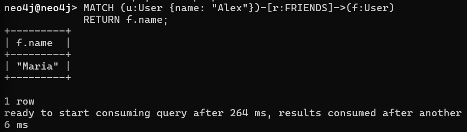
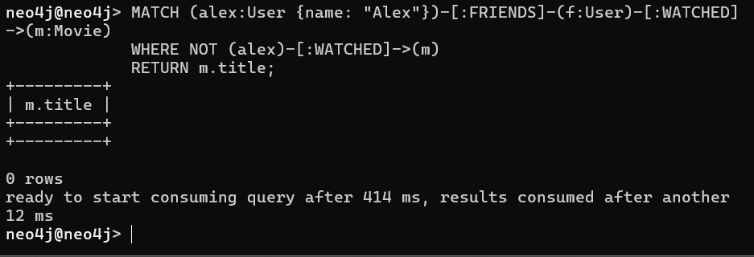

## Neo4j

### Задание 0. Запуск через Docker

Создаем docker-compose.yml
```yaml
version: '3.8'
services:
  neo4j:
    image: neo4j:5-enterprise
    container_name: neo4j
    ports:
      - "7474:7474"   # HTTP Browser
      - "7687:7687"   # Bolt protocol
    environment:
      - NEO4J_AUTH=neo4j/password123
      - NEO4J_ACCEPT_LICENSE_AGREEMENT=yes
      - NEO4J_PLUGINS='["apoc", "graph-data-science"]'
    volumes:
      - ./neo4j/data:/data
      - ./neo4j/logs:/logs
      - ./neo4j/import:/var/lib/neo4j/import
```

Запускаем контейнер через Docker
```bash
docker compose up -d
```

Подключаемся к контейнеру
```bash
docker exec -it neo4j cypher-shell -u neo4j -p password123
```

Задаем структуру
```bash
CREATE (alex:User {name: "Alex"}),
       (maria:User {name: "Maria"}),
       (john:User {name: "John"});

CREATE (inception:Movie {title: "Inception"}),
       (matrix:Movie {title: "The Matrix"});

MATCH (a:User {name: "Alex"}), (m:User {name: "Maria"})
CREATE (a)-[:FRIENDS]->(m);

MATCH (a:User {name: "Alex"}), (i:Movie {title: "Inception"})
CREATE (a)-[:WATCHED {rating: 5}]->(i);
```


### Задание 1. Написать запросы

Найдем всех друзей Алекса
```bash
MATCH (u:User {name: "Alex"})-[r:FRIENDS]->(f:User) 
RETURN f.name; 
```


Найдем фильмы, которые смотрели друзья Алекса, но не смотрел сам Алекс
```bash
MATCH (alex:User {name: "Alex"})-[:FRIENDS]-(f:User)-[:WATCHED]->(m:Movie)
WHERE NOT (alex)-[:WATCHED]->(m)
RETURN m.title;
```



### Задание 2. Написать запросы на SQL и сравнить сложность

Структура для SQL
```sql
CREATE TABLE Users (
    id INT PRIMARY KEY,
    name VARCHAR(50)
);

CREATE TABLE Movies (
    id INT PRIMARY KEY,
    title VARCHAR(50)
);

CREATE TABLE Friends (
    user_id INT,
    friend_id INT
);

CREATE TABLE Watched (
    user_id INT,
    movie_id INT,
    rating INT
);
```

Найдем всех друзей Алекса
```bash
SELECT u2.name AS friend_name
FROM Users u1 JOIN Friends f ON u1.id = f.user_id
JOIN Users u2 ON f.friend_id = u2.id
WHERE u1.name = 'Alex';
```

Найдем фильмы, которые смотрели друзья Алекса, но не смотрел сам Алекс
```bash
SELECT DISTINCT m.title
FROM Users u JOIN Friends f ON u.id = f.user_id
JOIN Users friend ON f.friend_id = friend.id
JOIN Watched w ON friend.id = w.user_id
JOIN Movies m ON w.movie_id = m.id
WHERE u.name = 'Alex'
  AND m.id NOT IN (
      SELECT movie_id 
      FROM Watched w2
      JOIN Users u2 ON w2.user_id = u2.id
      WHERE u2.name = 'Alex'
  );
```

Сравнение:
- Запрос Neo4j следует структуре построенного графа, из-за чего продумывать логику запроса становится легче
- Запросы Neo4j удобны для цепочек
- Сложность SQL-запроса растет с количеством связей, из-за чего для графовых представлений он становится громоздким и нечитаемым
Итог: для графов Neo4j более читаем и эффективен