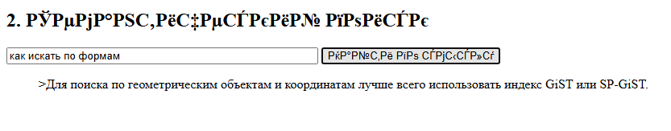
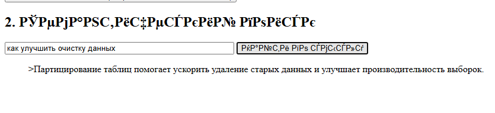
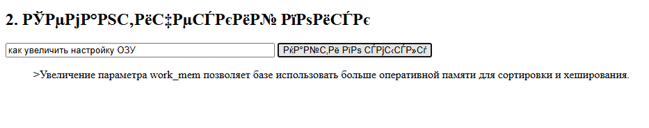

## Qdrant

### Задание 1–4. Запуск через Docker

Клонируем репозиторий
```bash
git clone https://github.com/ZhenShenITIS/hw-qdrant.git
cd hw-qdrant
```

Запускаем контейнер
```bash
docker compose up -d --build
```

Открываем «http://localhost:8080/»


### Задание 5. Ввести текст

```text
Индексы B-Tree отлично подходят для поиска точных совпадений и сортировки данных.;VACUUM очищает таблицу от мертвых строк (dead tuples), предотвращая раздувание файлов.;Команда EXPLAIN ANALYZE позволяет увидеть реальный план выполнения запроса и затраченное время.;Использование пула соединений, такого как PgBouncer, снижает нагрузку на сервер при большом количестве клиентов.;Партицирование таблиц помогает ускорить удаление старых данных и улучшает производительность выборок.;Материализованные представления сохраняют результаты сложных агрегаций для быстрого чтения.;Увеличение параметра work_mem позволяет базе использовать больше оперативной памяти для сортировки и хеширования.;Write-Ahead Log (WAL) обеспечивает надежность данных и используется для репликации.;Для поиска по геометрическим объектам и координатам лучше всего использовать индекс GiST или SP-GiST.;Триггеры в базе данных позволяют автоматически выполнять функции при вставке или обновлении записей.;Тип данных JSONB хранит документы в бинарном формате, что ускоряет доступ к ключам.;Настройка shared_buffers критически важна, так как она определяет, сколько данных будет кэшироваться в памяти.
```


### Задание 6. Попробовать семантический поиск

1. Запрос — «как искать по формам»


2. Запрос — «как улучшить очистку данных»


3. Запрос — «как увеличить настройку ОЗУ»



### Задание 7. Посмотреть, как выглядят данные

Запрос
```bash
{
  "limit": 15
}
```
