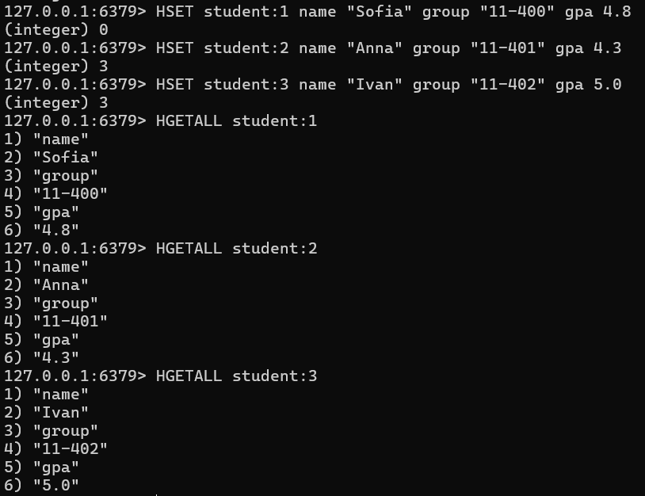
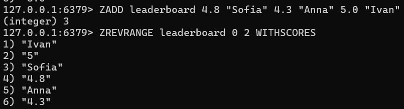
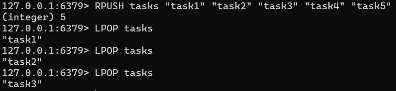
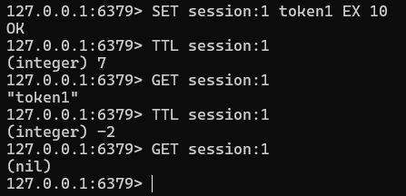
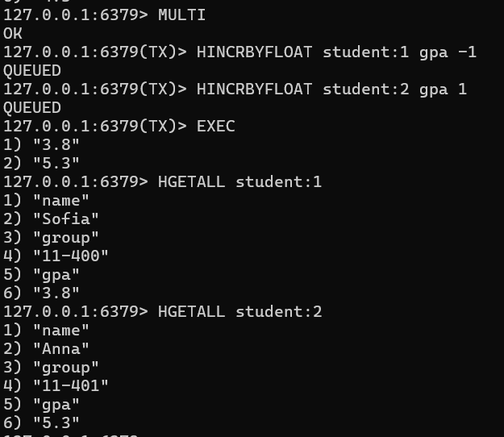
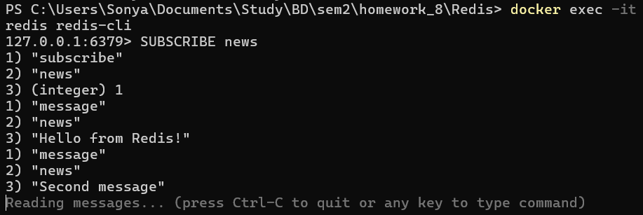
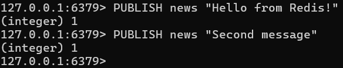

## Redis

### Задание 0. Запуск через Docker

Создаем docker-compose.yml
```yaml
services:
  redis:
    image: redis:7
    container_name: redis
    ports:
      - "6379:6379"
    volumes:
      - redis-data:/data
    command: redis-server --appendonly yes

volumes:
  redis-data:
```

Запускаем контейнер через Docker
```bash
docker compose up -d
```

Подключаемся к контейнеру
```bash
docker exec -it redis redis-cli
```


### Задание 1. Hash — данные о студентах

Создаем 3 студентов
```bash
HSET student:1 name "Sofia" group "11-400" gpa 4.8
HSET student:2 name "Anna" group "11-401" gpa 4.3
HSET student:3 name "Ivan" group "11-402" gpa 5.0
```

Проверяем, что данные сохранились
```bash
HGETALL student:1
HGETALL student:2
HGETALL student:3
```




### Задание 2. Sorted Set — лидерборд по GPA

Создаем рейтинг студентов по среднему баллу
```bash
ZADD leaderboard 4.8 "Sofia" 4.3 "Anna" 5.0 "Ivan"
```

Выводим топ-3 по убыванию среднего балла
```bash
ZREVRANGE leaderboard 0 2 WITHSCORES
```




### Задание 3. List — очередь задач

Добавляем 5 задач в очередь через «RPUSH»
```bash
RPUSH tasks "task1" "task2" "task3" "task4" "task5"
```

Выбираем 3 задачи из очереди (FIFO)
```bash
LPOP tasks
LPOP tasks
LPOP tasks
```




### Задание 4. TTL — время жизни ключа

Создаем ключ с TTL, равным 10 секундам
```bash
SET session:1 token1 EX 10
```

Проверяем оставшееся время
```bash
TTL session:1
```

Пробуем получить значение спустя время
```bash
GET session:1
```




### Задание 5. Транзакция MULTI/EXEC

Начинаем транзакцию
```bash
MULTI
```

Уменьшаем балл первого студента
```bash
HINCRBYFLOAT student:1 gpa -1
```

Увеличиваем балл второго студента
```bash
HINCRBYFLOAT student:2 gpa 1
```

Завершаем транзакцию
```bash
EXEC
```

Проверяем средние баллы
```bash
HGETALL student:1
HGETALL student:2
```




### Задание 6 — бонус. Pub/Sub

Создаем подписчика в первом терминале
```bash
SUBSCRIBE news
```

Публикуем news во втором терминале
```bash
PUBLISH news "Hello from Redis!"
PUBLISH news "Second message"
```

В первом терминале сообщения появятся автоматически

