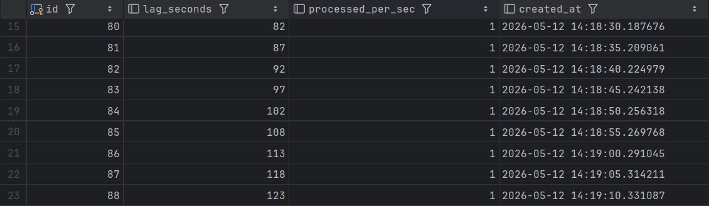
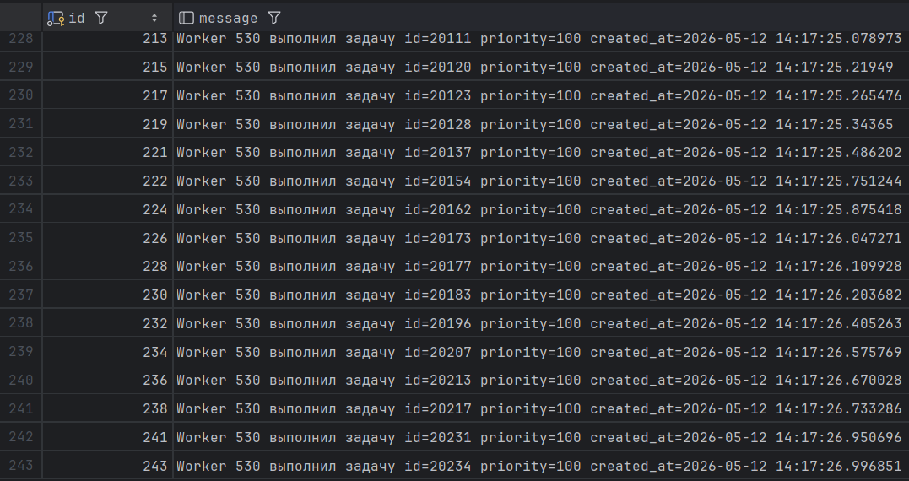
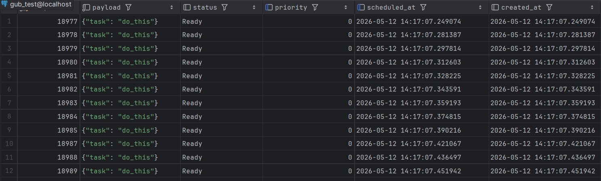

## Создание очереди

### 1. Проектирование схемы БД
Создаем таблицу tasks, которая будет хранить очередь:
```sql
CREATE TABLE tasks (
    id SERIAL PRIMARY KEY,
    payload JSONB NOT NULL,
    status VARCHAR(20) DEFAULT 'Ready' CHECK (status IN ('Ready','Running','Completed','Failed')),
    priority INT DEFAULT 0,
    scheduled_at TIMESTAMP DEFAULT NOW(),
    attempts INT DEFAULT 0,
    worker_id INT NULL,
    created_at TIMESTAMP DEFAULT NOW(),
    updated_at TIMESTAMP DEFAULT NOW()
);
```

Создаем таблицу tasks_dlq, которая будет хранить задачи, которые выполнить не удалось:
```sql
CREATE TABLE tasks_dlq (
    id SERIAL PRIMARY KEY,
    original_task_id INT,
    payload JSONB,
    attempts INT,
    failed_at TIMESTAMP DEFAULT NOW(),
    error TEXT
);
```

Создаем индекс для ускорения поиска в таблице:
```sql
CREATE INDEX idx_tasks_ready ON tasks(priority DESC, scheduled_at ASC) WHERE status='Ready';
```


### 2. Реализация Producer

Создаем таблицу logs для логирования всех задач:
```sql
CREATE TABLE logs (id SERIAL PRIMARY KEY, message TEXT);
```

Создаем объект Producer:
```java
public class Producer {
    public static void main(String[] args) throws Exception {
        Connection conn = DriverManager.getConnection("jdbc:postgresql://localhost:5432/gub_test", "postgres", "password");
        Random random = new Random();

        while (true) {
            boolean isCritical = random.nextInt(100) < 20;
            int priority = isCritical ? 100 : 0;

            conn.setAutoCommit(false);
            try {
                PreparedStatement stmt = conn.prepareStatement("INSERT INTO tasks(payload, priority) VALUES (?::jsonb, ?)");
                stmt.setString(1, "{\"task\":\"do_this\"}");
                stmt.setInt(2, priority);
                stmt.executeUpdate();

                conn.commit();

                System.out.println("Задача добавлена");
            } catch (Exception e) {
                conn.rollback();
            }
            Thread.sleep(10);
        }
    }
}
```


### 3. Реализация Consumer

Создаем объект Consumer:
```java
public class Consumer {

    private static final int WORKER_ID = new Random().nextInt(1000);
    private static final int MAX_ATTEMPTS = 3;

    public static void main(String[] args) throws Exception {
        Connection conn = DriverManager.getConnection("jdbc:postgresql://localhost:5432/gub_test", "postgres", "password");
        Random random = new Random();

        while (true) {
            conn.setAutoCommit(false);
            try {
                PreparedStatement stmt = conn.prepareStatement("SELECT * FROM tasks WHERE status='Ready' AND scheduled_at <= NOW() ORDER BY priority DESC, scheduled_at ASC LIMIT 1 FOR UPDATE SKIP LOCKED");
                ResultSet rs = stmt.executeQuery();

                if (rs.next()) {
                    int id = rs.getInt("id");
                    int attempts = rs.getInt("attempts");
                    int priority = rs.getInt("priority");
                    String payload = rs.getString("payload");

                    PreparedStatement runStmt = conn.prepareStatement("UPDATE tasks SET status='Running', worker_id=?, updated_at = NOW() WHERE id=?");
                    runStmt.setInt(1, WORKER_ID);
                    runStmt.setInt(2, id);
                    runStmt.executeUpdate();
                    runStmt.close();

                    System.out.println("Задача взята");
                    Thread.sleep(1000);

                    boolean success = random.nextInt(100) < 90;
                    if (success) {
                        PreparedStatement done = conn.prepareStatement("UPDATE tasks SET status='Completed', updated_at=NOW() WHERE id=?");
                        System.out.println("Задача выполнена");
                        done.setInt(1, id);
                        done.executeUpdate();
                        done.close();

                        PreparedStatement log = conn.prepareStatement("INSERT INTO logs(message) VALUES (?)");
                        log.setString(1, "Worker " + WORKER_ID + " выполнил задачу id=" + id + " priority=" + priority + " created_at=" + rs.getTimestamp("created_at"));
                        log.executeUpdate();
                        log.close();
                    } else {
                        if (attempts + 1 >= MAX_ATTEMPTS) {
                            PreparedStatement dlq = conn.prepareStatement("INSERT INTO tasks_dlq(original_task_id, payload, attempts, failed_at, error) VALUES (?, ?::jsonb, ?, NOW(), ?)");
                            dlq.setInt(1, id);
                            dlq.setString(2, payload);
                            dlq.setInt(3, attempts + 1);
                            dlq.setString(4, "Ошибка обработки после " + (attempts + 1) + " попытки");
                            dlq.executeUpdate();

                            PreparedStatement delete = conn.prepareStatement("DELETE FROM tasks WHERE id=?");
                            delete.setInt(1, id);
                            delete.executeUpdate();
                        } else {
                            PreparedStatement retry = conn.prepareStatement("UPDATE tasks SET status='Ready', attempts=attempts+1, scheduled_at=NOW() + INTERVAL '5 minutes', updated_at=NOW() WHERE id=?");
                            retry.setInt(1, id);
                            retry.executeUpdate();
                        }
                    }
                }
                conn.commit();
            } catch(Exception e) {
                conn.rollback();
            }

            Thread.sleep(500);
        }
    }
}
```


### 4. Нагрузка и мониторинг Лага

Создаем таблицу lag_log, которая будет хранить историю лага и пропускной способности:
```sql
CREATE TABLE lag_log (
    id SERIAL PRIMARY KEY,
    lag_seconds INT,
    processed_per_sec INT,
    created_at TIMESTAMP DEFAULT NOW()
);
```

Запрос для нахождения разности между now() и временем created_at самой старой задачи в статусе Ready:
```sql
SELECT EXTRACT(EPOCH FROM NOW() - MIN(created_at)) AS lag_seconds
FROM tasks
WHERE status = 'Ready';
```

Запрос для нахождения пропускной способности:
```sql
SELECT COUNT(*) / 10.0 AS processed_per_sec
FROM tasks
WHERE status = 'Completed' AND updated_at >= NOW() - INTERVAL '10 seconds';
```

Скрипт для сохранения лага и пропускной способности:
```java
public class LagConsumer {
    public static void main(String[] args) throws Exception {
        Connection conn = DriverManager.getConnection("jdbc:postgresql://localhost:5432/gub_test", "postgres", "password");

        while (true) {
            try {
                Statement stmt = conn.createStatement();
                ResultSet rs = stmt.executeQuery("SELECT EXTRACT(EPOCH FROM NOW() - MIN(created_at)) AS lag_seconds FROM tasks WHERE status = 'Ready'");
                int lag = 0;
                if (rs.next()) {
                    lag = rs.getInt("lag_seconds");
                }

                Statement stmt2 = conn.createStatement();
                ResultSet rs2 = stmt2.executeQuery("SELECT COUNT(*) / 10.0 AS processed_per_sec FROM tasks WHERE status = 'Completed' AND updated_at >= NOW() - INTERVAL '10 seconds'");
                int proc = 0;
                if (rs2.next()) {
                    proc = rs2.getInt("processed_per_sec");
                }

                PreparedStatement insertStmt = conn.prepareStatement("INSERT INTO lag_log(lag_seconds, processed_per_sec) VALUES (?, ?)");
                insertStmt.setInt(1, lag);
                insertStmt.setInt(2, proc);
                insertStmt.executeUpdate();

                System.out.println("Лог добавлен");
            } catch (SQLException e) {
                e.printStackTrace();
            }
            Thread.sleep(5000);
        }
    }
}
```


### 5. Дополнительно

a. Механизм Retry реализован в Consumer:
```java
else {
    if (attempts + 1 >= MAX_ATTEMPTS) {
        PreparedStatement dlq = conn.prepareStatement("INSERT INTO tasks_dlq(original_task_id, payload, attempts, failed_at, error) VALUES (?, ?::jsonb, ?,NOW(), ?)");
        dlq.setInt(1, id);
        dlq.setString(2, payload);
        dlq.setInt(3, attempts + 1);
        dlq.setString(4, "Ошибка обработки после " + (attempts + 1) + " попытки");
        dlq.executeUpdate();
        PreparedStatement delete = conn.prepareStatement("DELETE FROM tasks WHERE id=?");
        delete.setInt(1, id);
        delete.executeUpdate();
    } else {
        PreparedStatement retry = conn.prepareStatement("UPDATE tasks SET status='Ready', attempts=attempts+1, scheduled_at=NOW() + INTERVAL '5 minutes',updated_at=NOW() WHERE id=?");
        retry.setInt(1, id);
        retry.executeUpdate();
    }
}
```

b. Оптимизация (Notify)

При добавлении задачи в продюсере будим консьюмеров:
```sql
INSERT INTO tasks(payload, priority) 
VALUES ('{"task":"do_this"}'::jsonb, 0);
NOTIFY task_channel, 'new_task';
```

У консьюмеров подписываемся на канал:
```sql
LISTEN task_channel;
```

c. Для настройки агрессивного autovacuum:
```sql
ALTER TABLE tasks SET ( 
    autovacuum_vacuum_threshold = 50, 
    autovacuum_analyze_threshold = 50
)
```


## Результаты

### 2. График или лог, показывающий рост лага при увеличении нагрузки.


### 3. Демонстрация того, что приоритетные задачи (Priority 100) выполняются быстрее, чем обычные (Priority 0), даже если они были созданы позже.

В логах видно, что выполнялись задачи с priority = 100:


В tasks остались задачи с priority = 0, созданные раньше:
